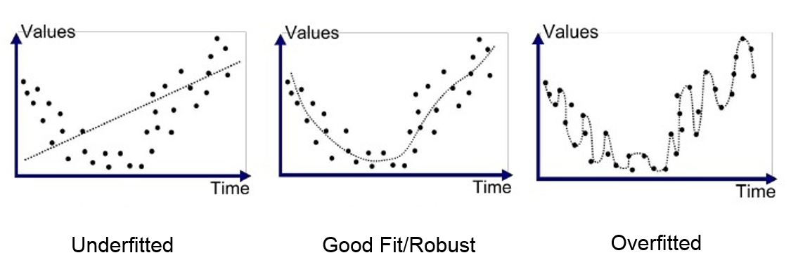

# Régression linéaire II {#lm2}

```{r setup, include=FALSE, echo=FALSE, message=FALSE, results='hide'}
SciViews::R("model", lang = "fr")
```

##### Objectifs {.unnumbered}

-   Être capable d'utiliser les outils de diagnostic de la régression linéaire correctement.

-   Appréhender les différentes formes de régressions linéaires par les moindres carrés.

-   Choisir sa régression linéaire de manière judicieuse.

##### Prérequis {.unnumbered}

Le module précédent est une entrée en matière indispensable qui est complétée par le contenu du présent module.

## Outils de diagnostic (suite)

La régression linéaire est une matière complexe et de nombreux outils existent pour vous aider à déterminer si le modèle que vous ajustez tient la route ou non. Il est très important de le vérifier avant d'utiliser un modèle. **Ajuster un modèle quelconque dans des données est à la portée de tout le monde, mais choisir un modèle pertinent et pouvoir expliquer pourquoi est nettement plus difficile !**

### Résumé avec `summary()`(suite)

Reprenons la sortie renvoyée par `summary()` appliquée à un objet `lm` (notez ici que nous analysons la sortie de `summary()` "brute", mais vous savez comment la transformer en un tableau plus présentable dans un rapport avec `tabularise()`).

```{r}
SciViews::R("model", lang = "fr") # Configuration du système

trees <- read("trees", package = "datasets") # Importation des données
trees_lm <- lm(data = trees, volume ~ diameter) # Régression
summary(trees_lm) # Résumé du modèle
```

Nous n'avons pas encore étudié la signification des trois dernières lignes de ce résumé. Voici de quoi il s'agit.

-   Residual standard error :

Il s'agit de l'écart type des résidus, considérant que les degrés de liberté du modèle correspond au nombre d'observations $n$ (ici 31) soustrait du nombre de paramètres à estimer (ici 2, la pente et l'ordonnée à l'origine de la droite). C'est donc une mesure globale de l'importance (c'est-à-dire de l'étendue) des résidus de manière générale et qui a les mêmes unités que *y*.

$$\sqrt{\frac{\sum(y_i - \hat{y_i})^2}{n-2}}$$

-   Multiple R-squared :

Il s'agit de la valeur du **coefficient de détermination** du modèle noté *R*^2^ de manière générale ou *r*^2^ dans le cas d'une régression linéaire simple. Il exprime la fraction de variance exprimée par le modèle. En fait, le *R*^2^ quantifie la capacité du modèle à *prédire* la valeur de $y$ connaissant la valeur $x$ pour un individu. C'est donc une indication du *pouvoir prédictif* de notre modèle autant que de sa **qualité d'ajustement** (*goodness-of-fit* en anglais).

Souvenons-nous que la variance totale respecte la propriété d'additivité (nous avions déjà utilisé cette propriété dans l'ANOVA). La variance est composée au numérateur d'une somme de carrés, et au dénominateur de degrés de liberté. La somme des carrés totaux (de la variance, $SC(total)$) peut elle-même être décomposée en une **fraction expliquée** par notre modèle $SC(rég)$, et la fraction qui ne l'est pas (les **résidus** $SC(résidus)$) :

$$SC(total) = SC(rég) + SC(résidus)$$

avec :

$$SC(total) = \sum_{i=0}^n(y_i - \bar{y_i})^2$$

$$SC(rég) = \sum_{i=0}^n(\hat{y_i} - \bar{y_i})^2$$

$$SC(résidus) = \sum_{i=0}^n(y_i - \hat{y_i})^2$$

À partir de la décomposition de ces sommes de carrés, le coefficient *R*^2^ (ou *r*^2^) se définit comme :

$$R^2 = \frac{SC(rég)}{SC(total)} = 1 - \frac{SC(résidus)}{SC(total)}$$

La valeur du *R*^2^ est comprise entre 0 (lorsque le modèle est très mauvais et n'explique rien) et 1 (lorsque le modèle est parfait et "capture" toute la variance des données ; dans ce dernier cas, tous les résidus valent zéro, donc, tous les points sont sur la droite). **Plus le coefficient *R*^2^ se rapproche de 1, plus le modèle explique bien les données et aura un bon pouvoir de prédiction** pour autant que l'on ne cherche pas à extrapoler des valeurs en dehors du domaine étudié.

```{block, type='warning'}

Dans R, le *R*^2^ multiple se réfère simplement au *R*^2^ (ou au *r*^2^ pour les régressions linéaires simples) calculé de cette façon. L'adjectif **multiple** indique que le calcul est valable pour une régression **multiple** tel que nous verrons plus loin.

Par contre, le terme au dénominateur considère en fait la somme des carrés totale **par rapport à un modèle de référence** lorsque la variable dépendante $y$ ne *dépend pas* de la ou des variables indépendantes $x$. Les équations indiquées plus haut sont valables lorsque l'ordonnée à l'origine *n'est pas* figée ($y = \alpha + \beta \ x$). Dans ce cas, la valeur de référence pour $y$ est bien sa moyenne, $\bar y$.

D'un autre côté, si l'ordonnée à l'origine est fixée à zéro dans le modèle simplifié $y = \beta \ x$ (avec $\alpha = 0$ obtenu en indiquant la formule `y ~ x + 0` ou `y ~ x - 1`), alors le zéro sur l'axe $y$ est considéré comme une valeur appartenant d'office au modèle et devient valeur de référence. Ainsi, dans les équations ci-dessus il faut remplacer $\bar y$ par 0 partout. Le *R*^2^ est alors calculé différemment, et sa valeur peut brusquement augmenter si le nuage de points est très éloigné du zéro sur l'axe Y. **Ne comparez donc jamais les *R*^2^ obtenus avec et sans forçage à zéro de l'ordonnée à l'origine !**

```

-   Adjusted R-squared :

La valeur du coefficient *R*^2^ **ajusté**, noté $\bar{R^2}$ n'est pas utile dans le cadre de la régression linéaire simple, mais est indispensable avec la régression multiple (un modèle qui relie une variable dépendante *y* à *plusieurs* variables indépendantes *x~1~*, *x~2~*, ..., *x~n~* et que nous étudierons plus loin). En effet, à chaque fois que vous rendez votre modèle plus complexe en ajoutant une ou plusieurs variables indépendantes *x~n~*, le modèle s'ajustera de mieux en mieux dans les données, même par pur hasard. C'est un phénomène que l'on appelle l'**inflation du *R*^2^**. À la limite, si nous ajoutons une nouvelle variable fortement corrélée avec les précédentes[^02-reg-lineaire-2-1], l'apport en matière d'information nouvelle sera négligeable, mais le *R*^2^ augmentera malgré tout un tout petit peu. Alors dans quel cas l'ajout d'une nouvelle variable est-il pertinent ? Le *R*^2^ ajusté apporte l'information désirée ici. Sa valeur n'augmentera pour l'ajout d'un nouveau prédicteur *que si l'ajustement est meilleur que ce que l'on obtiendrait par le pur hasard*. Le *R*^2^ ajusté se calcule comme suit (il n'est pas nécessaire de retenir cette formule, mais juste de constater que l'ajustement fait intervenir *p*, le nombre de paramètres du modèle et *n*, la taille de l'échantillon) :

[^02-reg-lineaire-2-1]: La corrélation entre les prédicteurs dans un modèle linéaire multiple est un gros problème et doit être évitée le plus possible. Cela s'appelle la **colinéarité** ou encore **multicolinéarité**. Ainsi, il est toujours préférable de choisir un ensemble de variables indépendantes peu corrélées entre elles dans un même modèle, mais ce n'est pas toujours possible.

$$
\bar{R^2} = 1 - (1 - R^2) \frac{n - 1}{n - p - 1}
$$

-   F-statistic :

Tout comme pour l'ANOVA, la distribution *F* de Fisher permet de vérifier la significativité de la régression, car $MS(rég)/MS(résidus)$ suit une distribution *F* à respectivement 1 et $n-2$ degrés de liberté, avec $MS$ les carrés moyens, c'est-à-dire les sommes des carrés $SC$ divisés par leurs degrés de liberté respectifs.

-   p-value :

Il s'agit de la valeur *p* associée à la statistique *F* observée, donc à l'ANOVA de la régression linéaire. Pour cette ANOVA particulière, l'hypothèse nulle est que la droite n'apporte pas plus d'explication des valeurs de *y* à partir des valeurs de *x* que la valeur moyenne de *y* (ou zéro, dans le cas particulier d'un modèle dont l'ordonnée à l'origine est forcée à zéro). L'hypothèse alternative est donc que le modèle est significatif au seuil $\alpha$ considéré. **Donc, notre objectif est de rejeter *H~0~* pour ce test ANOVA** pour que le modèle ait un sens (valeur *p* plus petite que le seuil $\alpha$ choisi).

Le tableau complet de l'ANOVA pour le modèle peut être obtenu à l'aide de `anova()` :

```{r}
anova(trees_lm)
```

Nous y retrouvons les mêmes informations, fortement résumées en une ligne à la fin de la sortie de `summary()`. Ici elles sont présentées sous une forme plus classique de tableau de l'analyse de la variance. N'oubliez pas `tabularise()` si vous avez besoin d'un tableau propre pour un rapport, aussi bien pour `anova()` :

```{r, warning=FALSE}
anova(trees_lm) |>
  tabularise()
```

... que pour `summary()` :

```{r, warning=FALSE}
summary(trees_lm) |>
  tabularise()
```


##### À vous de jouer ! {.unnumbered}

`r h5p(202, height = 270, toc = "Résumé lm() et résidus")`

### Comparaison de régressions

Vous pouvez à présent comparer ces résultats avec une régression réalisée sans la valeur supérieure à 0,5m de diamètre. **Attention ! On ne peut supprimer une valeur sans raison valable.** La suppression de points aberrants doit être justifiée (par exemple, vous pouvez montrer qu'il y a eu une erreur de mesure, ou que l'individu mesuré est anormal ou malade, ou qu'il y a un autre problème dans le jeu de données, problème explicable). La raison de la suppression de ce point ici est liée au fait qu'il n'y a qu'un seul arbre mesuré dont le diamètre soit supérieur à 0.5m. Dès lors, nous pourrions souhaiter réduire l'étendue du jeu de données à des arbres plus petits (mais par la même occasion, nous réduisons aussi la portée du modèle, bien sûr). Le nettoyage du jeu de donnée peut se faire avant l'appel de `lm()`, ou plus simple, nous pouvons utiliser l'argument `subset=` de la fonction.

```{r}
trees_lm2 <- lm(data = trees, volume ~ diameter, subset = diameter < 0.5)
chart(trees_lm2)
```

Le résumé de la régression donne ceci :

```{r, warning=FALSE}
summary(trees_lm2) |>
  tabularise()
```

Sans oublier l'analyse des résidus.

```{r}
chart$residuals(trees_lm2)
```

Comparez ces résultats avec ceux du modèle qui utilise tous les points. Lequel conserver ? Pas facile de décider. Il nous faut des métriques qui permettent de comparer de manière fiable différents modèles pour nous aider. Cela apparaîtra d'ailleurs d'autant plus utile que la situation va passablement se complexifier (dans le bon sens) avec l'introduction de la régression multiple et polynomiale.

##### À vous de jouer ! {.unnumbered}

`r h5p(203, height = 270, toc = "Métrique pour modèle prédictif")`

```{=html}
<!--
{{r assign_B02Ia_anscombe, echo=FALSE, results='asis'}
if (exists("assignment"))
  assignment("B02Ia_anscombe", part = NULL,
    url = "https://github.com/BioDataScience-Course/B02Ia_anscombe",
    course.ids = c(
      'S-BIOG-015' = !"B02Ia_{YY}M_anscombe"),
    course.urls = c(
      'S-BIOG-015' = "https://classroom.github.com/a/..."),
    course.starts = c(
      'S-BIOG-015' = !"{W[7]+1} 10:00:00"),
    course.ends = c(
      'S-BIOG-015' = !"{W[7]+1} 13:00:00"),
    term = "Q1", level = 3,
    toc = "Quartet d’Anscombe")
-->
```

## Régression linéaire multiple

Dans le cas de la régression linéaire simple, nous considérions le modèle statistique suivant (avec $\epsilon$ représentant les résidus, terme statistique dans l'équation) :

$$y = \alpha + \beta \ x + \epsilon $$

Dans le cas de la régression linéaire multiple, nous introduisons *plusieurs* variables indépendantes notées $x_1$, $x_2$, ..., $x_n$ :

$$y = \alpha + \beta_1 \ x_1 + \beta_2 \ x_2 + ... + \beta_n \ x_n + \epsilon $$

La bonne nouvelle, c'est que tous les calculs, les métriques et les tests d'hypothèses relatifs à la régression linéaire simple se généralisent, tout comme nous sommes passés dans le cours SDD 1 de l'ANOVA à un facteur à un modèle plus complexe à deux ou plusieurs facteurs. Voyons tout de suite ce que cela donne si nous utilisons *à la fois* le diamètre et la hauteur des cerisiers noirs pour prédire leur volume de bois :

```{r, warning=FALSE}
trees_lm3 <- lm(data = trees, volume ~ diameter + height)
summary(trees_lm3) |>
  tabularise()
```

D'un point de vue pratique, nous voyons que la formule qui spécifie le modèle peut très bien comporter plusieurs variables séparées par des `+`. Nous avons ici trois paramètres dans notre modèle : l'ordonnée à l'origine $\alpha$ qui vaut -1,64, la pente relative au diamètre $\beta_1$ de 5,26, et la pente relative à la hauteur $\beta_2$ de 0,031. Le modèle `trees_lm3` sera donc paramétré comme suit : volume de bois = 5,26 . diamètre + 0,031 . hauteur - 1,64... mais nous pouvons tout aussi bien laisser la fonction `eq__()` extraire cette équation paramétrée pour nous, en précisant l'argument `use_coefs = TRUE)` (ici, nous avons aussi ajouté `coef_digits = c(2, 2, 3)` pour avoir deux chiffres derrière la virgule pour les premiers paramètres et trois pour le dernier) :

$$`r eq__(trees_lm3, use_coefs = TRUE, coef_digits = c(2, 2, 3))`$$

Notons que la pente relative à la hauteur (0,031) n'est pas significativement différente de zéro au seuil $\alpha$ de 1% (mais l'est seulement pour $\alpha$ = 5%). En effet, la valeur *t* du test de Student pour $\beta_2$ (rappel : H~0~ : le paramètre vaut zéro, H~1~ : le paramètre est différent de zéro) vaut 2,57. Cela correspond à une valeur *p* du test de 0,0156, une valeur moyennement significative donc, matérialisée par un seul astérisque à la droite du tableau. Cela dénote un plus faible pouvoir de prédiction du volume de bois par la hauteur que par le diamètre de l'arbre. Nous l'avions déjà observé sur le graphique matrice de nuages de points réalisé initialement, ainsi que par l'intermédiaire des coefficients de corrélation respectifs.

La représentation de cette régression nécessite un graphique à trois dimensions (diamètre, hauteur et volume) et le modèle représente en fait le meilleur **plan** dans cet espace à trois dimensions. Pour un modèle comportant plus de deux variables indépendantes, il n'est plus possible de représenter graphiquement la régression.

```{r}
library(rgl)
knitr::knit_hooks$set(webgl = hook_webgl)
```

```{r}
car::scatter3d(data = trees, volume ~ diameter + height,
  fit = "linear", residuals = TRUE, bg = "white", axis.scales = TRUE,
  grid = TRUE, ellipsoid = FALSE)
rgl::rglwidget(width = 800, height = 800)
```

Utilisez la souris pour zoomer (molette) et pour retourner le graphique (cliquez et déplacez la souris en maintenant le bouton enfoncé) pour comprendre ce graphique 3D. La régression est matérialisée par un plan bleu. Les observations sont les boules jaunes et les résidus sont des traits cyan lorsqu'ils sont positifs et magenta lorsqu'ils sont négatifs.

Les graphes d'analyse des résidus sont toujours disponibles :

```{r}
chart$residuals(trees_lm3) 
```

##### À vous de jouer ! {.unnumbered}

`r h5p(204, height = 270, toc = "Graphiques d'analyse des résidus")`

Ce modèle est-il préférable à celui n'utilisant que le diamètre ? Le *R*^2^ ajusté est passé de 0,93 avec le modèle simple `trees_lm` utilisant uniquement le diamètre à 0,94 dans le présent modèle `trees_lm3` utilisant le diamètre et la hauteur. Cela semble une amélioration, mais le test de significativité de la pente pour la hauteur ne nous indique pas un résultat hautement significatif. De plus, cela a un coût en pratique de devoir mesurer deux variables au lieu d'une seule pour estimer le volume de bois. Cela en vaut-il la peine ? Nous sommes encore une fois confrontés à la question de comparer deux modèles, cette fois-ci ayant une complexité différente (comprenez, un nombre de paramètres à estimer différent).

##### À vous de jouer ! {.unnumbered}

`r h5p(205, height = 270, toc = "Coefficient de détermination et régression multiple")`

Dans le cas particulier de modèles **imbriqués** (un modèle *contient* l'autre, mais rajoute un ou plusieurs termes), une ANOVA est possible en décomposant la variance selon les composantes reprises respectivement par chacun des deux modèles. La fonction `anova()` est programmée pour faire ce calcul en lui indiquant chacun des deux objets contenant les modèles à comparer :

```{r, warning=FALSE}
anova(trees_lm, trees_lm3) |>
  tabularise()
```

Notez que dans le cas de l'ajout d'*un seul* terme, la valeur *p* de cette ANOVA est identique à la valeur *p* de test de significativité du paramètre de ce nouveau terme (ici, cette valeur *p* est de 0,0156 dans les deux cas). Donc, le choix peut se faire directement à partir de `summary()` pour ce terme unique. La conclusion est similaire : l'ANOVA donne un résultat seulement moyennement significatif entre les deux modèles. Dans un cas plus complexe, la fonction `anova()` de comparaison pourra être utile. Enfin, tous les modèles ne sont pas nécessairement imbriqués. Dans ce cas, il nous faudra un autre moyen de les départager... mais avant d'aborder cela, étudions une variante intéressante de la régression multiple : la régression polynomiale.

##### À vous de jouer ! {.unnumbered}

`r learnr("B02La_reg_multi", title = "Régression linéaire multiple", toc = "Régression linéaire multiple")`

## Régression linéaire polynomiale

Pour rappel, un polynôme est une expression mathématique du type (*notez la ressemblance avec l'équation de la régression multiple*) :

$$
a_0 + a_1 . x + a_2 . x^2 + ... + a_n . x^n
$$

Un polynôme d'ordre 2 (terme jusqu'au $x^2$) correspond à une parabole dans le plan *xy*. Que se passe-t-il si nous calculons une variable `diameter2` qui est le carré du diamètre et que nous prétendons faire une régression multiple en utilisant à la fois `diameter` et `diameter2` ?

```{r, warning=FALSE}
trees <- smutate(trees,
  diameter2 = labelise(diameter^2, "Diamètre^2", units = "m^2"))
summary(lm(data = trees, volume ~ diameter + diameter2)) |>
  tabularise()
```

Il semble que R ait pu réaliser cette régression. Cette fois-ci, nous n'avons cependant pas une droite ou un plan ajusté, mais par ce subterfuge, nous avons pu ajuster une **courbe** dans les données ! Nous pourrions augmenter le degré du polynôme (ajouter un terme en `diameter^3`, voire encore des puissances supérieures). Dans ce cas, nous obtiendrons une courbe de plus en plus flexible, toujours dans le plan *xy*. Ceci illustre parfaitement d'ailleurs l'ambiguïté de la complexité du modèle qui s'ajuste de mieux en mieux dans les données, mais qui, ce faisant, perd également progressivement son pouvoir explicatif. En effet, on sait qu'il existe toujours une droite qui passe entre deux points dans le plan. De même, il existe toujours une parabole qui passe par trois points quelconques dans le plan. Et par extension, il existe une courbe correspondant à un polynôme d'ordre *n* - 1 qui passe par n'importe quel ensemble de *n* points dans le plan. Un modèle construit à l'aide d'un tel polynôme aura **toujours** un *R*^2^ égal à 1... mais en même temps ce modèle ne sera d'**aucune** utilité, car il ne contient plus aucune information pertinente. C'est ce qu'on appelle le **surajustement** (*overfitting* en anglais). La figure ci-dessous (issue d'un article écrit par Anup Bhande [ici](https://medium.com/greyatom/what-is-underfitting-and-overfitting-in-machine-learning-and-how-to-deal-with-it-6803a989c76)) illustre bien ce phénomène.



Devoir calculer les différentes puissances des variables au préalable devient rapidement fastidieux. Heureusement, R autorise de glisser ce calcul *directement dans la formule*, mais à condition de lui indiquer qu'il ne s'agit pas du nom d'une variable `diameter^2`, mais d'un calcul effectué sur `diameter` en utilisant la fonction d'identité `I()`. Ainsi, sans rien calculer au préalable, nous pouvons utiliser la formule `volume ~ diameter + I(diameter^2)`. Le code ci-dessous qui construit le modèle `trees_lm4` l'utilise (seul petit bémol : le code n'est pas encore capable de recalculer les labels et les unités correctement et il présente alors juste le nom de la variable élevée au carré, ce qui n'est déjà pas si mal ; préférez un pré-calcul de `diameter2` comme plus haut pour résoudre le problème en spécifiant vous-même le label et l'unité).

```{r, warning=FALSE}
trees_lm4 <- lm(data = trees, volume ~  diameter + I(diameter^2))
summary(trees_lm4) |> tabularise()
chart(trees_lm4)
```

Remarquez sur le graphique comment, à présent, la courbe s'ajuste bien mieux dans le nuage de point et comme l'arbre le plus grand avec un diamètre supérieur à 0,5m est presque parfaitement ajusté par le modèle. **Faites donc très attention que des points influents ou extrêmes peuvent apparaître également comme tels à cause d'un mauvais choix de modèle !**

L'analyse des résidus nous montre aussi un comportement plus sain.

```{r}
chart$residuals(trees_lm4)
```

Revenons un instant sur le résumé de ce modèle.

```{r, warning=FALSE}
summary(trees_lm4) |>
  tabularise()
```

La pente relative au diamètre $\beta_1$ nécessite quelques éléments d'explication. En effet, que signifie une pente pour une courbe dont la dérivée première ("pente locale") change constamment ? En fait, il faut comprendre ce paramètre comme étant la pente de la courbe au point *x* = 0.

Si le modèle est très nettement significatif (ANOVA, valeur *p* \< 0,001), et si le *R*^2^ ajusté grimpe maintenant à 0,96, seul le paramètre relatif au diamètre^2^ ($\beta_2$) est significatif cette fois-ci. Ce résultat suggère que ce modèle pourrait être simplifié en considérant que l'ordonnée à l'origine $\alpha$ et la pente $\beta_1$ pour le diamètre valent zéro. Cela peut être tenté, mais **à condition de refaire l'analyse**. On ne peut jamais laisser tomber un paramètre dans une analyse et considérer que les autres sont utilisables tels quels. Tous les paramètres calculés sont interconnectés.

De plus, considérez ici la simplification d'un modèle polynomial d'ordre deux comme une exception. Dans le cas d'une régression polynomiale d'ordre supérieur, les différents termes étant corrélés par définition, puisqu'il s'agit en fait de puissances croissantes de la *même* variable, une instabilité dans l'estimation des différents paramètres apparaît, sauf pour le terme de plus haute puissance. Par conséquent, vous ne pouvez plus vous fier aux tests de Student pour les autres paramètres et vous êtes obligé de **considérer le polynôme comme un tout indissociable**.

##### À vous de jouer ! {.unnumbered}

`r h5p(206, height = 270, toc = "Choix de modèle polynomial")`

Ceci étant précisé, voyons ce que donne la simplification de notre modèle (la formule devient `volume ~ I(diameter^2) - 1` ou `volume ~ I(diameter^2) + 0`, ce qui a une signification identique dans R) :

```{r, warning=FALSE}
trees_lm5 <- lm(data = trees, volume ~  I(diameter^2) + 0)
summary(trees_lm5) |>
  tabularise()
```

Notez bien que, quand on réajuste un modèle simplifié, les paramètres restants doivent être recalculés. En effet, le paramètre $\beta_2$ relatif au diamètre^2^ valait 11,2 dans le modèle `trees_lm4` plus haut. Une fois les autres termes éliminés, ce paramètre devient $\beta$ qui vaut 7,30 dans ce modèle `trees_lm5` simplifié.

Le modèle `trees_lm5` revient aussi (autre point de vue) à transformer d'abord le diamètre en diamètre^2^ et à effectuer ensuite une régression linéaire simple entre deux variables, `volume` et `diametre2`. Nous ne sommes donc plus, ici, dans une régression polynomiale et c'est la raison pour laquelle une simplification de la régression polynomiale d'ordre deux est envisageable exceptionnellement alors qu'elle n'est pas conseillée pour un ordre supérieur :

```{r, warning=FALSE}
trees_lm5bis <- lm(data = trees, volume ~  diameter2 + 0)
summary(trees_lm5bis) |>
  tabularise()
```

Notez que nous obtenons bien évidemment exactement les mêmes résultats si nous transformons *d'abord* les données ou si nous intégrons le calcul à l'intérieur de la formule qui décrit le modèle.

Faites bien attention de ne pas comparer le *R*^2^ avec ordonnée à l'origine fixée à zéro ici dans notre modèle `trees_lm5` avec les *R*^2^ des modèles `trees_lm` ou `trees_lm4` qui ont ce paramètre estimé. Rappelez-vous que le *R*^2^ est calculé différemment dans les deux cas ! Donc, nous voilà une fois de plus face à un nouveau modèle pour lequel il nous est difficile de décider s'il est meilleur que les précédents. Avant de comparer, élaborons un tout dernier modèle, le plus complexe, qui reprend à la fois notre régression polynomiale d'ordre deux sur le diamètre **et** la hauteur. Autrement dit, une régression à la fois multiple et polynomiale.

```{r, warning=FALSE}
trees_lm6 <- lm(data = trees, volume ~  diameter + I(diameter^2) + height)
summary(trees_lm6) |>
  tabularise()
```

Ah ha, ceci est bizarre ! Le *R*^2^ ajusté nous indique que le modèle serait très bon puisqu'il grimpe presque à 0,98. Le terme $\beta_2$ en diamètre^2^ reste très significatif, ... mais la pente relative à la hauteur $\beta_3$ est maintenant elle aussi très significative alors que dans le modèle multiple `trees_lm3` ce n'était pas le cas. De plus, l'ordonnée à l'origine n'est plus significativement différente de zéro. Bienvenue dans les instabilités liées aux intercorrélations entre paramètres dans les modèles linéaires complexes !

## RMSE & critère d'Akaike

Le *R*^2^ (ajusté) n'est pas la seule mesure de la qualité d'ajustement d'un modèle. Il existe d'autres indicateurs. Par exemple, l'**erreur quadratique moyenne**, (*root mean square error*, ou RMSE en anglais) est la racine carrée de la moyenne des résidus au carré. Elle représente en quelque sorte la distance "typique" des résidus. Comme cette distance est exprimée dans les mêmes unités que l'axe *y*, cette mesure est particulièrement parlante. Nous pouvons l'obtenir par exemple comme ceci :

```{r}
rmse(trees_lm, trees)
```

Cela signifie que l'on peut s'attendre à ce que, en moyenne, les valeurs prédites de volume de bois s'écartent (dans un sens ou dans l'autre) de 0,12 m^3^ de la valeur effectivement observée. Évidemment, plus un modèle est bon, plus le RMSE est **faible**, contrairement au *R*^2^ qui lui doit être **élevé**.

##### À vous de jouer ! {.unnumbered}

`r h5p(207, height = 270, toc = "Erreur quadratique moyenne RMSE")`

Si le *R*^2^ comme le RMSE sont utiles pour quantifier la qualité d'ajustement d'*une* régression, ces métriques sont peu adaptées pour la comparaison de modèles entre eux. En effet, nous avons vu que, plus le modèle est complexe, mieux il s'ajuste dans les données. Le *R*^2^ ajusté tente de remédier partiellement à ce problème, mais cette métrique reste peu fiable pour comparer des modèles très différents. Le **critère d'Akaike**, du nom du statisticien japonais qui l'a conçu, est une métrique plus adaptée à de telles comparaisons. Elle se base au départ sur encore une autre mesure de la qualité d'ajustement d'un modèle : la **log-vraisemblance**. Les explications relatives à cette mesure sont obligatoirement complexes d'un point de vue mathématique et nous vous proposons ici d'en retenir la définition sur un plan purement conceptuel. Un **estimateur de maximum de vraisemblance** est une mesure qui permet d'inférer le meilleur ajustement possible d'une loi de probabilité par rapport à des données. Dans le cas de la régression par les moindres carrés, la distribution de probabilité à ajuster est celle des résidus (pour rappel, il s'agit d'une distribution Normale de moyenne nulle et de variance constante $\sigma^2$). La **log-vraisemblance**, pour des raisons purement techniques, est souvent préféré au maximum de vraisemblance. Il s'agit du logarithme de sa valeur.

Donc, plus la log-vraisemblance est grande, mieux les données sont compatibles avec le modèle probabiliste considéré. **Pour un même jeu de données**, ces valeurs sont comparables entre elles... même pour des modèles très différents. Mais cela ne règle pas la question de la complexité du modèle. C'est ici qu'Akaike entre en piste. Il propose le critère suivant :

$$
\operatorname{AIC} = -2 \cdot \operatorname{log-vraisemblance} + 2 \cdot \textrm{npar}
$$

-   où $\textrm{npar}$ est le nombre de paramètres à estimer dans le modèle. Donc, nous prenons comme point de départ moins deux fois la log-vraisemblance, une valeur *a priori* à **minimiser**, mais nous lui ajoutons le second terme de **pénalisation** en fonction de la complexité du modèle valant deux fois le nombre de paramètres du modèle. Notons d'ailleurs que le coefficient multiplicateur deux est modifiable. Si nous voulons un modèle le moins complexe possible, nous pourrions très bien multiplier par trois ou quatre pour pénaliser encore plus. Et si nous voulons être moins restrictifs, nous pouvons aussi diminuer ce facteur multiplicatif. Dans la pratique, le facteur deux est quand même très majoritairement adapté par les praticiens, mais la possibilité de changer l'impact de complexité du modèle est incluse dans le calcul *de facto*.

Dès lors que ce critère peut être calculé (et R le fait pour pratiquement tous les modèles), une comparaison est possible en vue de retenir le, ou un des modèles qui a l'AIC **le plus faible**. N'oubliez toutefois pas de comparer *visuellement* les différents modèles et d'interpréter les graphiques d'analyse des résidus respectifs en plus des valeurs d'AIC. **C'est l'ensemble de ces outils qui vous orientent vers le meilleur modèle, pas l'AIC seul !**

Calculons maintenant les critères d'Akaike pour nos six modèles `trees_lm` à `trees_lm6`...

```{r}
AIC(trees_lm) # Linéaire diamètre
AIC(trees_lm3) # Multiple diamètre et hauteur
AIC(trees_lm4) # Polynomial d'ordre 2 diamètre
AIC(trees_lm5) # Diamètre^2
AIC(trees_lm6) # Multiple et polynomial
```

D'après ce critère, le modèle linéaire est le moins bon, et le dernier modèle le plus complexe serait le meilleur. Notez toutefois que la différence est relativement minime (en regard du gain total) entre le modèle polynomial complet `trees_lm4` et la version simplifiée au seul terme diamètre^2^ en `trees_lm5`, ce qui donne à penser que cette simplification est justifiée.

##### À vous de jouer ! {.unnumbered}

`r h5p(208, height = 270, toc = "Critère d'akaike")`

Dans l'hypothèse où nous déciderions de conserver le modèle `trees_lm6`, en voici l'analyse des résidus qui est bonne dans l'ensemble :

```{r}
chart$residuals(trees_lm6)
```

Naturellement, même si c'est le cas ici, ce n'est pas le modèle le plus complexe qui "gagne" toujours. Même ici, nous pourrions nous demander si le modèle polynomial utilisant uniquement le diamètre ne serait pas plus intéressant en pratique, car son ajustement est tout de même relativement bon (même si son critère d'Akaike est nettement moins en sa faveur), mais d'un point de vue pratique, il nous dispense de devoir mesurer la hauteur des arbres pour prédire le volume de bois. Ce n'est peut-être pas négligeable comme gain, pour une erreur de prédiction légèrement plus élevée si on compare les valeurs de RMSE.

```{r}
rmse(trees_lm6, trees) # Multiple et polynomial
rmse(trees_lm4, trees) # Polynomial ordre 2 diamètre
```

L'erreur moyenne d'estimation du volume de bois passe de 0,07 m^3^ pour le modèle le plus complexe `trees_lm6` utilisant à la fois le diamètre et la hauteur à 0,09 m^3^ pour `trees_lm4`. C'est à l'exploitant qu'il appartient de déterminer si le gain de précision vaut la peine de devoir effectuer deux mesures au lieu d'une seule. Mais au moins, nous sommes capables maintenant de lui proposer des alternatives viables, et d'en quantifier les effets respectifs.

<!-- TODO: discuter également le cas du jeu de données ANSCOMBE pour montrer les biais qui peuvent apparaître si on ne visualise pas l'ajustement du modèle sur un graphique-->

<center>


</center>

##### À vous de jouer ! {.unnumbered}

`r learnr("B02Lb_reg_poly", title = "Régression linéaire polynomiale", toc = "Régression linéaire polynomiale")`

```{r assign_B02Ia_achatina, echo=FALSE, results='asis'}
if (exists("assignment"))
  assignment("B02Ia_achatina", part = NULL,
    url = "https://github.com/BioDataScience-Course/B02Ia_achatina",
    course.ids = c(
      'S-BIOG-015' = !"B02Ia_{YY}M_achatina"),
    course.urls = c(
      'S-BIOG-015' = "https://classroom.github.com/a/Jz38CzqC"),
    course.starts = c(
      'S-BIOG-015' = !"{W[7]+1} 10:00:00"),
    course.ends = c(
      'S-BIOG-015' = !"{W[8]+1} 23:59:59"),
    term = "Q1", level = 3,
    toc = "Régression linéaire sur achatina")
```

## Modèle empirique et mécaniste

Un **modèle empirique** est issu de l'observation. Nous collectons des données et nous cherchons à les prédire via un modèle statistique. L'important ici est d'obtenir une bonne prédiction, c'est-à-dire, une erreur quadratique moyenne du modèle la plus faible possible. Cependant, la forme mathématique du modèle n'a, éventuellement, rien à voir avec le mécanisme qui génère les données. C'est typiquement le cas pour un modèle polynomial d'ordre élevé.

Outre les prédictions pour lesquelles ce modèle est taillé par construction, un modèle linéaire simple ou multiple peut s'avérer également utile pour révéler les relations qui existent entre les variables impliquées... tout en restant très prudent concernant la colinéarité qui peut faire penser que des variables fortement corrélées entre elles aient faussement un pouvoir explicatif.

Dans le cas de `trees`, nos différents essais suggèrent que le diamètre du tronc pourrait être une variable explicative lorsqu'elle est élevée au carré. La hauteur est également utile, sous forme non transformée.

Un **modèle mécaniste** vise à expliciter le mécanisme qui est responsable de la relation observée. De tels modèles sont plus courants en physique, voire en chimie qu'en biologie, mais il y en a aussi. Le modèle mécaniste est plus difficile à définir, car il implique une compréhension profonde des mécanismes impliqués. Dans le cas de `trees`, il ne faut pas être un génie pour se rendre compte que le tronc de l'arbre peut être assimilé, en première approximation, à un cône. Par conséquent, le volume de bois peut être approximé par la formule suivante :

$$volume = \frac{1}{3} \cdot \pi \cdot rayon^2 \cdot hauteur$$

Avec notre diamètre au carré et notre hauteur, nous n'étions pas loin, à ceci près que les deux variables sont additionnées, et non multipliées dans notre modèle. La régression linéaire, et comme nous le verrons au chapitre suivant, le modèle linéaire sont fondamentalement des modèles additifs où les différents termes s'additionnent. Cependant, nous pouvons faire intervenir un terme qui multiplie nos deux variables explicatives par l'intermédiaire des **interactions** comme pour l'ANOVA à deux facteurs, voir [section 11.3 de SDD I](https://wp.sciviews.org/sdd-umons/?iframe=wp.sciviews.org/sdd-umons-2024/mod%25C3%25A8le-crois%25C3%25A9-complet.html). Afin de nous rapprocher de la formule du volume d'un cône, calculons à présent le carré du rayon et ajustons un modèle linéaire multiple **avec interactions** :

```{r, warning=FALSE}
trees <- smutate(trees, radius2 = labelise((diameter/2)^2, "Rayon^2", units = "m^2"))
trees_lm7 <- lm(data = trees, volume ~ radius2 * height) # Forme compacte
# Forme développée, équivalente à la forme compacte
trees_lm7 <- lm(data = trees, volume ~ radius2 + height + radius2:height)
summary(trees_lm7) |>
  tabularise()
```

Ce modèle est le suivant :

$$`r eq__(trees_lm7, use_coefs = TRUE, coef_digits = c(3, 2, 4, 2)) `$$

Or, le résumé du modèle nous indique clairement que $\alpha$, $\beta_1$ et $\beta_2$ sont tous les trois non significativement différents de zéro. Nous pouvons donc simplifier notre modèle à :

$$volume = \beta \cdot radius^2 \cdot height + \epsilon$$

... qui est mathématiquement équivalent à la formule qui calcule le volume d'un cône. Cela donne :

```{r, warning=FALSE}
trees_lm8 <- lm(data = trees, volume ~ radius2:height + 0)
summary(trees_lm8) |>
  tabularise()
AIC(trees_lm8)
rmse(trees_lm8, trees)
```

Vous aurez certainement noté un problème dans l'affichage de l'équation. C'est clairement un bug. Actuellement, le code qui crée l'équation du modèle n'est pas capable de le faire lorsque les termes qui apparaissent dans des interactions n'apparaissent pas également sous forme classique dans l'équation. Nous sommes donc ici obligés de fournir le code LaTeX de l'équation dans l'argument `equation=` de `tabularise()` pour avoir l'équation correcte (une astuce consiste à examiner et retravailler la sortie de `equation(trees_lm7)` à la console R) :

```{r, warning=FALSE}
trees_lm8 <- lm(data = trees, volume ~ 0*radius2 + 0*height + radius2:height + 0)
summary(trees_lm8) |>
  tabularise(equation = "\\operatorname{Volume\\ de\\ bois \\ [m^{3}]} =
  \\alpha + \\beta_{}(\\operatorname{Rayon^{2} \\ [m^{2}]} \\times
  \\operatorname{Hauteur \\ [m]}) + \\epsilon")
AIC(trees_lm8)
rmse(trees_lm8, trees)
```

Avec ce dernier modèle, nous avons une équation très simple pour laquelle un seul paramètre doit être évalué. L'estimateur de ce paramètre vaut 1,21. Il n'est pas très éloigné de la valeur théorique $1/3 \cdot \pi = 1.05$. Souvenons-nous que le tronc de nos cerisiers noirs a une forme plus complexe qu'un cône et que le diamètre est mesuré à 4 pieds 6 pouces = 1,37m au-dessus du sol (voir `?trees`) alors que la formule du cône utilise le rayon *à la base* du cône, sachant que le bûcheron coupe son arbre quand même plus bas que cela.

Avec ce modèle, nous obtenons le critère d'Akaiké et l'erreur quadratique moyenne les plus faibles aussi. Tout indique que c'est le meilleur modèle, et en plus, il est **mécaniste** en ce sens qu'il fait intervenir la géométrie pour expliquer un volume à partir de deux dimensions dont l'une est élevée au carré. D'ailleurs, une **analyse dimensionnelle** (comparaison des unités intervenant à gauche et à droite dans l'équation) montre aussi qu'il est cohérent de ce point de vue : un volume en **m^3^** s'obtient bien par la multiplication d'une dimension en **m^2^** (le rayon au carré) par une dimension en **m** (la hauteur). Voici pour finir à quoi ressemblent les graphiques d'analyse des résidus de ce dernier modèle :

```{r}
chart$residuals(trees_lm8)
```

Clairement, nous aurions pu nous économiser de nombreux essais si nous étions partis directement sur cette piste-là. Malheureusement, la biologie fait intervenir souvent un ensemble de mécanismes (bio)chimiques et physiques qui rendent la compréhension mécanistique du phénomène difficile, voire impossible. Heureusement, les modèles empiriques sont également utiles à condition d'être conscient de leurs limites qui impliquent de ne pas chercher à interpréter les termes et les paramètres comme autant d'indicateurs des mécanismes responsables de la distribution des données et sans tirer de conclusions au-delà de la relation entre variables (pas d'établissement de causalité sur base d'une régression, jamais).

##### À vous de jouer ! {.unnumbered}

Le projet suivant est un travail par groupe de quatre. Attendez les instructions de vos enseignants qui vont nommer des capitaines d'équipes pour créer les différents "teams" avant toute chose.

```{r assign_B02Ga_models_I, echo=FALSE, results='asis'}
if (exists("assignment2"))
  assignment2("B02Ga_models", part = "I",
    url = "https://github.com/BioDataScience-Course/B02Ga_models",
    course.ids = c(
      'S-BIOG-015' = !"B02Ga_{YY}M_models"),
    course.urls = c(
      'S-BIOG-015' = "https://classroom.github.com/a/PkWLRA7k"),
    course.starts = c(
      'S-BIOG-015' = !"{W[7]+4} 08:00:00"),
    course.ends = c(
      'S-BIOG-015' = !"{W[15]+2} 23:59:59"),
    term = "Q1", level = 4, n = 4,
    toc = "Modélisations libres par quatre (partie I)")
```

## Récapitulatif des exercices

Ce deuxième module vous a permis de prendre connaissance de différents outils de diagnostic pour sélectionner le meilleur modèle et de découvrir la régression linéaire multiple et polynomiale. Pour évaluer votre compréhension de cette matière, vous aviez les exercices suivants à réaliser :

`r show_ex_toc()`

##### Progression {.unnumbered}

`r launch_report("02", height = 800)`
