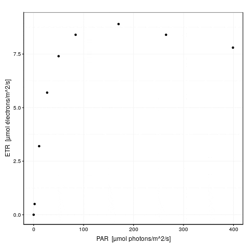

# Régression non linéaire {#reg-non-lin}

```{r setup, include=FALSE, echo=FALSE, message=FALSE, results='hide'}
SciViews::R("model", lang = "fr")
```

##### Objectifs {.unnumbered}

-   Comprendre comment ajuster une courbe dans un nuage de points à l'aide de la régression non linéaire par les moindres carrés

-   Apprendre à réaliser une régression non linéaire dans R, éventuellement en utilisant des modèles "self-start"

-   Comparer les modèles à l'aide du coefficient d'Akaike

-   Connaitre quelques-unes des courbes mathématiques les plus utilisées en biologie

##### Prérequis {.unnumbered}

-   Les modules 1 & 2 du cours concernant la régression linéaire sont une entrée en matière indispensable puisque la régression va être abordée ici comme une extension de ce qui a déjà été vu.

## Rendement photosynthétique

Afin d'avoir un premier aperçu de ce qu'est une régression non linéaire par les moindres carrés et comment on la calcule dans R, nous allons détailler un exemple concret. La posidonie *Posidonia oceanica* (L.) Delile (1813) est une plante à fleurs marine qui forme des herbiers denses en mer Méditerranée. Ses feuilles sont particulièrement adaptées à l'utilisation de la lumière qui règne à quelques dizaines de mètres en dessous de la surface où elle prospère en herbiers denses.

.jpg/800px-Posidonia_oceanica_(L).jpg)

Pour étudier le rendement de sa photosynthèse, c'est-à-dire la part du rayonnement lumineux reçu qui est effectivement utilisée pour initier la chaîne de transport d'électrons au sein de son photosystème II, nous pouvons utiliser un appareil spécialisé : le diving PAM.


Cet appareil est capable de déterminer le taux de transfert des électrons (ETR en µmol électrons/m^2^/s) par l'analyse de la fluorescence réémise par la plante lorsque ses photosites sont excités par une lumière monochromatique pulsée [@diving_pam2018]. Une façon de déterminer la réponse de la plante en rendement photosynthétique en fonction de l'intensité de la lumière reçue est de mesurer successivement l'ETR pour différentes intensités de lumière. En anglais cela s'appelle la "Rapid Light Curve" ou RLC en abrégé. Comme toutes les longueurs d'ondes lumineuses ne sont pas utilisables par la chlorophylle, l'intensité lumineuse est exprimée dans une unité particulière, le "PAR" ou "Photosynthetically Active Radiation" en µmol photons/m^2^/s qui ne prend en compte que les rayons utilisables. Une RLC représente donc la variation de l'ETR en fonction des PAR[^05-reg-non-lineaire-1]. Une RLC typique commence par une relation quasi linéaire aux faibles intensités, pour s'infléchir et atteindre un plateau de rendement maximum. Au-delà, si l'intensité lumineuse augmente encore, des phénomènes de photoinhibition apparaissent et le rendement diminue dans une troisième phase. Voici une RLC mesurée à l'aide du diving PAM sur une feuille de *P. oceanica*.

[^05-reg-non-lineaire-1]: Techniquement, l'ETR nécessite d'effectuer des mesures après stabilisation de la photosynthèse, ce qui prend plusieurs minutes. Donc, une courbe *rapide* est discutable de ce point de vue, mais reste un outil utile en écophysiologie où la comparaison de différentes RLCs indique un changement de capacité photosynthétique de la plante.

```{r}
rlc <- as_dtx(tribble(
  ~etr, ~par,
  0.0,  0,
  0.5,  2,
  3.2,  11,
  5.7,  27,
  7.4,  50,
  8.4,  84,
  8.9,  170,
  8.4,  265,
  7.8,  399
))
rlc <- labelise(rlc,
  label = list(
    etr = "ETR",
    par = "PAR"),
  units = list(
    etr = "µmol électrons/m^2/s",
    par = "µmol photons/m^2/s")
)
chart(data = rlc, etr ~ par) +
  geom_point()
```

Les trois phases successives sont bien visibles ici (linéaire pour des PAR de 0 à 25, plateau à des PAR de 150-200 et photoinhibition à partir de 200 PAR). Naturellement, une régression linéaire dans ces données n'a pas de sens. Une régression polynomiale d'ordre trois donne ceci :

```{r}
rlc_lm <- lm(data = rlc, etr ~  par + I(par^2) + I(par^3))
chart(rlc_lm)
```

La régression polynomiale tente maladroitement de s'ajuster dans les données, mais est incapable de retranscrire les trois phases correctement. En particulier, la troisième est incorrecte puisque le modèle semble indiquer une reprise du rendement aux intensités les plus élevées. **Une représentation incorrecte est à craindre lorsque le modèle mathématique utilisé ne représente pas les différentes caractéristiques du phénomène étudié. L'utilisation d'un modèle adéquat est possible ici seulement par régression non linéaire.** En effet, aucune transformation monotone croissante ou décroissante ne peut linéariser ce type de données.

```{block, type='info'}
**Quand passer à la régression non linéaire ?**

Nous pouvons être amenés à utiliser une régression non linéaire pour l'une de ces deux raisons, voire les deux en même temps :

- Lorsque le nuage de points est **curvilinéaire**, évidemment, mais après avoir tenté de le **linéariser** (et de résoudre un problème éventuel d’hétéroscédasticité ou de non-normalité des résidus) par **transformation** sans succès,

- En fonction de nos connaissances _a priori_ du phénomène. Tout phénomène issu d'un mécanisme dont nous connaissons le mode de fonctionnement menant à une équation mathématique non linéaire. Cela se rencontre fréquemment en physique, en chimie, et même en biologie (courbes de croissance, effet de modifications environnementales, courbes dose-réponse, etc.)
```

Les spécialistes de la photosynthèse ont mis au point différents modèles pour représenter les RLC. [@platt1980] ont proposé une formulation mathématique des phénomènes mis en jeu ici. Leur équation est la suivante :

$$ETR = ETR_{max} \cdot (1 - e^{-PAR \cdot \alpha/ETR_{max}}) \cdot e^{-PAR \cdot \beta/ETR_{max}}$$

avec $PAR$ la variable indépendante, $ETR$, la variable dépendante, et $ETR_{max}$, $\alpha$ et $\beta$, les trois paramètres du modèle. $ETR_{max}$ est le rendement maximum possible, $\alpha$ est la pente de la partie initiale linéaire avant infléchissement vers le maximum et $\beta$ est le coefficient de photoinhibition.

```{block, type='note'}
En matière de régression non linéaire, il est tout aussi important de bien comprendre les propriétés mathématiques de la fonction utilisée que de faire un choix judicieux du modèle. En particulier, il faut s'attacher à bien comprendre la signification (biologique) des paramètres du modèle. Non seulement, cela aide à en définir des valeurs initiales plausibles, mais c'est aussi indispensable pour pouvoir ensuite bien interpréter les résultats obtenus.
```

Nous pouvons facilement créer une fonction dans R qui représente ce modèle :

```{r}
pgh_model <- function(x, etr_max, alpha, beta)
  etr_max * (1 - exp(-x * alpha/etr_max)) * (exp(-x * beta/etr_max))
```

Le premier argument de la fonction *doit* être la variable indépendante (notée de manière générique `x`, mais n'importe quel nom fait l'affaire ici) et les autres arguments correspondent aux paramètres du modèle, donc `etr_max`, `alpha` et `beta`. Ce modèle peut être ajusté dans R à l'aide de la fonction `nls()` pour "Nonlinear Least Squares" (regression). Par contre, nous devons fournir une information supplémentaire (l'explication sera détaillée plus loin) : des valeurs approximatives de départ pour les paramètres. Nous voyons sur le graphique que `etr_max = 9` est une estimation plausible, mais il est difficile de déterminer `alpha` et `beta` rien qu'en regardant le graphique. Nous allons fixer `alpha = 1` (rendement max), et partir d'un modèle sans photoinhibition en utilisant `beta = 0`. Voici comment la régression non linéaire par les moindres carrés avec notre fonction `pgh_model` peut être calculée :

```{r, warning=FALSE}
rlc_nls <- nls(data = rlc, etr ~ pgh_model(par, etr_max, alpha, beta),
  start = list(etr_max = 9, alpha = 1, beta = 0))
# Note : tabularise() ne peut pas encore traiter les modèles non "self-start"
# (vous verrez ce que cela signifie plus loin) pour les équations. Donc,
# nous demandons le tableau SANS l'équation du modèle
summary(rlc_nls) |> tabularise(equation = FALSE)
# Une autre solution est de fournir l'équation en LaTeX à tabularise()
#summary(rlc_nls) |> tabularise(equation = "ETR = ETR_{max} \\cdot (1 - e^{-PAR \\cdot \\alpha/ETR_{max}}) \\cdot e^{-PAR \\cdot \\beta/ETR_{max}}")
```

La dernière ligne, "tolérance atteinte à la convergence" indique que le modèle a pu être calculé. Nous avons un tableau des paramètres qui ressemble très fort à celui de la régression linéaire, y compris les tests *t* de Student sur chacun des paramètres (H~0~: paramètre = 0, H~1~: paramètre ≠ 0). Nous obtenons `etr_max = 9.4`, `alpha = 0.33` et `beta = 0.0040`, avec tous les paramètres significativement différents de zéro au seuil $\alpha$ de 5%, mais pas $\beta$ au seuil $\alpha$ de 1%, ce qui montre qu'il est calculé avec le moins de précision des trois[^05-reg-non-lineaire-2]. Pour l'instant, nous allons conserver ce modèle tel quel. Notre modèle paramétré donne donc (ici, il faut écrire l'équation LaTeX soi-même) :

[^05-reg-non-lineaire-2]: Il faut faire attention ici, cela peut aussi signifier que nous n'avons pas assez de points après le plateau pour pouvoir estimer correctement $\beta$ !

$$ETR = 9.4 \cdot (1 - e^{-PAR \cdot 0.33/9.4}) \cdot e^{-PAR \cdot 0.0040/9.4}$$

Voyons ce que cela donne sur le graphique. Nous utiliserons pour ce faire une petite astuce qui consiste à utiliser `as.function()` pour transformer l'objet `nls` obtenu en une fonction utilisable par `stat_function()` pour le graphique {ggplot2} réalisé à l'aide de `chart()`[^05-reg-non-lineaire-3].

[^05-reg-non-lineaire-3]: Il est également possible de l'utiliser avec `curve()` pour un graphique de base dans R.

```{r}
chart(data = rlc, etr ~ par) +
  geom_point() +
  stat_function(fun = as.function(rlc_nls), col = "skyblue3", linewidth = 1)
# On peut aussi faire simplenet (mais c'est moins flexible) :
#chart(rlc_nls)
```

Ce modèle représente bien mieux le phénomène étudié, et il s'ajuste d'ailleurs beaucoup mieux également dans les données que notre modèle polynomial initial. Une comparaison sur base du critère d'Akaike est également en faveur de ce dernier modèle non linéaire (pour rappel, plus la valeur est faible, mieux c'est) :

```{r}
AIC(rlc_lm, rlc_nls)
```

**Nous venons de réaliser ensemble notre première régression non linéaire par les moindres carrés.** Étudions un petit peu plus dans le détail cette technique dans la section suivante. En effet, il est utile de connaitre et comprendre les différents pièges qui peuvent se présenter à nous pour les éviter.

##### À vous de jouer ! {.unnumbered}

`r h5p(46, height = 270, toc = "Bases de la régression non linéaire")`

## Principe

La régression non linéaire consiste à modéliser la variation d'une variable (dite variable réponse ou dépendante) par rapport à la variation d'une ou plusieurs autres variables (dites explicatives ou indépendantes). Le modèle utilisé pour représenter cette relation est une fonction mathématique de forme quelconque. Ceci constitue une généralisation de la régression linéaire où la fonction mathématique était nécessairement une droite ($y = a + bx$ dans le cas de la régression linéaire simple). La fonction est, dans la technique la plus courante, ajustée en minimisant la somme des carrés des résidus (écart entre les observations $y_i$ et les valeurs prédites par la droite, notées $\hat{y_i}$).

Lorsque le nuage de point ne s'étire pas le long d'une droite, nous pouvons tenter de transformer les données afin de les linéariser. Malheureusement, il existe de nombreux cas où la relation n'est pas linéarisable et la régression non linéaire est alors notre meilleur choix.

```{block, type='note'}
Il existe, en réalité, une autre raison pour laquelle nous pourrions être amenés à ne pas transformer les données pour les linéariser. Il s'agit du cas où les résidus ont une distribution correcte avec les données non transformées (distribution normale, et variance homogène --homoscédasticité--) lorsqu'on utilise un modèle non linéaire. Dans ce cas précis, une transformation pour linéariser les données devrait permettre d'utiliser une régression linéaire. Mais ce faisant, on rend alors les résidus non normaux et/ou on perd la propriété d'homoscédasticité, ce qui constitue une violation des conditions d'application de la régression par les moindres carrés que nous utilisons ici. Ainsi, dans ce cas-là, il vaut alors mieux ne pas transformer et utiliser plutôt une régression non linéaire à la place d'une régression linéaire pourtant plus simple d'emploi.
```

### Fonction objective

Nous appelons "fonction objective" la fonction qui quantifie la qualité de l'ajustement de sorte que plus le nombre renvoyé par cette fonction est petit, meilleur est l'ajustement. Cette fonction objective peut être définie librement, mais dans de nombreux cas, il s'agit du même critère que pour la régression linéaire par les moindres carrés, à savoir (considérant que la fonction $f$ que nous souhaitons ajuster a $k$ paramètres notés $p_1$, $p_2$, ..., $p_k$) :

$$f_{obj}(p_{1},p_{2},...,p_{k})=\sum_{i=1}^{n}(y_{i}-f(x_{i,}p_{1},p_{2},...,p_{k}))^{2}=\sum_{i}(y_{i}-\hat{{y_{i}}})^{2}$$

Notre fonction objective qui quantifie la qualité de l'ajustement du modèle est donc la somme des résidus ($y_i - \hat{y_i}$) élevés au carré.

### Calcul itératif

L'ajustement de notre courbe selon le modèle $y = f(x, p_1, p_2, ... p_k) + \epsilon$ avec les résidus $\epsilon \approx N(0, \sigma^2)$ peut se faire **de manière itérative**, en testant différentes valeurs des paramètres de la fonction, et en retenant au final la combinaison qui minimise le plus la fonction objective.

Par exemple, si notre courbe à ajuster est : $y = a x^b$, nous devrons estimer conjointement la valeur des deux paramètres $a$ et $b$ de la courbe. Bien qu'il s'agisse effectivement de la technique employée pour ajuster une courbe dans un nuage de point, `nls()` utilise ici des algorithmes d'optimisation efficaces pour trouver la solution plus rapidement. Une recherche en aveugle serait très peu efficace évidemment.

La description détaillée et les développements mathématiques de ces algorithmes d'optimisation sortent du cadre de ce cours. Nous renvoyons le lecteur intéressé à l'annexe C de [@sen1990]. Les algorithmes utilisés dans la fonction `nls()` sont :

-   **Gauss-Newton**, (par défaut), un algorithme utilisant la différentiation de la courbe et une expansion en série de Taylor pour approximer cette courbe par une série de termes additifs dont la solution peut être trouvée par régression linéaire multiple.

-   **plinear** de **Golub-Pereyra**, bien que peu répandu, est également implémenté. Il est utile en ce sens qu'il sépare les paramètres en deux sous-groupes : ceux qui sont linéaires dans la fonction (coefficients multiplicateurs de termes additifs) et ceux qui ne le sont pas. La recherche itérative ne se fait que sur les seconds. Les premiers étant estimés par régression linéaire. Ainsi, lorsque la fonction ne comporte que peu de paramètres non linéaires, l'algorithme converge beaucoup plus rapidement.

-   **Port** est également disponible. Il a la particularité, contrairement aux deux précédents, de permettre de définir des limites supérieures et inférieures acceptables pour chaque paramètre. Cela limite la recherche dans un domaine de validité, lorsque celui-ci peut être défini.

##### À vous de jouer ! {.unnumbered}

`r h5p(45, height = 270, toc = "Minimisation de la fonction objective")`

Reprenons le calcul de notre RLC pour *P. oceanica*. L'argument `trace = TRUE` peut être ajouté à l'appel de `nls()` pour visionner les différentes étapes du calcul itératif. Voici ce que cela donne :

```{r}
rlc_nls <- nls(data = rlc, etr ~ pgh_model(par, etr_max, alpha, beta),
  start = list(etr_max = 9, alpha = 1, beta = 0),
  trace = TRUE)
```

À gauche, nous avons la valeur de la fonction objective $f_{obj}$ suivi entre parenthèse de la tolérance (qui est expliquée plus bas), et à droite des deux points, la valeur actuelle des trois paramètres dans l'ordre `etr_max`, `alpha` et `beta`. La première ligne indique l'étape 0. $f_{obj}$ vaut 24,3 avec les valeurs par défaut. Dès l'étape suivante (itération #1), cette valeur est divisée par 6 et vaut 4,2. À ce stade, `etr_max = 8,5`, `alpha = 0,53` et `beta = -0,00040`. Les étapes #2 et #3 font encore significativement diminuer $f_{obj}$, et puis nous grappillons des décimales.

Voici une animation de ce processus :

```{r, echo=FALSE, include=FALSE, eval=FALSE}
params <- as_dtx(tribble(
  ~iter,    ~f_obj,     ~etr_max,  ~alpha,              ~beta,
      0,  24.34024,            9,            1,             0,
      1,  4.236559, 8.4785637209, 0.5324097242, -0.0004037391,
      2,  1.141967,  8.772552037,  0.289806296,   0.001855493,
      3, 0.1807006,  9.361592818,  0.325563316,   0.003954183,
      4, 0.1793698,  9.353620948,  0.327230129,   0.003990887,
      5, 0.1793659,  9.351296953,  0.327369993,   0.003982181,
      6, 0.1793658,   9.35108479,   0.32738331,    0.00398142,
      7, 0.1793658,  9.351064462,  0.327384565,   0.003981347
))

anim_plot <- chart(data = rlc, etr ~ par) +
  geom_point() +
  ggtitle("{next_layer}")
for (i in 1:8) {
  anim_plot <- anim_plot +
    stat_function(fun = pgh_model, col = "red",
      args = list(etr_max = params$etr_max[i],
        alpha = params$alpha[i], beta = params$beta[i]))
}
anim_plot +
  gganimate::transition_layers(layer_length = 1, transition_length = 0.5,
    from_blank = FALSE, keep_layers = c(Inf, 0, 0, 0, 0, 0, 0, 0, 0),
    layer_names = c("",
      paste("Iteration", 0:7, "- f_obj =", round(params$f_obj, 8))))
gganimate::anim_save("nls_anim.gif")
```



La convergence est considérée comme obtenue lorsque la différence de valeur de $f_{obj}$ d'une étape à l'autre tombe en dessous d'un **seuil de tolérance** que nous nous sommes fixé. C'est l'argument `control =` de `nls()` qui en reprend les détails, voir `?nls.control`. Les options sont :

-   `maxiter =` le nombre maximum d'itérations permises. Pour éviter de calculer à l'infini, nous arrêtons à cette valeur et décrétons que le calcul **n'a pas convergé**. La valeur pas défaut est de 50 itérations.

-   `tol =` le niveau de tolérance pour décider que l'on a convergé. C'est lui notre seuil de tolérance ci-dessus. Par défaut, il vaut `1e-05`, soit 0,00001. C'est une valeur *relative*. Cela signifie que la variation de la fonction objective ne doit pas être plus grande que cela *en valeur relative*, soit $|\frac{fobj_i - fobj_{i + 1}}{fobj_i}| < tol$.

-   ... d'autres arguments moins importants ici.

Comme nous pouvons le constater, le seuil de tolérance par défaut est très bas, de sorte que nous n'ayons besoin de le changer que très rarement.

### Pièges et difficultés

L'ajustement d'un modèle de manière itérative en utilisant un algorithme d'optimisation est une tâche délicate. Dans certains cas, la convergence est lente (il faut beaucoup d'étapes pour arriver au résultat). Dans d'autres cas, le processus s'interrompt à cause d'une singularité de la fonction à ajuster, d'une discontinuité, ou d'une fonction qui n'est pas définie sur une partie du domaine... Nous pouvons aussi rencontrer des divisions par zéro ou des paramètres qui tendent vers l'infini lors des calculs. Dans ce cas, **il faut tenter d'autres valeurs de départ**, voire changer le paramétrage de la fonction.

#### Valeurs initiales {.unnumbered}

La recherche de la solution optimale nécessite de partir de **valeurs de départ plausibles pour les paramètres du modèle** (c'est-à-dire, un ensemble de valeurs pour les paramètres tel que la courbe initiale est proche de la solution recherchée). Définir les valeurs initiales n'est pas toujours chose aisée, et de plus, le résultat final peut dépendre fortement de ces valeurs initiales. Si l'on choisit des valeurs initiales trop éloignées de la solution recherchée, on peut très bien se trouver enfermé dans une "fausse" solution (un minimum local de la fonction objective qui est moins bas que le minimum absolu que l'on recherche).

Considérons un cas fictif simple où la fonction à ajuster n'aurait qu'un seul paramètre $p$. Dans ce cas, nous pouvons visualiser la valeur de la fonction objective en fonction de la valeur choisie pour le paramètre $p$. Admettons que nous obtenons le graphique suivant pour cette représentation :

```{r, echo=FALSE}
chart(data = data.frame(p = c(-0.7, 1), f_obj = c(0, 20)), f_obj ~ p) +
  stat_function(fun = function(x) 5*x^5 - 5*x^3 + 0.8*x + 0.5, col = "red") +
  annotate("text", x = 0.75, y = 0.15, label = "minimum global") +
  annotate("text", x = -0.25, y = 0.35, label = "minimum local") +
  xlab("Paramètre p") +
  ylab("Valeur de la fonction objective")
```

Nous observons que la fonction objective a un **minimum global** pour $p$ valant 0,72. Par contre, un **minimum local** est également présent pour $p$ valant -0,26. Dans ce cas, si nous prenons une valeur de départ pour $p$ supérieure à 0,25, nous atterrirons dans le minimum global. Mais si nous prenons une valeur plus faible, par exemple 0 ou -0.5 comme valeur de départ, nous nous ferons **piéger dans le minimum local**. Dans ce cas, `nls()` déclarera qu'elle a convergé et que la valeur de $p$ vaut -0,26.

Si ce n'est toujours pas clair, imaginez que la courbe en rouge représente la forme d'un terrain sur lequel vous placer une balle à la position de départ. En fonction de l'endroit où vous la placer, la balle va glisser le long de la pente et finir par s'immobiliser dans une des deux cuvettes... mais celle de droite (minimum global) est plus profonde que celle de gauche (minimum local).

```{block, type='warning'}
Il vaut toujours mieux tester différentes combinaisons de valeurs de départ pour vérifier si la convergence se fait correctement et pour démasquer les cas de minima locaux.
```

#### Complexité du modèle {.unnumbered}

Lorsque la convergence a du mal à se faire, ceci est éventuellement lié à la complexité de la fonction que l'on cherche à ajuster. Les propriétés mathématiques de la courbe choisie peuvent très bien faire que cette courbe ne soit pas définie pour certaines valeurs des paramètres, ou qu'elle ait un comportement spécial dans un certain domaine (par exemple, courbe tendant vers l'infini). Ces cas sont difficilement traités par la plupart des algorithmes de minimisation de la fonction objective, et des erreurs de calcul de type "division par zéro", ou "résultat non défini" peuvent apparaître. Dans les meilleures implémentations (`nls()` en est une), des garde-fous ont été ajoutés dans le code de la fonction pour éviter les erreurs dans pareils cas. Toutefois, il n'est pas possible de traiter tous les cas. Ainsi, il arrive parfois que le modèle choisi ne soit pas ajustable dans les données.

Au final, l'ajustement d'un modèle non linéaire par les moindres carrés est une opération beaucoup plus délicate que l'ajustement par les moindres carrés d'un modèle linéaire. Dans le cas linéaire, la solution est trouvée de manière immédiate grâce à un calcul matriciel simple. Dans la version non linéaire, il n'existe souvent pas de solution miracle et le meilleur ajustement doit être recherché de manière itérative. Nous verrons ci-dessous que R propose, pour certains modèles appelés **'selfStart'** une solution élégante pour calculer automatiquement les valeurs initiales et pour converger très rapidement vers la solution recherchée, mais pour les modèles non implémentés sous forme **selfStart**, il faut tâtonner pour ajuster sa courbe.

### Modèles 'selfStart' dans R

Dans certains cas, il existe des petites astuces de calcul pour converger directement vers la solution, ou du moins, pour calculer des valeurs de départ très proches de la solution recherchée de sorte que l'algorithme de recherche pourra converger très rapidement. Par exemple, lorsqu'il est possible de linéariser le modèle en transformant les données. Dans ce cas, une bonne estimation des valeurs de départ des paramètres peut être obtenue en linéarisant la relation et en calculant les paramètres par régression linéaire. Ensuite, les paramètres obtenus sont retransformés dans leur forme initiale, et ils sont utilisés comme valeurs de départ.

Par exemple, si nous décidons d'ajuster un modèle allométrique de Huxley, de type $y = a x^b$[^05-reg-non-lineaire-4], nous pouvons linéariser la relation en transformant les deux variables en logarithmes. En effet, $\log(y) = \log(a x^b)$, ce qui est équivalent à une droite en développant: $\log(y) = b \log(x) + \log(a)$. Le paramètre $b$ devient donc la pente de la droite, et $\log(a)$ devient l'ordonnée à l'origine dans le modèle linéaire transformé. Une fois la droite ajustée, on a directement la valeur de $b$, et il suffit de calculer l'exponentielle de l'ordonnée à l'origine pour obtenir $a$. Toutefois, comme les résidus sont différents dans la relation non transformée initiale, il ne s'agit pas de la solution recherchée, mais d'un bon point de départ très proche de cette solution. On prendra les valeurs de $a$ et de $b$ ainsi calculées par la droite en double logarithme comme point de départ, et on laissera l'algorithme de recherche du minimum terminer le travail en mode non linéaire et donc, non transformé. En fait, c'est exactement de cette façon que les modèles dits **selfStart** fonctionnent dans R. Plus qu'une fonction, il s'agit en réalité d'un programme complet qui contient :

[^05-reg-non-lineaire-4]: Un modèle **selfStart** est disponible pour cette fonction dans le package {vegan}, voir `?vegan::SSarrhenius()`.

-   la fonction elle-même,
-   la résolution analytique de la dérivée première de la fonction en chaque point (utilisée par l'algorithme de convergence pour déterminer l'écart à apporter aux paramètres à l'itération suivante),
-   du code optimisé pour choisir les valeurs initiales idéales (proches du minimum global pour la $f_{obj}$) automatiquement,
-   du code pour optimiser la convergence, éventuellement.

Toutes les fonctions **selfStart** ont un nom commençant par `SS`. Nous pouvons donc les lister à l'aide de l'instruction suivante :

```{r}
apropos("^SS", ignore.case = FALSE)
```

Ensuite, nous recherchons l'aide relative à ces fonctions, par exemple via `?SSasymp` (note : il peut y avoir des faux positifs, comme `SSD` ici qui n'a rien à voir avec les fonctions **selfStart**).

## Modèles courants en biologie

Les domaines les plus courants où des modèles non linéaires sont utilisés en biologie concernent les cinétiques de réactions (chimiques, biochimiques), les courbes de type dose-réponse, les courbes de survie et les modèles de croissance. Nous verrons principalement divers modèles de croissance dans la section suivante. Certains de ces modèles, comme le modèle exponentiel, celui de Gompertz ou de Weibull sont aussi utilisés comme courbes de survie. De plus, la courbe logistique est un modèle classique de type dose-réponse. Ainsi, les différentes courbes de croissances recouvrent également une majorité des modèles utilisés dans d'autres domaines.

### Modèle de Michaelis-Menten

La fonction de Michaelis-Menten est bien connue pour modéliser des cinétiques chimiques simples, enzymatiques en particulier. Elle décrit la vitesse initiale d'une réaction chimique en fonction de la concentration des réactifs ou d'une enzyme selon le cas considéré. Son équation est :

$$V = \frac{V_{max} \cdot conc}{K + conc}$$

où $conc$ est la concentration des réactifs ou de l'enzyme au début de la réaction, c'est-à-dire, en absence de produits de cette réaction en mol/L, $V$ est la vitesse de réaction en mol/L/min. Le modèle a deux paramètres $V_{max}$ la vitesse maximale asymptotique en mol/L/min et $K$ en mol/L correspondant à la concentration telle que la vitesse est la moitié de $V_{max}$. Dans R, il existe un modèle **selfStart** facile à utiliser pour ajuster une courbe de type Michaelis-Menten. Il s'agit de la fonction `SSmicmen()`.

Voici le graphique d'un modèle Michaelis-Menten avec $V_{max} = 1$ et $K = 0,4$. Le trait horizontal en `Vm = 1` représente la vitesse maximale possible (asymptote horizontale du modèle). Nous voyons que cette vitesse maximale n'est atteinte que très lentement ici, et il faudrait que l'axe des X s'étende beaucoup plus sur la droite pour l'observer.

```{r}
micmen_data <- dtx(
  conc = seq(0, 10, by = 0.1),
  v    = SSmicmen(conc, Vm = 1, K = 0.5)
)
chart(data = micmen_data, v ~ conc) +
  geom_line() +
  xlab("Concentration [mol/L]") +
  ylab("Vitesse [mol/L/min]") +
  geom_vline(xintercept = 0, col = "darkgray") +
  geom_hline(yintercept = c(0.5, 1), col = "gray", linetype = "dashed") +
  geom_vline(xintercept = 0.4, col = "gray", linetype = "dashed") +
  annotate("text", label = "Vm", x = -0.4, y = 1) +
  annotate("text", label = "Vm/2", x = -0.5, y = 0.5) +
  annotate("text", label = "K", x = 0.5, y = 0.03)
```

Concernant les modèles utiles en chimie et biochimie, le modèle à compartiment de premier ordre permet de décrire la cinétique de transformation d'une substance au cours du temps. Voyez le modèle `?SSfol`. Il peut servir par exemple à déterminer la cinétique d'élimination d'une substance du sang après injection.

##### À vous de jouer ! {.unnumbered}

`r launch_shiny("https://sdd.umons.ac.be/B05Sa_micmen/", height = 600, delay = 20, toc = "Ajuster la meilleure courbe de Michaelis-Menten")`

### Modèles de croissance

Parmi les phénomènes biologiques courants qui sont essentiellement non linéaires, les modèles de croissance occupent une part importante. Il s'agit de phénomènes complexes, résultat d'un ensemble de processus, eux-mêmes très complexes : l'anabolisme, ou élaboration de matière organique et le catabolisme qui la détruit pour la transformer en énergie, en ce qui concerne la croissance somatique individuelle. Un modèle typique de croissance individuelle est le modèle de von Bertalanffy (von Bertalanffy, 1938, 1957).

Il existe un autre type de modèle de croissance : la croissance de populations. Ce type de modèle décrit l'évolution du nombre d'individus dans une population au cours du temps. Dans ce cas particulier, il s'agit également du résultat de plusieurs processus : la natalité, la mortalité et, éventuellement, les migrations. Une courbe type de modèle de croissance de population est la courbe logistique. Un autre modèle couramment utilisé est celui de Weibull pour décrire un nombre décroissant d'individus suite à une mortalité prédominante dans celle-ci.

De nombreux modèles de croissance différents sont disponibles. Certains sont exclusivement des modèles de croissance individuelle, d'autres sont exclusivement des modèles de croissance de populations, mais beaucoup peuvent être utilisés indifféremment dans les deux cas. Tous ont comme particularité d'être l'une ou l'autre forme de modèle exponentiel, exprimant ainsi le fait que la croissance est fondamentalement un processus exponentiel (comprenez que l'augmentation de masse ou du nombre d'individus est proportionnelle à la masse ou au nombre préexistant à chaque incrément temporel).

Nous allons décrire ci-dessous quelques-uns des modèles de croissance principaux. Ensuite, nous les utiliserons pour ajuster une courbe de croissance dans un jeu de données réel.

### Courbe exponentielle

En 1798, Thomas Malthus a décrit un modèle de croissance applicable pour décrire la croissance de la population humaine. Cependant, d'après Murray (1993), ce modèle a été suggéré en premier lieu par Euler. Quoi qu'il en soit, ce modèle n'est plus guère utilisé actuellement, mais son importance historique ne doit pas être négligée. Il s'agit, en effet, de la première modélisation mathématique d'une des caractéristiques les plus fondamentales de la croissance : son caractère exponentiel (positif ou négatif). Malthus a observé que la population des États-Unis double tous les 25 ans. Il suggère alors que les populations humaines augmentent d'une proportion fixe $r$ sur un intervalle de temps donné, lorsqu'elles ne sont pas affectées de contraintes environnementales ou sociales. Cette proportion $r$ est par ailleurs indépendante de la taille initiale de la population :

$$y_{t+1} = (1+r) \ y_t = k \ y_t$$

Une forme continue du modèle précédent (intervalle de temps infinitésimal) donne une équation différentielle :

$$\frac{d y(t)}{dt} = y'(t) = k \ y(t)$$

Cette équation différentielle admet la solution suivante :

$$y(t) = y_0 \ e^{k \ t}$$

avec $y_0$, la taille initiale de la population au temps $t = 0$. Ce modèle à deux paramètres est également intéressant parce qu'il montre une bonne manière de construire un modèle de croissance. Il suffit de décrire la croissance pour un accroissement infinitésimal de temps par le biais d'une équation différentielle, et ensuite de la résoudre (modélisation dynamique). Presque tous les modèles de croissance existants ont été élaborés de cette manière. Ainsi, la quasi-totalité des modèles de croissance correspondent en fait à une équation différentielle relativement simple.

Dans R, nous pourrons utiliser la fonction suivante :

```{r}
exponent <- function(x, y0, k)
  y0 * exp(k * x)
```

Voici un exemple d'un modèle de croissance exponentiel avec $y_0 = 1,5$ et $k = 0,9$. Le paramètre $y_0$ est indiqué sur le graphique.

```{r}
# Graphique avec y0 = 1.5 et k = 0.9
exponent_data <- dtx(
  t = seq(0, 3, by = 0.1),
  y = exponent(t, y0 = 1.5, k = 0.9)
)
chart(data = exponent_data, y ~ t) +
  geom_line() +
  geom_vline(xintercept = 0, col = "darkgray") +
  annotate("text", label = "y0", x = -0.05, y = 1.5)
```

Il existe aussi un modèle bi-exponentiel qui combine deux signaux exponentiels différents. Pour plus de détails, voyez `?SSbiexp`.

##### À vous de jouer ! {.unnumbered}

`r launch_shiny("https://sdd.umons.ac.be/B05Sb_exponent/", height = 600, delay = 20, toc = "Ajuster la meilleure courbe exponentielle")`

### Courbe logistique

Le modèle exponentiel décrit une croissance infinie sans aucune contrainte. Ce n'est pas une hypothèse réaliste. En pratique, la croissance est limitée par les ressources disponibles. Verhulst (1838), en travaillant aussi sur la croissance de populations, propose un modèle qui contient un terme d'auto-limitation $[y_\infty – y (t)] / y_\infty$ qui représente une quelconque limite théorique des ressources disponibles :

$$\frac{dy(t)}{dt} = k \ \frac{y_\infty - y(t)}{y_\infty} \ y(t) = - \frac{k}{y_\infty} \ y(t)^2 + k \ y(t)$$

Lorsque l'on résout et simplifie cette équation différentielle, on obtient :

$$y(t) = \frac{y_\infty}{1 + e^{-k \ (t - t_0)}}$$

Ceci est une des formes de la courbe logistique. Cette fonction a deux asymptotes horizontales en $y(t) = 0$ et $y(t) = y_\infty$ (voir schéma ci-dessous) et c'est une sigmoïde symétrique autour du point d'inflexion (les deux branches du S sont identiques). Le modèle **selfStart** correspondant dans R s'appelle `SSlogis()`. Ses paramètres sont `Asym` (= $y_\infty$), `xmid` (= $t_0$), et `scal` (= $k$).

Voici le graphique d'une courbe logistique avec $y_\infty = 0,95$, $t_0 = 5$ et $k = 1$.

```{r}
logis_data <- dtx(
  t = seq(0, 10, by = 0.1),
  y = SSlogis(t, Asym = 0.95, xmid = 5, scal = 1)
)
chart(data = logis_data, y ~ t) +
  geom_line() +
  geom_vline(xintercept = 0, col = "darkgray") +
  geom_hline(yintercept = c(0, 0.95/2, 0.95), col = "gray", linetype = "dashed") +
  geom_vline(xintercept = 5, col = "gray", linetype = "dashed") +
  annotate("text", label = "Asym", x = -0.4, y = 0.95) +
  annotate("text", label = "Asym/2", x = -0.5, y = 0.95/2) +
  annotate("text", label = "xmid", x = 5.4, y = 0.03) +
  annotate("text", label = "point d'inflexion", x = 6, y = 0.45)
```

Cette courbe sigmoïdale est asymptotique en 0 et $y_\infty$, et elle est également symétrique autour de son point d'inflexion situé à ${t_0, y_\infty / 2}$.

##### À vous de jouer ! {.unnumbered}

`r launch_shiny("https://sdd.umons.ac.be/B05Sc_logis/", height = 600, delay = 20, toc = "Ajuster la meilleure courbe logistique")`

Il est possible de généraliser ce modèle en définissant une courbe logistique dont l'asymptote basse peut se situer n'importe où ailleurs qu'en 0. Si cette asymptote se situe en $y_0$, nous obtenons l'équation :

$$y(t) = y_0 + \frac{y_\infty - y_0}{1 + e^{-k \ (t - t_0)}}$$

Ceci est le modèle logistique généralisé à quatre paramètres (modèle **selfSart** `SSfpl()` dans R, pour **f**our-**p**arameters **l**ogistic). Les arguments sont `A`, la première asymptote horizontale (= $y_0$), `B`, la seconde asymptote horizontale (= $y_\infty$), `xmid` (= $t_0$) et `scal` (= $k$).

Le graphique ressemble très fort à celui de la fonction logistique, mais la première asymptote n'est plus nécessairement à 0 (ici, $y_0$ = 0,15).

```{r}
fpl_data <- dtx(
  t = seq(0, 10, by = 0.1),
  y = SSfpl(t, A = 0.15, B = 0.95, xmid = 5, scal = 1)
)
chart(data = fpl_data, y ~ t) +
  geom_line() +
  geom_vline(xintercept = 0, col = "darkgray") +
  geom_hline(yintercept = c(0.15, 0.8/2 + 0.15, 0.95), col = "gray", linetype = "dashed") +
  geom_vline(xintercept = 5, col = "gray", linetype = "dashed") +
  annotate("text", label = "A", x = -0.4, y = 0.15) +
  annotate("text", label = "B", x = -0.4, y = 0.95) +
   annotate("text", label = "xmid", x = 5.4, y = 0.13) +
  annotate("text", label = "point d'inflexion", x = 6.1, y = 0.53)
```

##### À vous de jouer ! {.unnumbered}

`r launch_shiny("https://sdd.umons.ac.be/B05Sd_gen_logis/", height = 600, delay = 20, toc = "Ajuster le meilleur modèle logistique généralisé")`

### Modèle de Gompertz

Gompertz (1825) a observé de manière empirique que le taux de survie décroît souvent de manière proportionnelle au logarithme du nombre d'animaux qui survivent. Bien que ce modèle reste utilisé pour décrire des courbes de survie, il trouve de nombreuses applications pour décrire également des données de croissance. L'équation différentielle du modèle de Gompertz est :

$$\frac{dy(t)}{dt} = k \ [ \ln y_\infty - \ln y(t)] \ y(t)$$

qui se résout et se simplifie en :

$$y(t) = y_\infty \ e^{-k \ (t - t_0)} = y_\infty \ e^{-a \cdot b^t} = y_\infty \ a^{e^{-k \ t}} = y_\infty \ a^{b^t}$$

La dernière forme apparaît plus simple et est le plus souvent utilisée. La première forme est directement dérivée de l'équation différentielle et donne une meilleure comparaison avec la courbe logistique, puisque $t_0$ correspond aussi à l'abscisse du point d'inflexion, qui n'est plus en position symétrique ici (voir figure ci-dessous). Le modèle **selfStart** correspondant dans R s'appelle `SSgompertz()`. Sa paramétrisation correspond à la seconde forme, mais avec $a$ appelé `b2` et $b$ appelé `b3` ($y(t) = Asym \ e^{-b2 \cdot b3^t}$).

Voici le graphique d'une courbe de Gompertz avec $y_\infty = 0,95$, $a = 5$ et $b = 0,5$.

```{r}
gomp_data <- dtx(
  t = seq(0, 10, by = 0.1),
  y = SSgompertz(t, Asym = 0.95, b2 = 5, b3 = 0.5)
)
chart(data = gomp_data, y ~ t) +
  geom_line() +
  geom_vline(xintercept = 0, col = "darkgray") +
  geom_hline(yintercept = c(0, 0.95/exp(1), 0.95), col = "gray", linetype = "dashed") +
  geom_vline(xintercept = 2.3, col = "gray", linetype = "dashed") +
  annotate("text", label = "Asym", x = -0.4, y = 0.95) +
  annotate("text", label = "Asym/e", x = -0.5, y = 0.95/exp(1)) +
  annotate("text", label = "point d'inflexion", x = 3.5, y = 0.32)
```

##### A vous de jouer ! {.unnumbered}

`r launch_shiny("https://sdd.umons.ac.be/B05Se_gompertz/", height = 600, delay = 20, toc = "Ajuster le meilleur modèle de Gompertz")`

### Modèles de von Bertalanffy

Le modèle de von Bertalanffy, parfois appelé Brody-Bertalanffy (d'après les travaux de von Bertalanffy et Brody) ou modèle de Pütter (dans Ricker, 1979 notamment), est la première courbe de croissance qui a été élaborée spécifiquement pour décrire la croissance somatique individuelle. Il est basé sur une analyse bioénergétique simple. Un individu est vu comme un réacteur biochimique dynamique où les entrées (anabolisme) sont en compétition avec les sorties (catabolisme). Le résultat de ces deux flux étant la croissance. L'anabolisme est plus ou moins proportionnel à la respiration et cette dernière est proportionnelle à une surface pour beaucoup d'animaux (la surface développée des poumons ou des branchies), soit encore, les 2/3 de la masse. Le catabolisme est toujours proportionnel à la masse. Ces relations mécanistiques sont rassemblées dans l'équation différentielle suivante où $y(t)$ mesure l'évolution d'un volume ou d'un poids au cours du temps :

$$\frac{dy(t)}{dt} = a \ y(t)^{2/3} - b \ y(t)$$

En résolvant cette équation, nous obtenons le modèle de croissance pondérale de von Bertalanffy :

$$y(t) = y_\infty \ (1 - e^{-k \ (t - t_0)})^3$$

La forme la plus simple de ce modèle est obtenue lorsque nous mesurons des dimensions linéaires pour quantifier la taille de l'organisme, car une dimension linéaire est, en première approximation, la racine cubique d'une masse, proportionnelle au volume à densité constante (sans prendre en compte une possible allométrie). Le modèle de von Bertalanffy pour des mesures linéaires est alors :

$$y(t) = y_\infty \ (1 - e^{-k \ (t - t_0)})$$

Un graphique des deux modèles est présenté ci-dessous. Le modèle de von Bertalanffy pour mesures linéaires n'a pas de point d'inflexion. La croissance est la plus rapide à la naissance et ne fait que diminuer avec le temps pour finalement atteindre zéro lorsque la taille maximale asymptotique est atteinte. Avec ce modèle, la croissance est donc déterminée et elle ne peut dépasser cette asymptote horizontale située en $y(t)= y_\infty$. A cause de la puissance cubique de la forme pondérale du modèle von Bertalanffy, cette dernière est une sigmoïde asymétrique, comme l'est le modèle de Gompertz également. Trois modèles **selfStart** existent dans R : `SSasympOff()`, `SSasymp()` et `SSasympOrig()`.

-   `SSAsympOff()` est définie comme $y(t) = y_\infty \ (1 - e^{-e^{lrc} \ (t - t_0)})$. Ici $k$ est remplacé par $e^{lrc}$. Cette astuce permet d'avoir un paramètre $k$ qui ne prend pas de valeur négative, puisque l'exponentielle d'une valeur négative est un nombre compris entre 0 et 1. Donc, un $lrc$ négatif donne un $k$ compris entre 0 et 1. Cela permet de contraindre un paramètre du modèle sans nécessité de passer obligatoirement par l'algorithme "Port". A noter finalement que $y_\infty$ s'appelle `Asym` dans tous les modèles **selfStart** dans R, y compris ici, et que $t_0$ s'appelle ici `c0`.

-   `SSAsymp()` est définie comme $y(t) = y_\infty + (R_0 - y_\infty) \ e^{-e^{lrc} \cdot t}$. Par rapport à la forme habituelle, outre l'astuce de $e^{lrc}$ à la place de $k$, $t_0$ est également reparamétré en $R_0$ qui représente la taille initiale au temps $t = 0$. Cela met l'accent sur cette "taille à la naissance".

```{block, type='info'}
**Reparamétriser un modèle** consiste à exprimer la fonction mathématique qui le représente d'une façon différente. Étant donné que l'interprétation biologique des paramètres fait partie des objectifs de la méthode. On parle d'approche **mécanistique**, qui vise à décrypter le mécanisme sous-jacent *versus* une approche purement **empirique** basée sur les données uniquement avec un modèle polynomial tout venant, par exemple.

Ainsi, L'équation du modèle de von Bertalanffy présentée au début montre une paramétrisation "classique", implémentée dans `SSasympOff()` alors que `SSasymp()` met la taille initiale en évidence via le paramètre $R_0$.
```

-   `SSasympOrig()` force le modèle à passer par l'origine des axes {0, 0}. Il n'y a donc plus que deux paramètres `Asym` = $y_\infty$ et `lrc` tel que $k = e^{lrc}$. Ce modèle simplifié est souvent utile en pratique. Il a l'avantage d'être simple, avec seulement deux paramètres. Il est l'équivalent d'une droite forcée à zéro pour le modèle von Bertalanffy. Si `R0` dans `SSasymp()` ou `c0` dans `SSasympOff()` ne sont pas significativement différents de zéro (test *t* de Student dans le tableau des paramètres), vous pouvez envisager de simplifier le modèle vers `SSasympOrig()`.

Le modèle von Bertalanffy en poids n'est pas implémenté, nous devons utiliser une fonction personnalisée dans ce cas (avec une paramétrisation similaire à `SSasympOff()` :

```{r}
asympOff3 <- function(x, Asym, lrc, c0, m) Asym*(1 - exp(-exp(lrc) * (x - c0)))^3
```

Voici les deux modèles de von Bertalanffy présentés sur le même graphique avec $y_\infty$ (alias `Asym`) = 0,95, `lrc` = 0,1 et $t_0$ (alias `c0`) = 0.

```{r}
vb_data <- dtx(
  t  = seq(0, 10, by = 0.1),
  y  = SSasympOff(t, Asym = 0.95, lrc = 0.1, c0 = 0),
  y3 = asympOff3(t, Asym = 0.95, lrc = 0.1, c0 = 0),
)
chart(data = vb_data, y ~ t %col=% "VB en taille") +
  geom_line() +
  geom_line(f_aes(y3 ~ t %col=% "VB en poids")) +
  geom_vline(xintercept = 0, col = "darkgray") +
  geom_hline(yintercept = 0.95, col = "gray", linetype = "dashed") +
  annotate("text", label = "Asym", x = -0.4, y = 0.95) +
  labs(color = "Modèle")
```

Dans les deux cas l'asymptote représentant la taille maximale possible vaut 0,95. Pour le modèle pondéral, c'est le cube de la valeur obtenue avec `SSasympOff()` appliquée sur la racine cubique des masses. Dans les deux cas, `lrc = 0,1` donc $k = e^{0,1} = 1,1$ et `c0 = 0`, la droite passe par l'origine (donc, nous aurions également pu utiliser `SSasympOrig()` pour générer ces données.

### Modèle de Richards

La forme généralisée du modèle de von Bertalanffy est :

$$y(t) = y_\infty \ (1 - e^{-k \ (t - t_0)})^m$$

Von Bertalanffy (1938, 1957) a fixé $m$ à 1 ou à 3. Richards (1959) permet à $m$ de varier librement, et donc son modèle a un paramètre de plus. Cette dernière courbe est très flexible (voir schéma ci-dessous) et il est possible de démontrer que plusieurs autres modèles de croissance ne sont que des cas particuliers de ce modèle généraliste avec différentes valeurs de $m$. Nous avons déjà observé que le modèle de Richards se réduit aux deux modèles de von Bertalanffy quand $m = 1$ et $m = 3$. Il se réduit aussi à une courbe logistique lorsque $m = -1$ et il est possible de montrer qu'il converge vers le modèle de Gompertz lorsque $|m| \rightarrow \infty$. Il n'existe aucun modèle **selfStart** pour la courbe de Richards dans R à notre connaissance. Par ailleurs, il s'agit d'un modèle particulièrement délicat à ajuster, comme nous le verrons dans un exemple concret plus loin dans la section "choix du modèle".

Avec une paramétrisation proche de celle de `SSasympOff()`, la fonction de Richards peut s'écrire comme ceci :

```{r}
richards <- function(x, Asym, lrc, c0, m) Asym*(1 - exp(-exp(lrc) * (x - c0)))^m
```

Voici l'allure de différentes courbes de Richards en fonction de la valeur de $m$ (0,5, 1, 3, 6 et 9) avec $lrc = 0,1$, $y_\infty = 0,95$ et $t_0 = 0$ pour toutes les courbes.

```{r}
rich_data <- dtx(
  t   = seq(0, 10, by = 0.1),
  y   = richards(t, Asym = 0.95, lrc = 0.1, c0 = 0, m = 1),
  y05 = richards(t, Asym = 0.95, lrc = 0.1, c0 = 0, m = 0.5),
  y3  = richards(t, Asym = 0.95, lrc = 0.1, c0 = 0, m = 3),
  y6  = richards(t, Asym = 0.95, lrc = 0.1, c0 = 0, m = 6),
  y9  = richards(t, Asym = 0.95, lrc = 0.1, c0 = 0, m = 9)
)
chart(data = rich_data, y ~ t %col=% "m = 1") +
  geom_line() +
  geom_line(f_aes(y05 ~ t %col=% "m = 0.5")) +
  geom_line(f_aes(y3 ~ t %col=% "m = 3")) +
  geom_line(f_aes(y6 ~ t %col=% "m = 6")) +
  geom_line(f_aes(y9 ~ t %col=% "m = 9")) +
  geom_vline(xintercept = 0, col = "darkgray") +
  geom_hline(yintercept = 0.95, col = "gray", linetype = "dashed") +
  annotate("text", label = "Asym", x = -0.4, y = 0.95) +
  labs(color = "Richards avec :")
```

##### À vous de jouer ! {.unnumbered}

`r launch_shiny("https://sdd.umons.ac.be/B05Sf_richards/", height = 600, delay = 20, toc = "Ajuster le meilleur modèle de Richards")`

### Modèle de Weibull

Depuis son introduction en 1951 par Weibull, ce modèle est présenté comme polyvalent. Il a été décrit à l'origine comme une distribution statistique. Il trouve de nombreuses applications en croissance de population (éventuellement négative), et il est utilisé également pour décrire la courbe de survie en cas de maladie ou dans des études de dynamique de populations. Il a parfois été utilisé comme un modèle de croissance. La forme la plus générale de ce modèle est  :

$$y(t) = y_\infty - d \ e^{-k \ t^m}$$

avec $d = y_\infty - y_0$. Un modèle à trois paramètres est également utilisé où $y_0 = 0$. La fonction est sigmoïdale lorsque $m > 1$, sinon elle ne possède pas de point d'inflexion (voir graphique ci-dessous). Dans R, le modèle **selfStart** s'appelle `SSweibull()`. Comme pour le modèle von Bertalanffy, le paramètre $k$ est contraint à une valeur positive via l'astuce $k = e^{lrc}$. Comme d'habitude, $y_\infty$ se nomme `Asym`. $d$ est ici appelé `Drop` et $m$ est appelé `pwr`.

Voici l'allure de différentes courbes de Weibull pour respectivement $m$ (alias `pwr`) = 5, 2, 1 et 0,5, avec $lrc = -0,5$ (donc, $k = e^{-0,5}$ = 0,61), $y_\infty$ (alias `Asym`) = 0,95 et $y_0= 0,05$, ce qui donne $d$ (alias `Drop`) = 0,95 - 0,05 = 0,9. La courbe avec $m = 1$ est équivalente à un modèle de von Bertalanffy linéaire. Toutes les courbes démarrent en $y_0$ et passent par $y_\infty - d \ e^{-k}$ qui est également le point d'inflexion pour les sigmoïdes lorsque $m > 1$.

```{r}
weib_data <- dtx(
  t   = seq(0, 10, by = 0.1),
  y   = SSweibull(t, Asym = 0.95, Drop = 0.9, lrc = -0.5, pwr = 1),
  y05 = SSweibull(t, Asym = 0.95, Drop = 0.9, lrc = -0.5, pwr = 0.5),
  y2  = SSweibull(t, Asym = 0.95, Drop = 0.9, lrc = -0.5, pwr = 2),
  y5  = SSweibull(t, Asym = 0.95, Drop = 0.9, lrc = -0.5, pwr = 5)
)
chart(data = weib_data, y ~ t %col=% "m = 1") +
  geom_line() +
  geom_line(f_aes(y05 ~ t %col=% "m = 0.5")) +
  geom_line(f_aes(y2 ~ t %col=% "m = 2")) +
  geom_line(f_aes(y5 ~ t %col=% "m = 5")) +
  geom_vline(xintercept = 0, col = "darkgray") +
  geom_hline(yintercept = c(0.05, 0.95, 0.95 - 0.9 * exp(-exp(-0.5))),
    col = "gray", linetype = "dashed") +
  annotate("text", label = "Asym", x = -0.4, y = 0.95) +
  annotate("text", label = "y0", x = -0.4, y = 0.05) +
  annotate("text", label = "Asym-d*e^-k", x = 0, y = 0.95 - 0.9 * exp(-exp(-0.5))) +
  annotate("text", label = "point d'inflexion si m > 1", x = 3, y = 0.43) +
  labs(color = "Weibull avec :")
```

### Modèle Preece-Baines 1

Preece et Baines (1978) ont décrit plusieurs modèles spécifiques à la croissance humaine. Ces modèles combinent deux phases de croissance exponentielle pour représenter la croissance graduelle d'enfants suivie par une courte phase de croissance accélérée à l'adolescence, mais qui atteint rapidement un plateau correspondant à la taille adulte définitive (voir graphique ci-dessous). Ce type de modèle est naturellement très utile pour tous les mammifères, mais certains, comme le modèle 1 présenté ici, ont aussi été utilisés dans d'autres circonstances, profitant de sa grande flexibilité. Son équation est :

$$y(t) = y_\infty - \frac{2 (y_\infty - d)}{e^{k1 \ (t - t_0)} + e^{k2 \ (t - t_0)}}$$

Dans R, la fonction à utiliser (avec une paramétrisation similaire à celle des autres modèles **selfStart**) est :

```{r}
preece_baines1 <- function(x, Asym, Drop, lrc1, lrc2, c0)
  Asym - (2 * (Asym - Drop)) / (exp(exp(lrc1) * (x - c0)) + exp(exp(lrc2) * (x - c0)))
```

$k1$ et $k2$ sont forcés à des valeurs positives ou nulles grâce à l'astuce de passer par `lrc1` et `lrc2`. $d$ est `Drop` et $t_0$ est `c0`.

Ci-dessous un exemple de courbe Preece-Baines 1 avec $y_\infty$ (alias `Asym`) = 0,95, $d$ (alias `Drop`) = 0,8, $k1 = 0,19$ (alias `lrc1` = log(0,19) = -1,7), $k2 = 2,5$ (alias `lrc2`= log(2,5) = 0,92) et $t_0$ (alias `c0`) = 6.

```{r}
pb1_data <- dtx(
  t = seq(0, 10, by = 0.1),
  y = preece_baines1(t, Asym = 0.95, Drop = 0.8, lrc1 = -1.7, lrc2 = 0.92, c0 = 6)
)
chart(data = pb1_data, y ~ t) +
  geom_line() +
  geom_vline(xintercept = 0, col = "darkgray") +
  geom_hline(yintercept = 0.95, col = "gray", linetype = "dashed") +
  annotate("text", label = "Asym", x = -0.4, y = 0.95)
```

### Modèle de Tanaka

Tous les modèles précédents sont asymptotiques, à l'exception de la courbe exponentielle (mais cette dernière ne modélise valablement que la phase de croissance initiale). Tous ces modèles décrivent donc une **croissance déterminée** qui n'excédera jamais une taille maximale représentée par une asymptote horizontale en $y(t) = y_\infty$. Knight (1968) s'est demandé s'il s'agit d'une réalité biologique ou simplement d'un artéfact mathématique. Dans le second cas, la croissance n'apparaîtrait déterminée que parce que les modèles choisis pour la représenter sont asymptotiques. Pour s'affranchir d'une telle contrainte, Tanaka (1982, 1988) a élaboré un nouveau modèle de croissance qui décrit une croissance non déterminée :

$$y(t) = \frac{1}{\sqrt{b}} \ \ln |2 \ b \ (t - t_0) + 2 \ \sqrt{b^2 \ (t - t_0)^2 + a \ b}| + d$$

Ce modèle complexe à quatre paramètres a une période initiale de croissance lente, suivie d'une période de croissance exponentielle qui se poursuit par une croissance continue, mais plus faible tout au long de la vie de l'animal ou du végétal (voir graphique ci-dessous).

Dans R, nous pouvons utiliser la fonction suivante pour ajuster un modèle de Tanaka :

```{r}
tanaka <- function(x, a, b, c0, d)
  1 / sqrt(b) * log(abs(2 * b * (x - c0) + 2 * sqrt(b^2 * (x - c0)^2 + a * b))) + d
```

Ci-dessous, un exemple de courbe de Tanaka avec $a$ = 3, $b$ = 2,5, $d$ = -0,2 et $t_0$ (alias `c0`) = 2.

```{r}
tanaka_data <- dtx(
  t = seq(0, 10, by = 0.1),
  y = tanaka(t, a = 3, b = 2.5, c0 = 2, d = -0.2)
)
chart(data = tanaka_data, y ~ t) +
  geom_line() +
  geom_vline(xintercept = 0, col = "darkgray")
```

## Choix du modèle

Le choix d'un modèle non linéaire fait intervenir des critères identiques à ceux d'un modèle linéaire (qualité d'ajustement évaluée par l'AIC, inspection visuelle de l'ajustement dans le nuage de points), mais il fait aussi intervenir une dimension supplémentaire : le choix de la fonction mathématique à ajuster. Comme nous venons de le voir au travers de quelques modèles courants en biologie, le nombre de fonctions mathématiques résultant en des formes similaire, par exemple de type sigmoïde, est grand. Ainsi, le choix de la meilleure fonction à utiliser dans un cas particulier est rendu plus difficile.

Nous allons illustrer l'ajustement d'une courbe non linéaire par le choix et l'ajustement d'un modèle de croissance dans un jeu de données en modélisant la croissance somatique de l'oursin *Paracentrotus lividus* [@grosjean2001]. Ce jeu de données est disponible dans le package `data.io`, sous le nom `urchin_growth`.

```{r}
SciViews::R("model", lang = "fr")
urchins <- read("urchin_growth", package = "data.io")
chart(data = urchins, diameter ~ age) +
  geom_point()
```

Comme vous pouvez le voir, différents oursins ont été mesurés via le diamètre de leur test à son ambitus (zone la plus large du squelette de l'oursin, hors piquants) en mm à différents âges (en années). Les mesures ont été effectuées tous les 3 à 6 mois pendant plus de 10 ans, ce qui donne un bon aperçu de la croissance de cet animal y compris la taille maximale asymptotique qui est atteinte vers les 4 à 5 ans (pour ce genre de modèle, il est très important de continuer à mesurer les animaux afin de bien quantifier cette taille maximale asymptotique). Ainsi, l'examen du graphique nous permet d'emblée de choisir un modèle à croissance finie (pas le modèle de Tanaka, donc), et de forme sigmoïdale. Le modèle logistique, Weibull ou Gompertz pourrait convenir par exemple. Nous pouvons à ce stade, essayer différents modèles et choisir celui qui nous semble le plus adapté.

Le choix du meilleur modèle se fait grâce à deux critères :

1.  Les connaissances théoriques et *a priori* du modèle que l'on ajuste. En effet, il n'existe qu'un seul modèle linéaire, mais une infinité de modèles curvilinéaires qui peuvent s'ajuster dans les données. Le choix du meilleur modèle se fait en fonction de considérations sur le phénomène sous-jacent qui doivent se refléter dans les propriétés mathématiques de la courbe choisie. Par exemple, si on sait que la croissance est asymptotique vers une taille maximale, nous devrons choisir une courbe mathématique qui présente une asymptote horizontale à son maximum pour représenter au mieux le phénomène étudié.

2.  Le coefficient de détermination *R*^2^ n'est pas calculé par R pour une régression non linéaire, car sa validité est sujette à discussion entre les statisticiens (d'autres logiciels statistiques le calculent). Nous n'avons donc pas d'estimation de la qualité de l'ajustement par ce biais, comme dans le cas de la régression linéaire. Par contre, il est possible de calculer un autre critère plus fiable que nous avons déjà utilisé : le **critère d'Akaike** (fonction `AIC()` dans R). Ce critère tient compte à la fois de la qualité d'ajustement et de la complexité du modèle, exprimée par le nombre de paramètres qu'il faut estimer. Plus le modèle est complexe, plus on peut s'attendre à ce qu'il s'ajuste bien dans les données, car il est plus flexible. Cependant, en ce domaine, la complexité n'est pas forcément un gage de qualité. On recherche plutôt un compromis entre meilleur ajustement et simplicité. Le critère d'information d'Akaike quantifie précisément ce compromis, c'est-à-dire que le modèle qui a un AIC le plus faible est considéré comme le meilleur. Appliquons donc ce concept pour sélectionner le meilleur modèle de croissance pour décrire la croissance somatique de nos oursins après avoir sélectionné les modèles candidats les plus judicieux (modèles sigmoïdaux avec asymptote horizontale au maximum).

Notons toutefois que, comme les animaux sont mesurés aux mêmes âges, tous les 3 à 6 mois, certains points se superposent. Afin d'afficher tous les points, il est utile d'utiliser la fonction `geom_jitter()` à la place de `geom_point()` qui décale les points d'une valeur aléatoire pour éviter ces superpositions (l'argument `width =` indique le décalage maximum à appliquer). Voici ce que cela donne (en ajoutant également un titre avec formatage correct du nom en latin)  :

```{r}
urchins_plot <- chart(data = urchins, diameter ~ age) +
  geom_jitter(width = 0.1, alpha = 0.2, color = "darkgrey") +
  ggtitle(expression(paste("Croissance de l'oursin ", italic("Paracentrotus lividus"))))
urchins_plot
```

Nous avons ici également représenté les points de manière semi-transparente avec `alpha = 0.2` (transparence de 20%) pour encore mieux mettre en évidence les points de mesures qui se superposent.

Ajustons maintenant un modèle de Gompertz (modèle **selfStart**, notez qu'ici `tabularise()` est capable de calculer l'équation du modèle tout seul) :

```{r, warning=FALSE}
urchins_gomp <- nls(data = urchins, diameter ~ SSgompertz(age, Asym, b2, b3))
summary(urchins_gomp) |> tabularise()
```

Utilisons maintenant l'astuce de `stat_function()` combinée à `as.function.nls()` pour ajouter la courbe sur le graphique.

```{r}
urchins_plot +
  stat_function(fun = as.function(urchins_gomp), color = "red", linewidth = 1)
```

L'ajustement de cette fonction semble très bon, à l'œil. Voyons ce qu'il en est d'autres modèles. Par exemple, une courbe logistique :

```{r, warning=FALSE}
urchins_logis <- nls(data = urchins, diameter ~ SSlogis(age, Asym, xmid, scal))
summary(urchins_logis) |> tabularise()
```

Et voici le graphique avec les deux modèles superposés :

```{r}
urchins_plot +
  stat_function(fun = as.function(urchins_gomp), aes(color = "Gompertz"), linewidth = 1) +
  stat_function(fun = as.function(urchins_logis), aes(color = "logistique"), linewidth = 1) +
  labs(color = "Modèle")
```

Notez qu'ici, la couleur a été incluse dans le "mapping" (argument `mapping =`) de `stat_function()` en l'incluant dans `aes()`. Cela change fondamentalement la façon dont la couleur est perçue par {ggplot2}. Dans ce cas-ci, la valeur est interprétée non comme une couleur à proprement parler, mais comme un niveau (une couche) à inclure dans le graphique et à reporter via une légende. Ensuite, à l'aide de `labs()` on change le titre de la légende relatif à la couleur par un nom plus explicite : "Modèle".

Nous pouvons comparer ces modèles à l'aide du critère d'Akaike.

```{r}
AIC(urchins_gomp, urchins_logis)
```

Comme on peut le voir clairement sur le graphique, la courbe logistique donne une autre solution, cette dernière est à peine moins bonne que le modèle de Gompertz, selon le critère d'Akaike. Pourtant, la courbe est assez bien démarquée de celle de Gompertz. Essayons maintenant un modèle de Weibull. Ce modèle est plus complexe, car il a quatre paramètres au lieu de trois pour les deux modèles précédents :

```{r, warning=FALSE}
urchins_weib <- nls(data = urchins, diameter ~ SSweibull(age, Asym, Drop, lrc, pwr))
summary(urchins_weib) |> tabularise()
```

Ajoutons ce nouveau modèle sur le graphique :

```{r}
urchins_plot +
  stat_function(fun = as.function(urchins_gomp), aes(color = "Gompertz"), size = 1) +
  stat_function(fun = as.function(urchins_logis), aes(color = "logistique"), size = 1) +
  stat_function(fun = as.function(urchins_weib), aes(color = "Weibull"), size = 1) +
  labs(color = "Modèle")
```

... et comparons à l'aide du critère d'Akaike :

```{r}
AIC(urchins_gomp, urchins_logis, urchins_weib)
```

Ce modèle fait presque jeu égal avec le modèle de Gompertz d'après le critère d'Akaike ; juste un tout petit peu mieux. En fait, les deux courbes sont pratiquement superposées l'une à l'autre, mais le modèle de Weibull à un démarrage de croissance plus lent au début, ce qui reflète mieux ce que l'on observe dans les données. Par contre, il est pénalisé par le fait que c'est un modèle plus complexe qui possède un paramètre de plus. L'un dans l'autre, le critère d'information d'Akaike considère donc les deux modèles sur pratiquement le même plan du point de vue de la qualité de leurs ajustements respectifs.

À ce stade, nous voudrions également essayer un autre modèle flexible à quatre paramètres : le modèle de Richards. Malheureusement, il n'existe pas de fonction **selfStart** dans R pour ce modèle. Nous sommes donc réduits "à mettre les mains dans le cambouis", à définir la fonction nous-mêmes, à trouver de bonnes valeurs de départ, etc. Voici comment définir la fonction :

```{r}
richards <- function(x, Asym, lrc, c0, m) Asym*(1 - exp(-exp(lrc) * (x - c0)))^m
```

Pour les valeurs de départ, là ce n'est pas facile. `Asym` est l' asymptote horizontale à la taille maximum. On voit qu'elle se situe aux environs de 55 mm sur le graphique. Pour les autres paramètres, c'est plus difficile à évaluer. Prenons par exemple 1 comme valeur de départ pour les trois autres paramètres, ce qui donne (les valeurs de départ sont obligatoires ici puisque ce n'est pas un modèle **selfStart**) :

```{r, error=TRUE}
urchins_rich <- nls(data = urchins, diameter ~ richards(age, Asym, lrc, c0, m),
  start = c(Asym = 55, lrc = 0.1, c0 = 1, m = 1))
```

... et voilà ! Un excellent exemple de plantage de l'algorithme de minimisation de la fonction objective suite à un comportement inadéquat de la fonction avec les valeurs testées. Ici, la fonction renvoie l'infini et l'algorithme ne peut donc effectuer la minimisation. La fonction de Richards est effectivement connue pour être difficile à ajuster pour cette raison.

Il nous faut donc soit tester d'autres valeurs de départ, soit utiliser un autre algorithme de minimisation, soit les deux. Après différents essais il apparaît que le changement des valeurs de départ suffit dans le cas présent :

```{r, error=TRUE, warning=FALSE}
urchins_rich <- nls(data = urchins, diameter ~ richards(age, Asym, lrc, c0, m),
  start = c(Asym = 55, lrc = -0.7, c0 = 0, m = 1))
# N'étant pas une fonction selfStart, tabularise() ne peut pas déterminer
# l'équation du modèle toute seule. Donc, nous ne l'affichons pas.
summary(urchins_rich) |> tabularise(equation = FALSE)
```

Ajoutons ce dernier modèle sur notre graphique (avec des traits un peu plus fins pour mieux distinguer les modèles les uns des autres) :

```{r}
urchins_plot +
  stat_function(fun = as.function(urchins_gomp), aes(color = "Gompertz"), size = 0.7) +
  stat_function(fun = as.function(urchins_logis), aes(color = "logistique"), size = 0.7) +
  stat_function(fun = as.function(urchins_weib), aes(color = "Weibull"), size = 0.7) +
  stat_function(fun = as.function(urchins_rich), aes(color = "Richards"), size = 0.7) +
  labs(color = "Modèle")
```

... et comparons à l'aide du critère d'Akaike :

```{r}
AIC(urchins_gomp, urchins_logis, urchins_weib, urchins_rich)
```

La courbe est très proche des modèles de Gompertz et Weibull aux jeunes âges, mais l'asymptote maximale est légèrement plus haute que pour les deux autres modèles (58 mm au lieu de 57 mm). Les trois courbes sont très, très proches l'une de l'autre. Le critère d'information d'Akaike est marginalement moins bon pour le modèle de Richards que pour celui de Weibull, mais est tout juste meilleur que celui de Gompertz. En outre, l'écart type pour le paramètre `x0` est plus conséquent en comparaison de sa valeur, ce qui démontre une certaine instabilité de la fonction par rapport à ce paramètre, et par conséquent, une incertitude dans son estimation. Pour cette raison, et pour la difficulté à l'ajuster, le modèle de Richards sera écarté dans notre cas au bénéfice du modèle de Weibull, voire de celui de Gompertz plus simple.

Le choix final entre Gompertz ou Weibull dépend de l'usage que l'on veut faire du modèle. Si la simplicité du modèle est primordiale, nous garderons Gompertz. Si la croissance des petits oursins est un aspect important de l'analyse, nous garderons Weibull qui semble mieux s'ajuster aux données à ce niveau.

##### À vous de jouer ! {.unnumbered}

`r learnr("B05La_nls", title = "Modèles non linéaires", toc = "Récapitulatif modèles non linéaires")`

```{r assign_B05Ia_abies_balsamea, echo=FALSE, results='asis'}
if (exists("assignment"))
  assignment("B05Ia_abies_balsamea", part = NULL,
    url = "https://github.com/BioDataScience-Course/B05Ia_abies_balsamea",
    course.ids = c(
      'S-BIOG-015'         = !"B05Ia_{YY}M_abies_balsamea"),
    course.urls = c(
      'S-BIOG-015'         = "https://classroom.github.com/a/5V8pnRmE"),
    course.starts = c(
      'S-BIOG-015'         = !"{W[13]+1} 10:00:00"),
    course.ends = c(
      'S-BIOG-015'         = !"{W[14]+1} 23:59:59"),
    term = "Q1", level = 3,
    toc = "Croissance d'un conifère")
```

```{r assign_B02Ga_models_IV, echo=FALSE, results='asis'}
if (exists("assignment2"))
  assignment2("B02Ga_models", part = "IV",
    url = "https://github.com/BioDataScience-Course/B02Ga_models",
    course.ids = c(
      'S-BIOG-015' = !"B02Ga_{YY}M_models"),
    course.urls = c(
      'S-BIOG-015' = "https://classroom.github.com/a/PkWLRA7k"),
    course.starts = c(
      'S-BIOG-015' = !"{W[7]+4} 08:00:00"),
    course.ends = c(
      'S-BIOG-015' = !"{W[15]+2} 23:59:59"),
    term = "Q1", level = 4, n = 4,
    toc = "Modélisations libres par quatre (partie IV)")
```

<!-- éliminé pour l'instant
{r assign_B05Ga_bacterial_growth, echo=FALSE, results='asis'}
if (exists("assignment2"))
  assignment2("B05Ga_bacterial_growth", part = NULL,
    url = "https://github.com/BioDataScience-Course/B05Ga_bacterial_growth",
    course.ids = c(
      'S-BIOG-015' = !"B05Ga_{YY}M_bacterial_growth"),
    course.urls = c(
      'S-BIOG-015' = "https://classroom.github.com/a/..."),
    course.starts = c(
      'S-BIOG-015' = !"{W[13]+4} 08:00:00"),
    course.ends = c(
      'S-BIOG-015' = !"{W[14]+1} 23:59:59"),
    term = "Q1", level = 4, n = 2,
    toc = "Croissance bactérienne")
-->

## Challenge

À l'issue de ce cinquième et dernier module consacré à la modélisation, vous avez appris à ajuster différents modèles dans des jeux de données biologiques. Vous allez maintenant utiliser vos connaissances acquises ici pour vous mesurer individuellement les uns contre les autres dans un exercice chronométré. Mais attention, l'exercice n'est pas facile. Vous allez devoir ruser pour gagner des places dans le classement, et mettre en œuvre toutes les techniques étudiées jusqu'ici pour arriver aux meilleurs résultats ! Notez bien que n'importe lequel des modèles vus dans les modules 1 à 5 peut représenter la meilleure solution.

##### À vous de jouer ! {.unnumbered}

```{r assign_B05Ca_models, echo=FALSE, results='asis'}
if (exists("challenge"))
  challenge("B05Ca_models", part = NULL,
    url = "https://github.com/BioDataScience-Course/B05Ca_models",
    course.ids = c(
      'S-BIOG-015' = !"B05Ca_{YY}M_models"),
    course.urls = c(
      'S-BIOG-015' = "https://classroom.github.com/a/K0NIl0ip"),
    course.starts = c(
      'S-BIOG-015' = !"{W[13]+4} 10:15:00"),
    course.ends = c(
      'S-BIOG-015' = !"{W[13]+4} 12:30:00"),
    toc = "Challenge modélisation")
```

::: nocourse
Vous n'êtes pas correctement enregistré pour ce cours. Vous ne pouvez pas participer à ce challenge. Si vous êtes étudiant•e de l'UMONS, vérifiez que vous vous êtes bien enregistré•e via Moodle...
:::

::: S-BIOG-015
Vous pouvez soumettre vos résultats pendant une période de temps précise via l'application ci-dessous :

`r launch_shiny("https://sdd.umons.ac.be/B05Ca_models/", height = 800, delay = 20, toc = NULL, alt1 = "*Cliquez pour visualiser le classement.*", alt2 = "*Cliquez pour visualiser le classement.*")`
:::

## Récapitulatif des exercices

Ce cinquième module vous a permis de comprendre les régressions non linéaires. Pour évaluer votre compréhension de cette matière, vous aviez les exercices suivants à réaliser :

`r show_ex_toc()`

##### Progression {.unnumbered}

`r launch_report("05", height = 800)`
