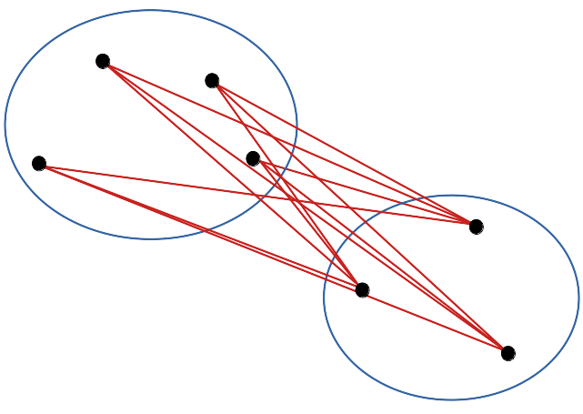

# (PART) SDD II: analyse {.unnumbered}

# Classification & indices {#cah-kmeans-div}

```{r setup, include=FALSE, echo=FALSE, message=FALSE, results='hide'}
SciViews::R("explore")
```

##### Objectifs {.unnumbered}

-   Appréhender les métriques multivariées importantes en biologie (indices de distance, indices de diversité).

-   Comprendre la notion de distance et la matrice de distance.

-   Maîtriser la classification ascendante hiérarchique (CAH) et le dendrogramme.

-   Maîtriser la technique de classification par les k-moyennes comme alternative à la CAH pour les gros jeux de données.

-   Appliquer ces techniques pour effectuer un regroupement pertinent à partir d'un jeu de données biologique.

##### Prérequis {.unnumbered}

Vous devez être à l'aise avec l'utilisation de R et RStudio, en particulier pour l'importation, le remaniement et la visualisation de données multivariées. Ceci correspond au cours SDD I. Cette partie est relativement indépendante de **SDD II : modélisation** qui forme la première section de cet ouvrage. Par conséquent, ces deux sections peuvent très bien être inversées si vous le souhaitez (si vous êtes en dehors d'un cours qui impose un ordre bien défini, bien entendu).

## Analyse de données

L'analyse de données (on parle aussi d'*analyse exploratoire des données*, EAD ou **statistiques exploratoires**) met en œuvre des méthodes statistiques multivariées visant à découvrir de l'information pertinente dans un gros jeu de données via des approches multidimensionnelles et essentiellement descriptives. Ces méthodes se regroupent en deux grandes familles :

-   Celles visant à **réduire la dimensionnalité** (travailler avec des tableaux ayant moins de colonnes). Elles permettent ensuite de présenter les données de manière synthétique pour observer des relations entre les variables ou les individus avec des **représentations graphiques**. Nous aborderons ces techniques dans les modules suivants.

-   Celles cherchant à **classifier** (ou regrouper) les individus. Il s'agit ici de synthétiser le gros tableau de données dans l'autre sens, selon les lignes. L'approche par la *classification ascendante hiérarchique* sera détaillée ici, de même que la **méthode des k-moyennes**.

La vidéo suivante introduit l'EAD (jusqu'à 2:11) :

```{r, echo=FALSE}
vembedr::embed_youtube("q-IVQoh1nxA", width = 770, height = 433, query = "end=131")
```

##### À vous de jouer ! {.unnumbered}

`r h5p(75, height = 270, toc = "Objectif des statistiques exploratoires")`

## Distance entre individus

Pour partir d'un exemple concret, imaginez que vous êtes en train d'analyser des données concernant les échantillons de plancton que vous avez prélevé sur votre lieu de recherche. Ce plancton a été numérisé (photo de chaque organisme) et les images ont été traitées avec un logiciel qui mesure automatiquement une vingtaine de variables telles que la surface de l'objet sur l'image, son périmètre, sa longueur... Vous vous trouvez donc face à un jeu de données qui a une taille non négligeable : 20 colonnes par 1262 lignes, soit le nombre d'individus mesurés dans vos échantillons.

SciViews vous propose, comme d'habitude, une série de fonctions qui simplifient et homogénéisent l'utilisation de R (avec la part belle à l'interface "formule") pour votre exploration de données multivariées, notamment avec le package {exploreit}. Tout ce que vous aurez besoin est chargé automatiquement si vous spécifiez `"explore"` comme section dans `SciViews::R`. Vous commencerez donc vos scripts R et vos documents Quarto ou R Markdown avec l'instruction suivante :

```{r}
SciViews::R("explore")
```

Ensuite, nous récupérons les données avec `read()` à partir du package {data.io} :

```{r}
zoo <- read("zooplankton", package = "data.io")
zoo
```

Vous voulez regrouper votre plancton en fonction de la ressemblance entre les organismes, c'est-à-dire, en fonction des écarts entre les mesures effectuées pour les 19 variables quantitatives, à l'exclusion de la vingtième colonne `class` (qui est une variable `factor` qui indique le groupe taxonomique de chaque individu et que nous n'utiliserons pas ici). En raison de la taille du tableau, il est évident que cela ne pourra pas se faire de manière manuelle. Nous pouvons raisonnablement considérer que plus les mesures sont similaires entre deux individus, plus ils ont des chances d'être semblables. **Mais comment faire pour synthétiser l'information de similarité ou différence contenue dans 19 paires de valeurs** (une paire par variable) ? Nous avons besoin d'une **mesure de distance** qui quantifie la similarité (ou à l'inverse la dissimilarité) en un seul nombre. Celle qui vient naturellement à l'esprit est la **distance euclidienne**, c'est-à-dire, la distance dans l'espace euclidien représentant les variables mesurées (pensez à quelque chose comme un nuage de points, mais dans 19 dimensions au lieu de deux). Prenons un cas simplifié. Quelle est la distance qui sépare deux individus *A* et *B* par rapport à trois variables *x*, *y*, *z* ? Ici, nous pouvons représenter l'information graphiquement dans un espace à trois dimensions. La distance qui nous intéresse est la distance linéaire entre les deux points dans l'espace. Autrement dit, c'est la longueur du segment de droite qui relie les deux points dans l'espace. Cette distance, nous pouvons la calculer à l'aide de la formule suivante (voir par exemple [ici](http://www.mathematiques-lycee.com/geometrie/2nde-01-longueur-segment.html) pour une résolution dans le plan) :

$$\mathrm{D_{Euclidean}}_{A, B} = \sqrt{(x_A - x_B)^2 + (y_A - y_B)^2 + (z_A - z_B)^2}$$

Notez que cette formule se généralise à *n* dimensions et s'écrit alors, pour n'importe quelle paire d'individus indicés *j* et *k* dans notre tableau et pour les différentes mesures de 1 à *i* notés *y~i~* :

$$\mathrm{D_{Euclidean}}_{j, k} = \sqrt{\sum_{i=1}^{n}(y_{ij}-y_{ik})^2}$$

En français, nous dirons que c'est la racine carrée de la somme dans les *n* dimensions des écarts entre les valeurs au carré pour toutes les variables *y~i~*. Plus sa valeur est grande, plus les individus sont éloignés (différents). Pour cette raison, nous appellerons cette distance, une mesure de **dissimilarité**.

### Matrice de distance

Nous avons maintenant la possibilité de quantifier la dissimilarité entre nos organismes planctoniques... mais nous en avons un grand nombre. Cela va être impossible à gérer autant de mesures qu'il y a de paires possibles parmi 1262 individus[^06-cah-kmeans-div-1]. La **matrice de distance** est une matrice ici 1262 par 1262 qui rassemble toutes les valeurs possibles. Notez que sur la diagonale, nous comparons chaque individu avec lui-même. La distance euclidienne vaut donc systématiquement zéro sur la diagonale (distance nulle du point vers lui-même).

[^06-cah-kmeans-div-1]: Le nombre de paires uniques et distinctes (donc dans les cas où *j* ≠ *k*) possibles parmi *n* items est $n(n-1)/2$. Donc pour nos 1262 individus, nous avons 795.691 paires à calculer.

$$\mathrm{D_{Euclidean}}_{j, j} = 0$$

De plus, de part et d'autre de cette diagonale, nous trouvons les paires complémentaires (*j versus k* d'un côté et *k versus j* de l'autre). Or qu'elle soit mesurée dans un sens ou dans l'autre, la distance du segment de droite qui relie deux points dans l'espace est toujours la même.

$$\mathrm{D_{Euclidean}}_{j, k} = \mathrm{D_{Euclidean}}_{k, j}$$

Par conséquent, seulement une portion de notre matrice de distance (soit le triangle inférieur, soit le triangle supérieur hors diagonale) est informative. La diagonale ne porte aucune information utile, et l'autre triangle est redondant. Nous avons donc pour habitude de ne calculer et représenter que le triangle inférieur de cette matrice.

##### À vous de jouer ! {.unnumbered}

`r h5p(76, height = 270, toc = "Objectif de la matrice de distance")`

```{block2, type='note'}

Le package {exploreit} met à votre disposition les fonctions suivantes pour créer une matrice de dissimilarité et pour effectuer des regroupements (*cluster* en anglais) sur base de l'information qu'elle contient (nous verrons leur usage progressivement dans ce module) :

- **`dissimilarity(data, method = "euclidean", scale = FALSE, transpose = FALSE)`** : matrice de dissimilarité, voir `?vegan::vegdist` sur laquelle cette fonction est basée
    + méthodes `print()`, `chart()`, `labels()` et `nobs()` sont des méthodes disponibles pour les objets **Dissimilarity**/**dist**
- **`cluster(x, method = "complete")`** : CAH (nous verrons plus loin ce que c'est) à partir d'un objet **Dissimilarity**/*dist**, voir `?stats:hclust`
    + méthodes `print()`, `str()`, `plot()`, `chart()`, `labels()`, `nobs()`, `predict()` et `augment()`
- **`chart(cluster)`** : visualise un cluster (dendrogramme). Utiliser `+ geom_dendroline(h = XX, color = "red")` pour y visualiser la coupure (voir plus loin)
- **`predict(cluster, h = 5)`** ou **`predict(cluster, k = 5)`** extrait les groupes
- **`augment(data = df, cluster, h =|k = )`** ajoute les groupes dans le tableau `df`

```

Voici comment nous calculons une matrice de distance `zoo6_dist`, ici sur un petit sous-ensemble de six lignes de notre jeu de données (nous devons aussi éliminer la colonne `class` qui ne contient pas de données numériques et qui ne nous intéresse pas pour le moment) :

```{r}
zoo %>.%
  sselect(., -class) %>.% # Élimination de la colonne class
  head(., n = 6) ->
  zoo6 # Récupération des 6 premiers individus
zoo6_dist <- dissimilarity(zoo6, method = "euclidean")
zoo6_dist
```

Nous voyons bien ici que R n'imprime que le *triangle inférieur* de notre matrice 6 par 6. Notez aussi que les objets **Dissimilarity** de tailles plus réalistes que vous utiliserez dans vos analyses ne sont **pas prévus pour être imprimés et visualisés tels quels**. Il s'agit seulement de la *première étape* vers une représentation utile qui sera réalisée ci-dessous, à l'aide de la classification hiérarchisée. **Ne les imprimez donc jamais tels quels dans vos scripts ou rapports !**

Nous verrons plus loin comment nous pouvons utiliser l'information que cette matrice de distance contient pour regrouper les individus de manière pertinente à l'aide de la technique CAH. Mais avant cela, nous avons besoin d'un peu de théorie pour bien comprendre quelle **métrique** choisir pour calculer nos distances et pourquoi. On parle aussi d'**indices** de **similarité** ou **dissimilarité**.

```{block2, type='warning'}

**Attention :** nous n'avons pas considéré ici les unités respectives de nos variables. Une surface (mm^2^) ou une longeur (mm) ne sont pas mesurées dans les mêmes unités. Nous risquons alors de donner plus de poids dans nos calculs aux variables qui présentent des valeurs élevées. Nous aurions le même effet si nous décidions par exemple d'exprimer une mesure longitudinale en µm au lieu de l'exprimer en mm. Dans ce cas, il vaut mieux standardiser d'abord le tableau (moyenne de zéro et écart type de un) selon les colonnes avant d'effectuer le calcul. Une illustration de cette approche sera discutée plus loin.

```

##### À vous de jouer ! {.unnumbered}

`r h5p(77, height = 270, toc = "Utilisation de la distance euclidienne")`

### Indices de (dis)similarité

Un indice de similarité (*similarity index* en anglais) est un descripteur statistique (nombre unique) de la similitude de deux échantillons ou individus représentés par plusieurs variables dans un échantillon multivarié. Un indice de similarité prend une valeur comprise entre 0 (différence totale) et 1 ou 100% (similitude totale). Un indice de dissimilarité est le complément d'un indice de similarité (dis = 1 -- sim) ; sa valeur est comprise entre 100% (différence totale) et 0 (similitude totale).

```{block2, type='warning'}

**Attention :** dans certains cas, un indice de dissimilarité peut varier de 0 à +$\infty$**. Il n'existe alors pas d'indice de similarité complémentaire. C'est le cas précisément de la distance euclidienne que nous avons explorée jusqu'ici.

```

Tous les indices de similarité / dissimilarité peuvent servir à construire des matrices de distances.

#### Indice de Bray-Curtis

L'indice de dissimilarité de Bray-Curtis, aussi appelé coefficient de Czecanowski est calculé comme suit :

$$\mathrm{D_{Bray-Curtis}}_{j,k}=\frac{\sum_{i=1}^{n}\left|y_{ij}-y_{ik}\right|}{\sum_{i=1}^{n}(y_{ij}+y_{ik})}$$

Dans SciViews::R nous utiliserons `dissimilarity(DF, method = "bray")`. Cet indice s'utilise pour mesurer, entre autres, la similitude entre échantillons sur base du **dénombrement d'espèces**. Si le nombre d'espèces est très variable (espèces dominantes *versus* espèces rares), nous devons transformer les données pour éviter de donner trop de poids aux espèces les plus abondantes (par exemple à l'aide de transformations $log(x+1)$, double racine carrée...).

Une caractéristique essentielle de cet indice (contrairement à la distance euclidienne) est que toute double absence n'est pas prise en compte dans le calcul. C'est souvent pertinent dans le cadre de son utilisation comme le dénombrement d'espèces. En effet, quelle information utile retire-t-on de doubles zéros dans un tableau répertoriant la faune belge pour le crocodile du Nil et le tigre de Sibérie par exemple ? Aucune ! Ils sont tous deux systématiquement absents des dénombrements, mais cette double absence n'apporte aucune information utile pour caractériser la faune belge par ailleurs. Cet exemple caricatural vous montre le côté absurde de considérer qu'une double absence puisse être une information utile dans le cas de dénombrement d'espèces.

L'indice de similarité de Bray-Curtis (*sim*) est complémentaire à l'indice de dissimilarité correspondant (*dis* tel que calculé ci-dessus) :

$$sim = 1 – dis$$

#### Indice de Canberra

L'indice de dissimilarité de Canberra est apparenté à l'indice de Bray-Curtis mais il pondère les individus en fonction du nombre d'occurrences pour donner le *même* poids à chacun. Il se calcule comme suit :

$$\mathrm{D_{Canberra}}_{j,k}=\frac{1}{nz}\sum_{i'=1}^{nz}\frac{\left|y_{i'j}-y_{i'k}\right|}{\left|y_{i'j}\right|+\left|y_{i'k}\right|}$$

où $nz$ est le nombre de valeurs non nulles simultanément dans le tableau de départ. Tous les cas contribuent ici de manière égale. C'est un point positif, mais il faut faire attention à ce que cet indice a souvent tendance à donner, au contraire, trop d'importance aux dénombrements très rares observés une seule fois ou un petit nombre de fois ! Dans SciViews::R, nous utiliserons `dissimilarity(DF, method = "canberra")`.

Toute double absence n'est pas prise en compte ici également. Seuls les indices ne dépendant pas des doubles zéros sont utilisables pour des dénombrements d'espèces ou des présences-absences. Ainsi, pour ce type de données, notre choix se portera sur :

-   Bray-Curtis si l'on souhaite que le résultat soit dominé par les espèces les plus abondantes.

-   Canberra si notre souhait est de donner la même importance à toutes les espèces, mais avec un risque d'importance exagérée des espèces rares par rapport au nombre relatif d'observations pour l'ensemble du jeu de données.

-   Bray-Curtis sur données transformées ($log(x+1)$ ou double racine carrée) pour un compromis entre les deux avec prise en compte de toutes les espèces, mais dépondération partielle des espèces les plus abondantes. C'est souvent un bon compromis.

```{block2, type='warning'}

Attention : Si les volumes échantillonnés entre stations ne sont pas comparables, il faut standardiser (moyenne nulle et écart type un) les données selon les échantillons avant de faire les calculs de distances. L'argument `scale = TRUE` pourra être ajouté à l'appel de `dissimilarity()` pour ce faire.

```

De même que pour Bray-Curtis, l'indice de similarité *sim* se calcule à partir de l'indice de dissimilarité *dis* tel que ci-dessus comme $sim = 1 - dis$.

#### Distance euclidienne

Nous savons déjà que c'est la distance géométrique entre les points dans un espace à *n* dimensions :

$$\mathrm{D_{Euclidean}}_{j,k}=\sqrt{\sum_{i=1}^{n}(y_{ij}-y_{ik})^2}$$

Dans SciViews::R, cette distance peut être calculée avec `dissimilarity(DF, method = "euclidean")`. Attention : en anglais, c'est *euclidean* avec un "e", pas *euclidian* ! Cet indice de dissimilarité est utile pour des mesures quantitatives, pour des données environnementales, etc. Il faut que les mesures soient toutes effectuées dans les mêmes unités. Si ce n'est pas le cas, nous devons les standardiser avant le calcul, avec `scale = TRUE`. Il n'existe pas d'indice de similarité complémentaire.

#### Distance de Manhattan

La distance de Manhattan, encore appelée *"city-block distance"* en anglais, est un indice de dissimilarité qui, contrairement à la distance euclidienne, ne mesure pas la distance géométrique entre les points en ligne droite, mais via un trajet composé de segments de droites parallèles aux axes. C'est comme si la distance euclidienne reliait les points à vol d'oiseau, alors qu'avec la distance de Manhattan, nous devions contourner les blocs de maisons du quartier pour aller d'un point A à un point B (d'où le nom de cette métrique). Elle se calcule comme suit :

$$\mathrm{D_{Manhattan}}_{j,k}=\sum_{i=1}^{n}|y_{ij}-y_{ik}|$$

Dans SciViews::R, nous utiliserons `dissimilarity(DF, method = "manhattan")`. Ici aussi, seul l'indice de dissimilarité est défini. L'indice de similarité complémentaire n'existe pas, car la valeur de l'indice de dissimlarité n'est pas bornée à droite et peut varier de zéro (dissimilarité nulle, cela signifie alors que les deux individus sont identiques) à l'infini pour une différence maximale.

### Utilisation des indices

-   Les distances euclidiennes ou de Manhattan sont à préférer pour les **mesures environnementales** ou de manière générale pour les variables quantitatives continues.

-   Les distances de Bray-Curtis ou Canberra sont meilleures pour les **dénombrements d'espèces** (ou à chaque fois que les doubles zéros ne portent aucune information utile). Il s'agit souvent de variables quantitatives discrètes prenant des valeurs nulles ou positives.

##### À vous de jouer ! {.unnumbered}

`r h5p(78, height = 270, toc = "Choix des indices")`

### Propriétés des indices

Les indices varient en 0 et 1 (0 et 100%), mais les distances sont utilisées aussi comme indices de dissimilarité et peuvent varier entre 0 et $+\infty$.

Un indice est dit **métrique** si il a les propriétés suivantes :

-   **Minimum 0** : $I_{j, k} = 0$ si $j = k$

-   **Positif** : $I_{j, k}>0$ si $j \neq k$

-   **Symétrique** : $I_{j, k}=I_{k, j}$

-   **Inégalité triangulaire** : $I_{j, k} + I_{k, l} >= I_{j, l}$

La dernière propriété d'inégalité triangulaire est la plus difficile à obtenir, et n'est pas toujours nécessaire. Nous pouvons montrer que certains indices qui ne respectent pas cette dernière propriété sont pourtant utiles dans le contexte. Nous dirons alors d'un indice que c'est une **semi-métrique** s'il répond à toutes les conditions sauf la quatrième. Enfin, un indice est dit **non métrique** dans tous les autres cas. Le tableau suivant reprend les métriques que nous avons vues jusqu'ici, et rajoute d'autres candidats potentiels (la distance du Chi carré, l'indice de corrélation ou de variance/covariance) en indiquant leur type :

| **Distance**          | **Type**       |
|-----------------------|----------------|
| Bray-Curtis           | semi-métrique  |
| Canberra              | métrique       |
| Euclidienne           | métrique       |
| Manhattan             | métrique       |
| Chi carré             | métrique       |
| (corrélation)         | (non métrique) |
| (variance/covariance) | (non métrique) |

##### Pour en savoir plus {.unnumbered}

-   Vous pouvez aussi transposer le tableau pour calculer la distance entre ses colonnes en utilisant l'argument `transpose = TRUE` dans `dissimilarity()`. Par exemple, dans le cas d'un tableau "espèces - stations" (dénombrement d'espèces en différentes stations), nous pouvons comparer les stations du point de vue de la composition en espèces, mais nous pouvons aussi comparer les espèces du point de vue de leur répartition entre les stations. Pour passer d'un calcul à l'autre, nous transposerons donc le tableau (les colonnes deviennent les lignes et inversement).

-   Pour bien comprendre la logique derrière ces indices, il est utile de comprendre leurs équations. Si elles sont pour vous trop abstraites, une façon efficace de comprendre consiste à faire le calcul à la main. Par exemple, dans le cas de l'indice de Canberra, la notion de nombre de données non nulles $nz$ n'est pas évidente. Effectuons un calcul à la main détaillé sur le tableau fictif suivant concernant trois espèces `A`, `B`, et `C` dénombré en trois stations `sta1`, `sta2` et `sta3` dans le tableau nommé `ex1` :

```{r, echo=FALSE}
ex1 <- dtf( # Here we need to create a data.frame explicitly to use row names!
  A = c(4, 3, 1),
  B = c(0, 0, 8),
  C = c(2, 10, 0))
rownames(ex1) <- paste0("sta", 1:3)
ex1bold <- ex1
rownames(ex1bold) <- paste0("**sta", 1:3, "**")
knitr::kable(ex1bold)
```

Pour rappel, la dissimilarité de Canberra se calcule comme suit :

$$\mathrm{D_{Canberra}}_{j,k}=\frac{1}{nz}\sum_{i'=1}^{nz}\frac{\left|y_{i'j}-y_{i'k}\right|}{y_{i'j}+y_{i'k}}$$

où :

-   *nz* est le nombre d'observations non nulles simultanément dans les deux vecteurs comparés (les doubles zéros ne sont pas pris en compte)
-   *i'* est l'itérateur sur toutes les valeurs non doubles zéros

Voici le détail du calcul (notez bien comment le double zéro pour l'espèce `B` entre les stations `sta1` et `sta2` est pris en compte dans le calcul) :

```{r}
sta1_2 <- (1/2) * ((abs(4 - 3)) / (4 + 3) + (abs(2 - 10)) / (2 + 10))
round(sta1_2, 3)

sta1_3 <- (1/3) * (abs(4 - 1) / (4 + 1) + abs(0 - 8) / (0 + 8) +
  abs(2 - 0) / (2 + 0))
round(sta1_3, 3)

sta2_3 <- (1/3) * (abs(3 - 1) / (3 + 1) + abs(0 - 8) / (0 + 8) +
  abs(10 - 0) / (10 + 0))
round(sta2_3, 3)
```

La matrice finale est la suivante :

```{r, echo=FALSE}
vegan::vegdist(ex1, method = "canberra") %>.%
  round(., 3) %>.%
  as.matrix(.) ->
  dst # We need to use a data.frame explicitly (dtf) to use row names!
dst[!lower.tri(dst)] <- ""
dst <- dst[-1, -3]
knitr::kable(dst)
```

Vérifions en laissant R faire le calcul :

```{r}
(dissimilarity(ex1, method = "canberra"))
```

## Regroupement avec CAH

À partir du moment où nous avons une matrice de dissimilarité entre toutes les paires d'individus de notre jeu de données, nous pouvons les regrouper en fonction de leurs ressemblances. Deux approches radicalement différentes existent. Soit nous pouvons diviser l'échantillon progressivement jusqu'à obtenir des groupes homogènes (**méthodes divisives, telles que les k-moyennes** que nous aborderons un peu plus loin), soit nous pouvons regrouper les items semblables petit à petit jusqu'à avoir traité tout l'échantillon (**méthodes agglomératives, telles que la classification ascendante hiérarchique** ou CAH étudiée ici).

##### À vous de jouer ! {.unnumbered}

`r h5p(79, height = 270, toc = "Méthodes divisives ou agglomératives")`

### Dendrogramme

Le **dendrogramme** est une manière très utile de représenter graphiquement un regroupement. Il s'agit de réaliser un arbre dichotomique ressemblant un peu à un arbre phylogénétique qui est familier aux biologistes (par exemple [ici](https://www.futura-sciences.com/planete/definitions/classification-vivant-phylogenie-4372/)) :


Dans l'arbre, nous représentons des divisions dichotomiques (division d'une branche en deux) matérialisant les divergences au cours de l'évolution. Dans l'arbre présenté ci-dessus, l'axe des ordonnées est utilisé pour représenter le temps et les branchements sont placés à une hauteur correspondante en face de l'axe. Le dendrogramme est une représentation similaire de la CAH avec l'axe des ordonnées indiquant *à quelle distance* le rassemblement se fait.

Dans `SciViews::R`, un dendrogramme se construit en deux étapes :

1)  Son calcul par CAH à l'aide de la fonction `cluster()`, à partir d'une matrice de dissimilarité, donc un objet **Dissimilarity** ou **dist**.

2)  Sa représentation sur un graphique en utilisant `chart()`.

Partons, pour étayer notre raisonnement, d'une matrice de distance euclidienne sur les données de zooplancton. Au passage, voyons quelques options utiles pour préparer correctement nos données.

-   À la section précédente, nous avons suggéré qu'il peut être utile de *standardiser* nos données préalablement si les données numériques sont mesurées dans des unités différentes, comme c'est le cas ici. La fonction `scale()` ou l'argument `scale = TRUE` de `dissimilarity()` effectuent ce travail.
-   Limitons, pour l'instant, notre ambition à la comparaison de six individus. Afin d'observer tous les cas possibles dans le dendrogramme, nous ne prendrons pas les six premières lignes du tableau, mais les lignes 13 à 18. Cela peut se faire à l'aide de la fonction `slice()` que nous n'avons pas encore beaucoup utilisée jusqu'ici. Cette fonction permet de spécifier explicitement les numéros de lignes à conserver, contrairement à `sfilter()` et `filter()` qui appliquent un test de condition pour décider quelles ligne(s) conserver. Nous pouvons aussi utilise l'argument `subset =` de `dissimilarity()` pour sélectionner une partie des données.

Voici donc notre matrice de distance euclidienne sur les données ainsi traitées. Les individus initiaux 13 à 18 sont renumérotés 1 à 6. Nous n'imprimons plus ici la matrice de distance obtenue, car ce n'est que la première étape du travail vers une représentation plus utile (le dendrogramme).

```{r}
zoo %>.%
  select(., -class) %>.%   # Élimination de la colonne class
  slice(., 13:18) ->       # Récupération des lignes 13 à 18
  zoo6

zoo6 %>.% # Matrice de dissimilarité sur données standardisées
  dissimilarity(., method = "euclidean", scale = TRUE) ->
  zoo6std_dist
```

Notre objet `zoo6std_dist` est ensuite utilisé pour calculer notre CAH à l'aide de `cluster()`. Enfin, `chart()`se charge de tracer le dendrogramme.

```{r}
zoo6std_dist %>.%
  cluster(.) ->
  zoo6std_clust # Calcul du dendrogramme
  chart(zoo6std_clust) +
    ylab("Hauteur")
```

Voici comment lire ce graphique. Les deux individus les plus semblables sont le 2 et le 5 (regroupement effectué le plus bas, donc, avec la valeur de l'indice de dissimilarité le plus faible). Ensuite ce groupe formé du 2 et du 5 est le plus similaire au 3. Ensuite, le 1 et le 6 sont rassemblés. Puis le 4 se rattache au groupe formé des 2, 3 et 5 un peu plus haut sur l'axe. Finalement, le groupe de droite constitué des individus 2, 3, 4 et 5 et celui de gauche contenant le 1 et le 6 sont reliés encore plus haut suggérant ainsi la dissimilitude la plus forte entre ces deux sous-groupes.

```{block2, type='warning'}

**Attention :** La position des individus selon l'axe horizontal n'est pas importante. Il faut voir le dendrogramme comme un mobile qui peut tourner librement. C'est-à-dire que le groupe constitué de 2, 3, 4 et 5 aurait très bien pu être placé à la gauche de celui constitué de 1 et 6. De même, le sous-groupe 2, 3 et 5 aurait très bien pu être à la gauche du regroupement avec 4 à la droite, etc. Seul compte la hauteur sur l'axe vertical à laquelle le regroupement se fait.

```

Notez que nous n'avons *pas* utilisé l'information concernant les classes taxonomiques auxquelles les individus appartiennent (nous avons éliminé la variable `class` en tout début d'analyse). Ce type de regroupement s'appelle une **classification non supervisée** parce que nous n'imposons pas les groupes que nous souhaitons réaliser[^06-cah-kmeans-div-2]. Cependant, comme nous possédons cette indication du groupe taxonomique de nos six individus par ailleurs dans `class`, nous pouvons en profiter pour l'utiliser à des fins de vérification :

[^06-cah-kmeans-div-2]: Les techniques complémentaires de classification supervisées seront abordées dans le cours de Science des Données biologiques III l'an prochain.

```{r}
zoo$class[13:18]
```

Les individus 2, 3 et 5 ("Poecilostomatoid" ou "Calanoid") sont des [copépodes](http://www.obs-vlfr.fr/~gaspari/copepodes/cop_doc.htm), des crustacés particulièrement abondants dans le zooplancton. Leur forme est similaire. Leur regroupement est logique. L'individu 4 est une [larve de décapode](https://images.cnrs.fr/photo/20120001_1829), un autre crustacé. Ainsi le regroupement de 2, 3 et 5 avec 4 correspond aux crustacés ici. Enfin, les individus 1 et 6 sont très différents puisqu'il s'agit respectivement d'un [œuf](http://grainesdexplorateurs.ens-lyon.fr/archives-1/2012-2013/projets/tara-2013/pouldreuzic-2013/plancton-de-beg-meil/copy_of_embryon-de-poisson/view) rond, probablement de poisson et d'un [appendiculaire](https://scripps.ucsd.edu/zooplanktonguide/species/oikopleura-dioica).

### Séparer les groupes

Si notre dendrogramme est satisfaisant (nous le déterminons en l'étudiant et en vérifiant que les regroupements obtenus ont un sens biologique par rapport à l'objectif de notre étude), nous concrétisons les groupes que nous souhaitons retenir au final en coupant l'arbre horizontalement à une hauteur choisie et en récupérant ces groupes avec la méthode `predict()`. Nous pouvons matérialiser ce niveau de coupure en traçant un trait horizontal rouge dans le dendrogramme en ajoutant `geom_dendroline(h = XXX, color = "red")`, avec 'XXX' la hauteur de coupure souhaitée. Par exemple, si nous coupons l'arbre à une hauteur de 8, nous obtenons deux groupes :

```{r}
chart(zoo6std_clust) +
  geom_dendroline(h = 8, color = "red")
```

Si nous coupons l'arbre plus bas, par exemple à la hauteur de 5,8, nous obtenons trois groupes :

```{r}
chart(zoo6std_clust) +
  geom_dendroline(h = 5.8, color = "red")
```

Les niveaux de coupure ne sont pas toujours très lisibles sur le dendrogramme, mais ils peuvent être obtenus à l'aide de `str()`.

```{r}
str(zoo6std_clust)
```

À mesure que la hauteur de coupure descend, nous réaliserons quatre, puis cinq groupes. Quel est le meilleur niveau de coupure ? Il n'y en a pas un seul forcément, car les différents niveaux correspondent à un point de vue de plus en plus détaillé du regroupement. Néanmoins, lorsque le saut sur l'axe des ordonnées d'un regroupement à l'autre est fort, nous pouvons considérer une séparation des groupes d'autant meilleure. Cela crédibilise d'autant le regroupement choisi. Ainsi la séparation en deux groupes apparaît forte (entre 9.45 et 6.16, sur un intervalle de 3,3 unités donc). De même, la séparation de l'individu 4 par rapport au groupe constitué de 2, 3 et 5 se fait sur un intervalle de 2 unités (entre 6.16 et 4.17). La séparation de l'individu 3 du groupe 2 et 5 est un petit peu moins nette puisqu'elle apparaît aux hauteurs entre 4,17 à 2.38, soit sur un intervalle de 1,8 unité. Ces mesures d'intervalles n'ont aucune valeur absolue. Il faut les considérer uniquement de manière relative les unes par rapport aux autres, et seulement au sein d'un même dendrogramme.

Ici, deux niveaux de coupure se détachent :

-   en deux groupes, nous avons les crustacés séparés du reste.

```{r}
chart(zoo6std_clust) +
  geom_dendroline(h = 7.5, color = "red")
```

```{r}
(group2 <- predict(zoo6std_clust, h = 7.5))
```

Les individus 1 et 6 sont dans le groupe 1, et les autres dans le groupe 2.

-   en quatre groupes, nous avons les copépodes séparés des trois autres items chacun dans un groupe séparé.

```{r}
chart(zoo6std_clust) +
  geom_dendroline(h = 5, color = "red")
```

Le groupe des individus 2, 3 et 5 est formé. Les trois autres groupes contiennent des individus uniques 1, 6 et 4 respectivement.

```{r}
(group4 <- predict(zoo6std_clust, h = 5))
```

L'individu 1 est dans le groupe 1, les individus 2, 3 et 5 sont dans le groupe 2, l'individu 4 est dans le groupe 3 et enfin l'individu 6 est dans le groupe 4. Donc, `predict()` numérote ses groupes en fonction du premier item de cette catégorie rencontré dans le tableau des données dans l'ordre dans lequel les valeurs se présentent.

Nous pouvons ajouter cette variable indiquant les groupes dans le tableau de données à l'aide de la méthode `augment()`. Le nom de la variable ainsi créée est `.fitted`. Ensuite, nous utilisons cette information pour en faire d'autres choses utiles. Par exemple, nous représentons un nuage de point à partir de deux variables quantitatives et colorons nos points en fonction de nos groupes comme suit :

```{r}
zoo6g <- augment(data = zoo6, zoo6std_clust, h = 7.5)
names(zoo6g) # Nom des variables dans ce tableau
# Nous transformons ces groupes en variable facteur
zoo6g$group <- factor(zoo6g$.fitted)
chart(data = zoo6g, area ~ circularity %col=% group) +
  geom_point()
```

Nous voyons que les copépodes (groupe 2 en turquoise) sont plus grands (`area`) et moins circulaires (`circularity`) que les deux autres items du groupe 1 en rouge. Nous pouvons ainsi réexplorer nos données en fonction de ces groupes pour mieux les comprendre.

### Méthodes de CAH

Tant que l'on compare des individus isolés entre eux, il n'y a pas d'ambiguïté. Par contre, dès que nous comparons un groupe avec un individu isolé, ou deux groupes entre eux, nous avons plusieurs stratégies possibles pour calculer leurs distances (argument `method =` de `cluster()`) :

-   **Liens simples** (*single linkages* en anglais) `cluster(DIS, method = "single")` : la distance entre les plus proches voisins au sein des groupes est utilisée.


```{r}
zoo6std_dist %>.%
  cluster(., method = "single") %>.%
  chart(.)
```

Les données tendent à être agrégées de proche en proche en montrant une gradation d'un extrême à l'autre. Dans le cas d'une variation progressive, par exemple lors d'un passage graduel d'une situation A vers une situation B, le dendrogramme obtenu à l'aide de cette méthode représentera la situation au mieux.

-   **Liens complets** (*complete linkages* en anglais) `cluster(DIS, method = "complete")`, méthode utilisée par défaut si non précisée : la distance entre les plus lointains voisins est considérée. C'est le premier dendrogramme que nous avions réalisé.


Le dendrogramme a tendance à effectuer des groupes séparés plus nettement les uns des autres qu'avec les liens simples.

-   **Liens moyens** (*group-average* en anglais) `cluster(DIS, method = "average")` encore appelés méthode UPGMA : moyenne des liens entre toutes les paires possibles intergroupes.



Nous obtenons une situation intermédiaire entre liens simples et liens moyens.

```{r}
zoo6std_dist %>.%
  cluster(., method = "average") %>.%
  chart(.)
```

Dans ce cas-ci, le résultat est similaire aux liens complets, mais ce n'est pas forcément le cas tout le temps.

-   **Méthode de Ward D2** `cluster(DIS, method = "ward.D2")`. Considérant le partitionnement de la variance totale du nuage de points (on parle aussi de l'*inertie* du nuage de points) entre variance interclasse et variance intraclasse, la méthode vise à maximiser la variance interclasse et minimiser la variance intraclasse, ce qui revient d'ailleurs au même. Cette technique fonctionne souvent très bien pour obtenir des groupes bien individualisés.

```{r}
zoo6std_dist %>.%
  cluster(., method = "ward.D2") %>.%
  chart(.)
```

Ici nous obtenons un dendrogramme très proche des liens complets. Encore une fois, ce n'est pas forcément le cas dans toutes les situations.

-   Liens **médians**, **centroïdes**..., constituent encore d'autres méthodes possibles, mais moins utilisées. Elles ont l'inconvénient de produire parfois des *inversions* dans le dendrogramme, c'est-à-dire qu'un regroupement plus avant se fait parfois à une hauteur plus basse sur l'axe des ordonnées, ce qui rend le dendrogramme peu lisible et beaucoup moins esthétique. Dans notre exemple, la méthode centroïde crée une telle inversion à la hauteur de 5 environ sur l'axe des ordonnées entre l'individu 6 et l'individu 1. Alors, qui est regroupé en premier ? Pas facile à déterminer dans ce cas !

```{r}
zoo6std_dist %>.%
  cluster(., method = "centroid") %>.%
  chart(.)
```

##### À vous de jouer ! {.unnumbered}

`r h5p(80, height = 350, toc = "Ordre des étapes pour obtenir un dendrogramme")`

### Étude complète

Voici ce que cela donne si nous effectuons une CAH sur le jeu `zoo`plancton complet avec ses 1262 lignes. Notez que pour visionner les labels lorsque le nombre d'items augmente, vous pouvez combiner comme ici un dendrogramme horizontal et un étirement en hauteur du graphique en indiquant `fig.asp=...` comme paramètre du chunk avec une valeur de `fig.asp` \> 1.

```{r, fig.asp=4/3}
zoo %>.%
  sselect(., -class) %>.% # Élimination de la colonne class
  # Matrice de dissimilarité sur données standardisées
  dissimilarity(., method = "euclidean", scale = TRUE) %>.%
  cluster(., method = "ward.D2") -> # CAH avec Ward D2
  zoo_clust

# Dendrogramme horizontal et sans labels (plus lisible si beaucoup d'items)
chart$horizontal(zoo_clust, labels = FALSE) +
  geom_dendroline(h = 70, color = "red") + # Séparation en 3 groupes
  ylab("Hauteur")
```

Naturellement, avec 1262 branches, notre dendrogramme est très encombré. Cependant, il reste analysable tant que nous nous intéressons aux regroupements de plus haut niveau (vers le haut du dendrogramme, ou sa gauche pour un dendrogramme horizontal). Notez comme les valeurs sur l'axe des ordonnées ont changé par rapport à nos cas simples à six items (ne jamais comparer les hauteurs *entre* dendrogrammes différents).

Notre CAH est terminée, nous pouvons récupérer les groupes dans une variable supplémentaire dans notre tableau et l'utiliser ensuite.

```{r}
augment(data = zoo, zoo_clust, h = 70) %>.%
  smutate(., group = as.factor(.fitted)) ->
  zoog

chart(data = zoog, compactness ~ ecd %col=% group) +
  geom_point() + # Exploration visuelle des groupes (exemple)
  coord_trans(x = "log10", y = "log10") # Axes en log10
```

Et de manière optionnelle, si un classement est disponible par ailleurs (c'est le cas ici avec la variable `class`), nous pouvons réaliser un tableau de contingence à doubles entrées entre le regroupement obtenu par CAH et le classement récupéré de manière indépendante à cette analyse pour comparaison.

```{r}
table(classe = zoog$class, cah = zoog$group)
```

Ainsi, nous pouvons constater que le groupe 1 contient une fraction importante des annélides, des cladocères, des décapodes, des œufs ronds et des gastéropodes. Le groupe 2 contient un maximum des copépodes représentés par les calanoïdes, les cyclopoïdes, les harpacticoïdes et les poecilostomatoïdes. Il contient aussi tous les appendiculaires, tous les protistes, presque tous les œufs allongés, les poissons, et une majorité des malacostracés. Enfin, le groupe 3 contient une majorité des chétognathes et des cnidaires. Le regroupement a été réalisé uniquement en fonction de mesures effectuées sur les images. Il n'est pas parfait, mais des tendances se dégagent tout de même.

##### Pour en savoir plus {.unnumbered}

-   La vidéo suivante présente la matière que nous venons d'étudier de manière légèrement différente. Plus d'explications sont également apportées concernant la méthode de Ward.

```{r, echo=FALSE}
vembedr::embed_youtube("SE_4dLh5vXY", width = 770, height = 433, query = list(start = 192, end = 1004))
```

-   Une autre explication encore [ici](https://larmarange.github.io/guide-R/analyses_avancees/classification-ascendante-hierarchique.html).

-   Pour bien comprendre la façon dont une CAH est réalisée, il est utile de détailler le calcul étape par étape sur un exemple simple. Voici une matrice de distance euclidienne fictive entre six stations nommées A à F :

```{r, echo=FALSE}
dat <- dtf(
  espece1 = c(0,  9,  2,  1,  1,  7),
  espece2 = c(8,  0,  2,  5,  8,  1),
  espece3 = c(1,  5,  1,  5,  1,  0),
  espece4 = c(2, 10,  3,  1,  7,  5)) 
stations <- c("A", "B", "C", "D", "E", "F")
rownames(dat) <- stations
dst0 <- round(dist(dat, method = "euclidian"), 2)
dst <- as.matrix(dst0)
dst[!lower.tri(dst)] <- ""
dst <- dst[-1, ]
dst[, 2:6] <- dst[, 1:5]
dst[, 1] <- c("**B**", "**C**", "**D**", "**E**", "**F**")
colnames(dst) <- c("&nbsp;", "A", "B", "C", "D", "E")
rownames(dst) <- NULL
knitr::kable(dst)
```

Effectuons une CAH manuellement par liens complets et traçons le dendrogramme correspondant. *Pour vous aider à comprendre, prenez une feuille de papier et un crayon et réalisez les différentes étapes à la main par vous-mêmes.*

**Étape 1 :** Nous repérons dans la matrice de distance la paire qui a l'indice de dissimilarité le plus petit et effectuons un premier regroupement. A_E = groupe I à la distance 5,1. La matrice de distance est simplifiée par rapport à ce groupe I en considérant la règle utilisée (ici, liens complets, donc on garde la plus grande distance entre toutes les paires possibles lorsqu'il y a des groupes).

-   Distance entre B et I = B_A = 15
-   Distance entre C et I = C_E = 7,28
-   Distance entre D et I = D_E = 7,81
-   Distance entre F et I = F_A = 10,39

Matrice de distance recalculée :

```{r, echo=FALSE}
dst1 <- dtf(
  I = c(15,  7.28,  7.81, 10.39),
  B = c("", 10.86, 13.04,  7.42),
  C = c("",    "",  5.48,  5.57),
  D = c("",    "",    "",  9.64))
dst1 <- as.matrix(dst1)
rownames(dst1) <- c("**B**", "**C**", "**D**", "**F**")
knitr::kable(dst1)
```

**Étape 2 :** Nous répétons le processus. C_D = groupe II à la distance la plus petite de 5,48.

-   Distance entre I et II = I_D = 7,81
-   Distance entre B et II = B_D = 13,04
-   Distance entre F et II = F_D = 9,64

Matrice de distance recalculée :

```{r, echo=FALSE}
dst2 <- dtf(
  I  = c(15,  7.81, 10.39),
  B  = c("", 13.04,  7.42),
  II = c("",    "",  9.64))
dst2 <- as.matrix(dst2)
rownames(dst2) <- c("**B**", "**II**", "**F**")
knitr::kable(dst2)
```

**Étape 3 :** B_F = groupe III à la distance 7,42

-   Distance entre I et III = I_B = 15
-   Distance entre II et III = II_B = 13,04

Matrice de distance recalculée :

```{r, echo=FALSE}
dst3 <- dtf(
  I   = c(15,  7.81),
  III = c("", 13.04))
dst3 <- as.matrix(dst3)
rownames(dst3) <- c("**III**", "**II**")
knitr::kable(dst3)
```

**Étape 4 :** I_II = groupe IV à la distance 7,81

-   Distance entre III et IV = III_I = 15

Matrice de distance recalculée :

```{r, echo=FALSE}
dst4 <- dtf(III = c(15))
dst4 <- as.matrix(dst4)
rownames(dst4) <- c("**IV**")
knitr::kable(dst4)
```

**Étape 5 :** III - IV = groupe V à la distance 15.

**fini !**

Voici le dendrogramme résultant *(si vous avez réalisé l'exercice à la main, vous pouvez aussi tracer le dendrogramme avec votre crayon et le comparer à la version ci-dessous tout en vous rappelant que l'ordre des labels sur l'axe des abscisses n'a pas d'importante, par exemple, si vous avez placé le groupe B-F à la droite de votre dendrogramme, c'est également correct)* :

```{r, echo=FALSE}
complete <- cluster(dst0, method = "complete")
chart(complete)
```

##### À vous de jouer ! {.unnumbered}

`r learnr("B06La_ahc", title = "Matrices de distance et classification hiérarchique ascendante", toc = "Matrices de distance et CAH")`

```{r assign_B06Ia_fish_market_I, echo=FALSE, results='asis'}
if (exists("assignment"))
  assignment("B06Ia_fish_market", part = "I",
    url = "https://github.com/BioDataScience-Course/B06Ia_fish_market",
    course.ids = c(
      'S-BIOG-061' = !"B06Ia_{YY}M_fish_market"),
    course.urls = c(
      'S-BIOG-061' = "https://classroom.github.com/a/TQY58US3"),
    course.starts = c(
      'S-BIOG-061' = !"{W[22]+1} 13:00:00"),
    course.ends = c(
      'S-BIOG-061' = !"{W[23]+1} 23:59:59"),
    term = "Q2", level = 3,
    toc = "Analyse multivarée sur sept poissons (CAH)")
```

## K-moyennes

Les k-moyennes (ou *k-means* en anglais) représentent une autre façon de regrouper les individus d'un tableau multivarié. Par rapport à la CAH, cette technique est généralement moins efficace, mais elle a l'avantage de permettre le regroupement d'un très grand nombre d'individus (gros jeu de données), là où la CAH nécessiterait trop de temps de calcul et de mémoire vive. Il est donc utile de connaître cette seconde technique à utiliser comme solution de secours lorsque le dendrogramme de la CAH devient illisible sur de très gros jeux de données.

##### À vous de jouer ! {.unnumbered}

`r h5p(93, height = 270, toc = "Avantages des k-moyennes")`

Le principe des k-moyennes est assez simple[^06-cah-kmeans-div-3] :

[^06-cah-kmeans-div-3]: Différents algorithmes avec diverses optimisations existent. Le plus récent et le plus sophistiqué est celui de Hartigan-Wong. Il est utilisé par défaut par la fonction `k_means()`. En pratique, il y a peu de raison d'en changer.

-   L'utilisateur choisit à l'avance le nombre de groupes *k* qu'il veut obtenir.
-   La position des *k* centres est placée au hasard au début.
-   Les individus sont attribués aux *k* groupes en fonction de leurs distances aux centres (attribution au groupe de centre le plus proche).
-   Les *k* centres sont relocalisés au centre de gravité des groupes ainsi obtenus.
-   Les individus sont réaffectés en fonction de leurs distances à ces nouveaux centres.
-   Si au moins un individu a changé de groupe, le calcul est réitéré. Sinon, nous considérons avoir atteint la configuration finale.

La technique est illustrée dans la vidéo suivante :

```{r, echo=FALSE}
#vembedr::embed_youtube("Aic2gHm9lt0", width = 770, height = 433)
vembedr::embed_youtube("5I3Ei69I40s", width = 770, height = 433)
```

Essayez par vous-même via l'application ci-dessous qui utilise le [célèbre jeu de données `iris`](https://archive.ics.uci.edu/ml/datasets/iris). Notez que vous devez utiliser des variables **numériques**. Par exemple, `Species` étant une variable qualitative, vous verrez que cela ne fonctionne pas dans ce cas.

```{r, echo=FALSE, include=TRUE, out.extra='style="border: none;"', out.width='100%'}
knitr::include_app("https://jjallaire.shinyapps.io/shiny-kmeans/", height = "600px")
```

### Exemple simple

R propose la fonction `kmeans()` et différents packages la supplémentent pour enrichir votre boite à outils. Nous rassemblons tout cela sous une interface cohérente dans `SciViews::R` autour d'une fonction légèrement différente : `k_means()`. Vous rendez cette fonction disponible grâce à l'instruction `SciViews::R("explore")`.

```{r}
SciViews::R("explore")
```

Vous avez les méthodes `print()`, `plot()`, `autoplot()`, `chart()`, `augment()`, `tidy()`, `glance()`, `predict()` et `fitted()`. Nous verrons leur utilisation au fur et à mesure des explications dans cette partie. Enfin, la fonction `profile_k()` permet de rechercher *k*, le nombre optimal de clusters à réaliser.

Afin de comparer la classification par k-moyennes à celle par CAH, nous reprendrons ici le même jeu de données `zooplankton`.

```{r}
zoo <- read("zooplankton", package = "data.io")
zoo
```

Commençons par l'exemple simplissime de la réalisation de deux groupes à partir de six individus issus de ce jeu de données, comme nous l'avons fait avec la CAH :

```{r, echo=FALSE}
set.seed(38)
```

```{r}
zoo %>.%
  select(., -class) %>.% # Élimination de la colonne class
  slice(., 13:18) ->   # Récupération des lignes 13 à 18
  zoo6

# Ne pas oublier de standardiser avec scale()
zoo6_kmn <- k_means(scale(zoo6), k = 2)
zoo6_kmn
```

Nous voyons que la fonction `k_means()` effectue notre classification[^06-cah-kmeans-div-4]. Nous lui fournissons le tableau de départ et spécifions le nombre *k* de groupes souhaités via l'argument `k =`. Ne pas oublier de standardiser les données si les variables sont dans des unités différentes et/ou si leurs valeurs diffèrent de manière importante entre les colonnes. N'oubliez pas non plus d'assigner le résultat du calcul à une nouvelle variable, ici `zoo6_kmn`, pour pouvoir l'inspecter et l'utiliser par la suite. L'impression du contenu de l'objet nous donne plein d'information dont :

[^06-cah-kmeans-div-4]: Utilisez l'aide en ligne de `?kmeans` pour connaître les arguments. Seul `centers =` est changé en `k =` dans `k_means()`, mais avec `centers =` aussi accepté.

-   le nombre d'individus dans chaque groupe (ici 3 et 3),
-   la position des centres pour les *k* groupes dans `Cluster means`,
-   l'appartenance aux groupes dans `Clustering vector` (dans le même ordre que les lignes du tableau de départ),
-   la somme des carrés des distances entre les individus et la moyenne au sein de chaque groupe dans `Within cluster sum of squares` ; le calcul `between_SS / total_SS` est à mettre en parallèle avec le *R*^2^ de la régression linéaire : c'est une mesure de la qualité de regroupement des données (plus la valeur est proche de 100% mieux c'est, mais attention que cette valeur augmente d'office en même temps que *k*),
-   et enfin, la liste des composants accessibles avec l'opérateur `$` ; par exemple, pour obtenir la taille de chaque groupe (en nombre d'individus), nous ferons :

```{r}
zoo6_kmn$size
```

Le package {broom} contient trois fonctions complémentaires qui nous seront utiles : `tidy()`, `augment()` et `glance()`. `broom::glance()` retourne un **data.frame** avec les statistiques permettant d'évaluer la qualité de la classification obtenue :

```{r}
glance(zoo6_kmn)
```

Si nous voulons déterminer la valeur optimale de *k*, nous pouvons utiliser `profile_k()` appliqué au jeu de données initial, ou à la composante `data` de notre objet `k_means` (spécifier éventuellement une valeur différente de celle par défaut pour l'argument `k.max =` de la fonction, voir l'aide en ligne de `?factoextra::fviz_nbclust`) dont `profile_k()` dérive :

```{r}
profile_k(scale(zoo6)) # ou zoo6_kmn$data
```

Le graphique obtenu montre la décroissance de la somme des carrés des distances intragroupes en fonction de *k*. Avec *k* = 1, nous considérons toutes les données dans leur ensemble et nous avons la somme des carrés des distances euclidiennes entre tous les individus et le centre de gravité du nuage de points dont les coordonnées sont les moyennes de chaque variable. C'est le point de départ qui nous indique de combien les données sont dispersées (la valeur absolue de ce nombre n'est pas importante).

Ensuite, avec *k* croissant, notre objectif est de faire des regroupements qui diminuent la variance intragroupe autant que possible, ce que nous notons par la diminution de la somme des carrés intragroupes (la variance du groupe est, en effet, la somme des carrés des distances euclidiennes entre les points et le centre du groupe, divisée par les degrés de liberté).

Nous recherchons ici des sauts importants dans la décroissance de la somme des carrés, tout comme dans le dendrogramme obtenu par la CAH nous recherchions des sauts importants dans les regroupements (hauteur des barres verticales du dendrogramme). Nous observons ici un saut important pour *k* = 2, puis une diminution un peu moins forte. Ceci *suggère* que nous pourrions considérer deux groupes, mais qu'un regroupement plus détaillé a quand même un sens ici.

```{block2, type='note'}
Le nombre de groupes proposé par `profile_k()` n'est qu'indicatif ! Si vous avez par ailleurs d'autres informations qui vous suggèrent un regroupement différent, ou si vous voulez essayer un regroupement plus ou moins détaillé par rapport à ce qui est proposé, c'est tout aussi correct.

La fonction `profile_k()` propose d'ailleurs deux autres méthodes pour déterminer le nombre optimal de groupes *k*, avec `method = "silhouette"` ou `method = "gap_stat"`. Voyez l'aide en ligne de la fonction `?factoextra::fviz_nbclust`. Ces différentes méthodes peuvent d'ailleurs suggérer des regroupements différents pour les mêmes données... preuve qu'il n'y a pas *une et une seule* solution optimale !
```

À ce stade, nous pouvons collecter les groupes et les ajouter à notre tableau de données avec `augment()`. Notez que si vous voulez *juste* récupérer les groupes, vous pouvez utiliser alors `predict(zoo6_kmn)`. `augment()` crée une nouvelle colonne nommée `.cluster` que nous renommons ici immédiatement en `cluster`, et ensuite, nous enregistrons le tout dans un nouveau jeu de données nommé `zoo6b`[^06-cah-kmeans-div-5].

[^06-cah-kmeans-div-5]: De manière générale, éviter de rajouter des données calculées dans le jeu de données initial. Cela peut amener à des erreurs particulièrement délicates si vous relancez ensuite l'analyse sur ce tableau.

```{r}
augment(zoo6_kmn, zoo6) %>.%
  srename(., cluster = .cluster) ->
  zoo6b
names(zoo6b)
```

La nouvelle variable `cluster` contient ceci :

```{r}
zoo6b$cluster
```

C'est le contenu de `zoo6_kmn$cluster`, mais transformé en variable `factor`.

```{r}
class(zoo6b$cluster)
```

Nous pouvons enfin utiliser `tidy()` pour obtenir un tableau avec les coordonnées des *k* centres. Nous l'enregistrerons dans la variable `zoo6_centers`, en ayant bien pris soin de nommer les variables du même nom que dans le tableau original `zoo6` (argument `col.names = names(zoo6)`, afin de conserver le nom de nos variables initiales dans ce nouveau tableau :

```{r}
zoo6_centers <- tidy(zoo6_kmn, col.names = names(zoo6))
zoo6_centers
```

La dernière colonne de ce tableau est également nommée `cluster`. C'est le lien entre le tableau `zoo6b` augmenté et `zoo6_centers`.

Un autre outil très utile est la représentation visuelle du regroupement effectué par nos k-moyennes sur un graphique en nuage de points. Évidemment, on ne peut choisir que deux variables parmi l'ensemble de celles qui sont utilisées pour le calcul (argument `choices =`).

```{r}
kmn_chart <- chart(zoo6_kmn, choices = c("circularity", "area"),
  alpha = 0.8, c.size = 5, c.shape = 17)
kmn_chart
```
Les arguments optionnels `c.size =` et `c.shape =` contrôlent l'apparence des centres des groupes. L'argument optionnel `alpha =` gère la semi-transparence des points, utile si vous avez beaucoup de points à afficher sur le graphique. À noter que nos variables étant standardisées avec `scale()`, les échelles des axes X et Y ne correspondent plus aux valeurs, ni aux unités initiales. De plus, les labels ont été perdus. Donc, vous pourriez y rajouter des labels plus informatifs pour indiquer que les valeurs sont standardisées :

```{r}
kmn_chart +
  labs(x = "Circularité standardisée", y = "Aire standardisée")
```

Comparez avec le graphique équivalent obtenu à l'aide de la CAH. Outre que l'ordre des groupes est inversé, et que les données sont standardisées dans le présent graphique, un point est classé dans un groupe différent par les deux méthodes. Il s'agit du point ayant environ -0.2 de circularité standardisée et -0.5 d'aire standardisée. Comme nous connaissons par ailleurs la classe à laquelle appartient chaque individu, nous pouvons la récupérer comme colonne supplémentaire du tableau et ajouter cette information sur notre graphique. Cela nécessite cependant un petit peu de travail pour créer un jeu de données ne contenant que les 6 items avec les mesures standardisées et leur classe.

```{r}
# Données standardisées + classe pour les individus de 13 à 18 de zoo
zoo6std <- scale(zoo6)
zoo6std$class <- zoo$class[13:18] 
# Graphique annoté des classes
kmn_chart +
  labs(x = "Circularité standardisée", y = "Aire standardisée") +
  ggrepel::geom_text_repel(data = zoo6std, aes(label = class))
```

Nous constatons que le point classé différemment est un "Poecilostomatoïd". Or, l'autre groupe des k-moyennes contient aussi un individu de la même classe. Donc, la CAH a mieux classé notre plancton que les k-moyennes dans le cas présent. Ce n'est pas forcément toujours le cas, mais souvent.

Comme les k-moyennes partent d'une position aléatoire des *k* centres, le résultat final peut varier et n'est pas forcément optimal. Pour éviter cela, nous pouvons indiquer à `k_means()` d'essayer différentes situations de départ via l'argument `nstart =`. Par défaut, nous prenons une seule situation aléatoire de départ `nstart = 1`, mais en indiquant une valeur plus élevée pour cet argument, il est possible d'essayer plusieurs situations de départ et ne garder que le meilleur résultat final. Cela donne une analyse plus robuste et plus reproductible... mais le calcul est naturellement plus long.

```{r, echo=FALSE}
set.seed(9768)
```

```{r}
k_means(zoo6, k = 2, nstart = 50) # 50 positions de départ différentes
```

Dans ce cas simple, cela ne change pas grand-chose. Mais avec un plus gros jeu de données plus complexe, cela peut être important.

##### À vous de jouer ! {.unnumbered}

`r h5p(94, height = 270, toc = "Les arguments de la fonction k_means()")`

### Classification du zooplancton

Maintenant que nous savons utiliser `k_means()` et les fonctions annexes, nous pouvons classer le jeu de données `zoo` tout entier.

```{r}
zoo %>.%
  sselect(., -class) %>.%
  scale(.) %>.%
  profile_k(., k.max = 15)
```

Nous observons un saut maximal pour *k* = 2, mais le saut pour *k* = 3 est encore conséquent. Afin de comparer avec ce que nous avons fait par CAH, nous utiliserons donc *k* = 3. Enfin, comme un facteur aléatoire intervient, qui définira au final le numéro des groupes, nous utilisons `set.seed()` pour rendre l'analyse reproductible. **Pensez à donner une valeur différente, choisie au hasard, à cette fonction pour chaque utilisation !** Pensez aussi à éliminer les colonnes non numériques à l'aide de `sselect()` et à standardiser avec `scale()` si c'est nécessaire.

```{r}
set.seed(562)
sselect(zoo, -class) %>.%
  scale(.) %>.%
  k_means(., k = 3, nstart = 50) ->
  zoo_kmn
zoo_kmn
```

Récupérons les groupes dans `zoob`

```{r}
augment(zoo_kmn, zoo) %>.%
  srename(., cluster = .cluster) ->
  zoob
```

Et enfin, effectuons un graphique similaire à celui réalisé pour la CAH au module précédent. À noter que nous pouvons ici choisir n'importe quelle paire de variables quantitatives pour représenter le nuage de points. Nous ajoutons des ellipses pour matérialiser les groupes à l'aide de `stat_ellipse()`. Elles contiennent 95% des points du groupe à l'exclusion des extrêmes. Enfin, comme il y a beaucoup de points, nous choisissons de les rendre semi-transparents avec l'argument `alpha = 0.2` pour plus de lisibilité du graphique.

```{r}
chart(zoo_kmn, choices = c("ecd", "compactness"), alpha = 0.2) +
  labs(x = "ECD standardisée", y = "Compacité standardisée") +
  stat_ellipse()
```

Nous observons ici un regroupement similaire, mais pas identique à la CAH. La tabulation des groupes en fonction des classes connues par ailleurs montre aussi que les k-moyennes donnent des résultats similaires à la CAH :

```{r}
table(zoob$class, zoob$cluster)
```

Le groupe 1 est également dominé par les annélides, les cladocères, les décapodes, les œufs ronds et les gastéropodes comme pour la CAH. Par contre, on y retrouve aussi la majorité de poissons alors que ces derniers sont dans le second groupe pour la CAH. Le groupe 2 contient majoritairement les copépodes (calanoïdes, cyclopoïdes et poecilostomatoïdes, ce dernier dans une moindre mesure), ainsi que les appendiculaires, les cirripèdes, les œufs allongés et les protistes, comme pour la CAH. Par contre, les malacostracés sont bien plus répartis entre les trois groupes. Enfin, le groupe 3 contient une majorité de chétognathes et de cnidaires comme pour la CAH.

##### À vous de jouer ! {.unnumbered}

`r h5p(95, height = 270, toc = "Transformation des données avant k_means()")`

##### Pour en savoir plus {.unnumbered}

Il existe une approche mixte qui combine la CAH et les k-moyennes. Cette approche est intéressante pour les gros jeux de données. Elle est implémentée dans la fonction `factoextra::hkmeans()` et son utilisation est détaillée [ici (en anglais)](https://www.datanovia.com/en/lessons/hierarchical-k-means-clustering-optimize-clusters/).

<!-- Il y avait cette référence, mais plus accessible en janvier 2024: (https://lovelyanalytics.com/2017/11/18/cah-methode-mixte/ -->

Cet [article](https://www.r-bloggers.com/the-complete-guide-to-clustering-analysis-k-means-and-hierarchical-clustering-by-hand-and-in-r/) explique dans le détail `kmeans()` et `hclust()` dans R, et montre aussi comment on peut calculer les k-moyennes à la main pour bien en comprendre la logique (en anglais).

##### À vous de jouer ! {.unnumbered}

`r learnr("B06Lb_kmeans", title = "Partitionnement par k-moyennes", toc = "Partitionnement par k-moyennes")`

```{r assign_B06Ia_fish_market_II, echo=FALSE, results='asis'}
if (exists("assignment"))
  assignment("B06Ia_fish_market", part = "II",
    url = "https://github.com/BioDataScience-Course/B06Ia_fish_market",
    course.ids = c(
      'S-BIOG-061' = !"B06Ia_{YY}M_fish_market"),
    course.urls = c(
      'S-BIOG-061' = "https://classroom.github.com/a/TQY58US3"),
    course.starts = c(
      'S-BIOG-061' = !"{W[22]+1} 13:00:00"),
    course.ends = c(
      'S-BIOG-061' = !"{W[23]+1} 23:59:59"),
    term = "Q2", level = 3,
    toc = "Analyse multivarée sur sept poissons (Kmeans)")
```

## Indices de diversité

Au premier abord, la notion de biodiversité est simple. Elle représente toute la variété des formes de la vie des gènes jusqu'à l'écosystème. Cependant, réduire toute cette richesse à un seul nombre n'est pas quelque chose d'évident. Les scientifiques vont donc avoir recours à ce que l'on appelle des **indices de diversité** pour tenter de la quantifier. Ces indices sont des paramètres qui sont fréquemment utilisés pour obtenir des informations sur l'état de communautés végétales ou animales, leur viabilité ou leur évolution dans le temps par exemple. Ils permettront également d'apprécier la diversité qui peut exister entre des zones ou des milieux différents. Le choix d'un indice dépendra de la taille de l'échantillon, du type de données et de la résolution spatiale. Dès lors, il existe différentes expressions de la diversité :

-   la **diversité alpha** ($\alpha$) ou diversité locale, entre les différents relevés à l'intérieur d'une zone (diversité intrazone),
-   la **diversité bêta** ($\beta$) : diversité de relevé entre des zones différentes (diversité interzone),
-   la **diversité gamma** ($\gamma$) qui représente la richesse spécifique globale.

### Diversité alpha

#### Richesse spécifique

Le premier indice et le plus simple à calculer correspond à la **richesse spécifique** (S) et représente le nombre d'espèces que compte une communauté sans tenir compte de l'abondance relative de chacune des espèces. Vous pouvez l'obtenir très facilement avec la fonction `vegan::specnumber()`.

Le jeu de données `BCI` du package {vegan} contient les valeurs de dénombrement obtenues suite au recensement des arbres sur 50 parcelles de 1 hectare sur l'île de Barro Colorado (BCI = Barro Colorado Island). Le nombre total d'espèces recensées sur les 50 parcelles est de 225. Prenons, un sous-ensemble de cinq parcelles de ce jeu de données et cherchons à identifier la richesse spécifique pour chacune d'entre-elles.

```{r}
SciViews::R("explore")

bci <- read("BCI", package = "vegan")

set.seed(2003)
bci_sub <- sample_n(bci, 5) 

# Exploration partielle des données (15 premières espèces)
skimr::skim(bci_sub[, 1:15])

# Calcul de la Richesse spécifique pour chacune des parcelles
vegan::specnumber(bci_sub)
```

Comme on peut le voir, cet indice permet de connaître le nombre d'espèces présent sur chaque parcelle. Mais est-ce que chaque espèce est présente de manière équitable ? Ou est-ce que certaines espèces sont plus abondantes que d'autres ? Cet indice ne tient pas compte de l'abondance dans son calcul et ne permet donc pas de répondre à ces questions. Par contre, l'**indice de Shannon** peut nous aider à répondre à cette question.

#### Indice de Shannon

L'**indice de Shannon** ou de Shannon-Weaver, introduit en écologie comme une mesure de la stabilité des communautés, prend en compte lors de son calcul la richesse et l'abondance relative des espèces contrairement à la richesse spécifique. La formule mathématique de l'indice de Shannon est la suivante :

$$H = - \sum_{i=1}^S p_i \ log_b\ p_i$$

où :

-   $p_i$ représente l'abondance proportionnelle de l'espèce et est compris entre 0 et 1 : $p_i = \frac{n_i}{N}$
-   $S$ est la richesse spécifique
-   $b$ la base du logarithme
-   $n_i$ est le nombre d'individus d'une espèce dans l'échantillon
-   $N$ est le nombre total d'individus de toutes les espèces dans l'échantillon : $N = \sum_{i=1}^S n_i$

L'indice H de Shannon varie donc en fonction du nombre d'espèces et de la proportion relative de ces différentes espèces. H vaudra 0 quand l'échantillon ne contient qu'une seule espèce et augmente lorsque le nombre d'espèces s’accroît. Plus l'indice H est élevé, plus la diversité est grande. À nombre d'espèces égal, H sera maximal et vaudra $log_b S$ quand toutes les espèces sont également représentées.

Pour calculer l'indice de Shannon avec R, vous pouvez utiliser la fonction `vegan::diversity()`. Celle-ci demande comme argument :

-   x : des données sur une communauté sous la forme d'un vecteur ou d'une matrice
-   index : le choix d'un indice de biodiversité, ici `"shannon"` (valeur pas défaut, donc, pouvant être omis)
-   base : la base du logarithme lors du calcul de l'indice de Shannon. Par défaut, la fonction utilise le logarithme népérien.

```{r}
bci_sub_h <- vegan::diversity(bci_sub)
bci_sub_h
```

#### Indice d'équitabilité de Piélou

L'indice de Shannon est rarement utilisé seul. Il est souvent accompagné de l'**indice d'équitabilité de Piélou** qui permet de mesurer la répartition des individus au sein des espèces. Il s'agit là d'un paramètre plus rigoureux et très utile pour comparer des dominances potentielles entre sites puisqu'il est indépendant de la richesse spécifique. Il traduit donc le degré de diversité qui est atteint par un peuplement et se calcule comme suit :

$$J = \frac{H}{H_{max}}$$

où :

-   $H$ correspond à l'indice de Shannon
-   $H_{max}$ correspond à la valeur de la diversité théorique maximale ($log_b\ S$)
-   $S$ est la richesse spécifique

La valeur de l'indice d'équitabilité de Piélou (J) varie donc entre 0 et 1 où 0 correspond à la dominance d'une des espèces et 1 à l'équirépartition des individus entre les différentes espèces.

Il n'existe pas de fonction pour calculer cet indice dans R mais on peut le calculer facilement à partir de l'indice de Shannon que l'on vient de calculer et avec la fonction `vegan::specnumber()` pour connaître la richesse spécifique.

```{r}
bci_sub_s <- vegan::specnumber(bci_sub)
bci_sub_s
bci_sub_j <- bci_sub_h / ln(bci_sub_s)
bci_sub_j  
```

Il est important de noter que ces deux indices restent dépendants de la taille des échantillons et sont sensibles aux espèces rares.

#### Indice de Simpson

Il existe plusieurs indices permettant d'évaluer la biodiversité parmi lesquels on retrouve l'**indice de Simpson**. Cet indice aussi appelé indice de dominance mesure la probabilité que deux individus tirés au hasard à partir d'un échantillon appartiennent à la même espèce. Avec cet indice, on donne plus de poids aux espèces abondantes par rapport aux espèces rares. Dès lors, l'ajout d'une espèce rare à un échantillon ne modifiera pratiquement pas la valeur de l'indice de diversité.

$$D = \sum_{i=1}^S p_i^2$$

où :

-   $p_i$ représente l'abondance proportionnelle de l'espèce et est compris entre 0 et 1 : $p_i = \frac{n_i}{N}$
-   $S$ est la richesse spécifique

Sous cette forme, l'indice est inversement proportionnel à la diversité. La formulation suivante a donc été proposée pour que l'indice soit directement représentatif de la diversité : 

$$E = 1 - \sum_{i=1}^S p_i^2$$

L'indice de Simpson varie dans l'intervalle $[0,1[$. Cet indice tend donc vers 0 lorsque la diversité est minimale et vers $1 - \frac{1}{S}$ lorsque la diversité est maximale. Il vaudra donc 0 si une seule espèce est présente et une probabilité de $p_i = 1$ et $1 - \frac{1}{S}$ si les différentes espèces présentes ont la même probabilité $p_i = \frac{1}{S}$. Le calcul de cet indice dans R se fait aussi avec la fonction `diversity()`, mais en précisant l'argument `index=` : `vegan::diversity(, index = "simpson")`.

```{r}
bci_sub_e <- vegan::diversity(bci_sub, index = "simpson")
bci_sub_e
```

##### À vous de jouer ! {.unnumbered}

`r h5p(121, height = 270, toc = "Indices de diversité alpha")`

### Diversité beta

La diversité $\beta$ traduit la diversité interstations. Pour identifier le degré de similarité, d'association entre des groupes ou la diversité de différenciation des espèces entre différents habitats, on utilise les coefficients ou indices de similarité ou de similitude. Le choix adéquat d'un indice de similarité n'est pas évident et la question à se poser est de savoir si le fait qu'une espèce soit absente ou non contribue à augmenter la dissimilarité. Nous avons étudié ces indices de dissimilarité au début du module et nous savons déjà qu'il en existe plusieurs. Nous allons vous présenter un autre indice qui s'applique sur des données de type présence-absence : l'**indice de Jaccard**.

Cet indice permet une comparaison entre deux sites, car il évalue la ressemblance en calculant le rapport entre les espèces communes aux deux sites et celles propres à chaque relevé. La formule est la suivante :

$$I = \frac{N_c}{N_1 + N2 – N_c}$$

où :

-   $N_c$ correspond au nombre de taxons communs entre les deux sites
-   $N_1$ et $N_2$ le nombre de taxons présents sur le site 1 et 2, respectivement

Les valeurs de l'indice varient entre 0 lorsque les deux sites n'ont aucune espèce en commun, et 1 quand les deux sites ont toutes leurs espèces en commun. Dès lors plus la valeur est proche de 1, plus les sites sont similaires.

Dans `SciViews::R`, l'indice est calculé avec la fonction `dissimilarity()` (indice de dissimilarité). L'indice de similarité est complémentaire à l'indice de dissimilarité et se calcule comme d'habitude comme son complément à 1 :

$$ similarité = 1 – dissimilarité$$

Regardons comment calculer l'indice de dissimilarité de Jaccard pour nos cinq parcelles avec R :

```{r}
dissimilarity(bci_sub, method = "jaccard", binary = TRUE)
```

##### À vous de jouer ! {.unnumbered}

`r h5p(122, height = 270, toc = "Indice de Jaccard")`

##### Pour en savoir plus {.unnumbered}

-   [L'introduction des indices de diversité](https://cran.r-project.org/web/packages/vegan/vignettes/diversity-vegan.pdf) dans le package {vegan} par son auteur (en anglais),

-   [Un ouvrage complet consacré à la mesure de la biodiversité](https://ericmarcon.github.io/MesuresBioDiv2/index.html) en français,

<!-- Ce document n'est malheureusement plus accessible!  Un [document très détaillé décrivant les différents indices de diversité](http://www.ecofog.gf/fr/enseignement/fth2010/Cours/4-Biodiversite/Mesures%20de%20la%20biodiversité.pdf) en français, -->

<!-- Ce document n'est malheureusement plus accessible! [Numerical Ecology with R](https://www.springer.com/gp/book/9781441979766) traite en détail de nombreuses méthodes multivariées avec illustrations dans R (ouvrage recommandé pour tous ceux qui explorent des données multivariées en écologie, en anglais). -->

## Récapitulatif des exercices

Ce sixième module vous a permis de comprendre la classification hiérarchique, la méthode des k-moyennes et divers indices intéressants en biologie. Pour évaluer votre compréhension de cette matière, vous aviez les exercices suivants à réaliser :

`r show_ex_toc()`

##### Progression {.unnumbered}

`r launch_report("06", height = 800)`
