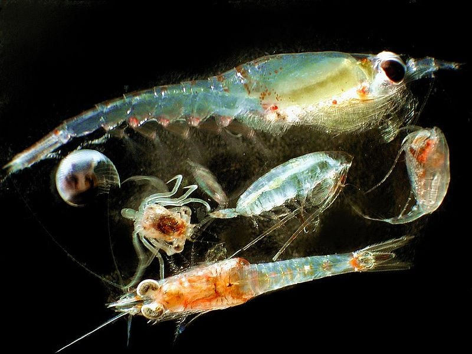
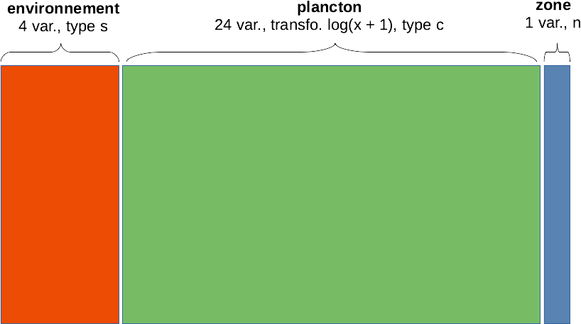

# AFM & big data {#afm-big-data}

```{r setup, include=FALSE, echo=FALSE, message=FALSE, results='hide'}
SciViews::R("explore", lang = "fr")
```

##### Objectifs {.unnumbered}

-   Être capable d'analyser des données présentes dans des tableaux multiples et/ou hétérogènes simultanément à l'aide de l'analyse factorielle multiple

-   Être capable de choisir les meilleurs outils de traitement et de remaniement de données en fonction de la taille des jeux de données à traiter, en particulier pour les (très) gros tableaux (= big data)

##### Prérequis {.unnumbered}

-   Les modules 6 et 7 doivent être assimilés avant d'attaquer le présent module.

```{asis, eval=is_html_output()}
](https://storage.googleapis.com/djnavarro-art/series-puffs/800/pollen_13_1366.jpg)
```

## Analyse factorielle multiple (AFM)

Jusqu'ici nous avons étudié différentes techniques pour explorer des données multivariées *soit* quantitatives (ACP), *soit* qualitatives (AFC). Nous n'avons pas abordé encore la question de données *mixtes* avec des tableaux qui contiennent *à la fois* des variables quantitatives et des données qualitatives.

Une première approche consiste à convertir des variables afin d'homogénéiser le tableau. La conversion ne peut se faire qu'en dégradant l'information, c'est-à-dire, dans le sens quantitatif continu -\> quantitatif discret -\> qualitatif ordonné -\> qualitatif non ordonné -\> binaire. Ainsi, dans un tableau contenant quelques variables quantitatives, nous pouvons créer des classes pour convertir les variables quantitatives en qualitatives. C'est par exemple ce que nous faisons quand nous remplaçons les indices de masse corporelle IMC dans nos données de biométrie humaine (quantitatif) en classes (tableau des classes proposées par l'OMS[^08-afm-big-data-1]).

[^08-afm-big-data-1]: OMS = Organisation Mondiale de la Santé, voir [ici](https://apps.who.int/bmi/index.jsp?introPage=intro_3.html).

| IMC [kg/m^2^] | Classification OMS |
|:-------------:|:-------------------|
|    \< 16,5    | sous-poids sévère  |
|    16 - 17    | sous-poids modéré  |
|   17 - 18,5   | sous-poids léger   |
|   18.5 - 25   | normal             |
|    25 - 30    | préobésité         |
|    30 - 35    | obésité classe I   |
|    35 - 40    | obésité classe II  |
|     \> 40     | obésité classe III |

À l'extrême, il est toujours possible d'encoder n'importe quelle variable sous forme binaire. C'est ce qu'on appelle le **codage disjonctif complet** (voir, par exemple, [ici](https://mtes-mct.github.io/parcours_r_module_analyse_multi_dimensionnelles/lacm.html)). Cette approche a non seulement l'avantage de transformer des variables différentes en 0 ou 1 dans un tableau homogène, mais permet aussi de comparer plus de deux variables qualitatives selon une extension de l'AFC dit **Analyse en Composantes Multiples** ou ACM que nous ne verrons pas dans ce cours, mais qu'il est important de mentionner pour mémo ici[^08-afm-big-data-2].

[^08-afm-big-data-2]: Si vous êtes intéressé par l'ACM et le codage disjonctif complet, voyez [cette vidéo](https://www.youtube.com/watch?v=bihScz3OXbw).

L'analyse factorielle multiple (AFM, *multiple factorial analysis* ou MFA en anglais) va permettre d'analyser simultanément plusieurs tableaux de données multivariés, et éventuellement mélanger des tableaux quantitatifs et qualitatifs (pour autant que les variables soient homogènes au sein de chaque tableau).

### AFM dans SciViews::R

Lorsque vous chargez les packages nécessaires à l'analyse exploratoire dans SciViews R à l'aide de `SciViews::R("explore")`, vous avez à disposition la fonction `mfa(data = ...., formula)` qui fera les calculs qui nous intéressent. Ensuite nous utiliserons `summary()` et `chart$type()` pour les graphiques, où `type` pourra être `screeplot`, `altscreeplot`, `loadings`, `scores`, `groups`, `axes`, `contingency` ou `ellipses` (nous verrons plus loin ce que représentent tous ces graphiques).

Nous allons aborder cette technique puissante, mais un peu plus complexe qu'est l'AFM sur la base d'un jeu de données que nous connaissons bien maintenant via nos exercices précédents : la communauté de plancton le long d'un transect entre Nice et la Corse.

### Plancton en Méditerranée

Les jeux de données `marphy` et `marbio` dans le package {pastecs} présentent deux tableaux de données complémentaires. Le premier, `marphy` reprend les mesures environnementales de base (température, salinité et densité des masses d'eaux), ainsi qu'une information indirecte sur la concentration en phytoplancton : la fluorescence de la chlorophylle. Le second tableau `marbio` reprend les effectifs observés dans 24 groupes de zooplancton mesurés sur des échantillons issus des mêmes stations que `marphy`. Ces stations sont réparties de manière équidistante le long d'un transect entre le continent (vers Nice, station n°1) et la Corse (à Calvi, station n°68).



Jusqu'à présent, nous avions utilisé ces deux tableaux séparément. Notre objectif ici est de les analyser ensemble. Nous allons commencer par considérer ces deux tableaux comme **quantitatifs**. Dans ce cas, l'AFM réalisera deux ACP, une par tableau. Ensuite, elle pondérera les données de chacun en fonction de la part de variance sur le premier axe respectif. Pour finir, elle réalisera une ACP globale avec toutes les données qui conservera la structure de chacun des deux tableaux initiaux grâce à la pondération appliquée en interne.

Les données environnementales dans `marphy` étant mesurées dans des unités différentes, nous les standardiserons. Concernant le plancton dans `marbio`, nous allons pondérer les espèces rares par rapport aux espèces abondantes en transformant $log(x + 1)$ les abondances observées avec la fonction `log1p()`. Enfin, nous rajouterons les différentes masses d'eaux identifiées par ailleurs (voir l'aide `?pastecs::marphy`) dans `marzones` que nous utiliserons comme troisième tableau de **variables supplémentaires** (un tableau que nous n'utilisons *pas* dans l'analyse, mais que nous représenterons dans les graphiques afin d'aider à leur interprétation). Voici donc la constitution d'un gros tableau qui reprend toutes les données dans la variable `mar` :

```{r}
marzones <- factor(c(
  rep("périphérique", 16),
  rep("divergente1", 8),
  rep("convergente", 5),
  rep("frontale", 11),
  rep("divergente2", 5),
  rep("centrale", 23)),
  levels = c("périphérique", "divergente1", "convergente",
    "frontale", "divergente2", "centrale"))

bind_cols(
  read("marphy", package = "pastecs"),
  log1p(read("marbio", package = "pastecs"))) %>.%
  smutate(., Zone = marzones) ->
  mar
```

Ce tableau n'a aucune valeur manquante et il contient 29 variables :

```{r}
names(mar)
```

Il y a trois groupes distincts :

-   les 4 premières colonnes comme variables quantitatives continues pour l'**environnement**,
-   les 24 colonnes suivantes comme quantitatives pour le **plancton**,
-   la dernière colonne qui caractérise les masses d'eaux (**zone**) comme variable qualitative supplémentaire.



Avant de pouvoir réaliser notre AFM, nous devons comprendre comment écrire la formule qui va décrire nos données. Pour chaque groupe, nous ajouterons un terme à la formule qui contient trois composantes :

1.  Le nombre `n` de colonnes constituant le groupe (les colonnes du tableau composite sont comptées de gauche à droite),
2.  Le `type` de variable considérée. Quatre types sont possibles. Les variables continues à standardiser avant d'être utilisées dans une ACP sont de type **std**. Les variables quantitatives également à utiliser selon l'ACP, mais *sans* standardisation sont de type **num**. Les données qualitatives assimilables à un tableau de contingence à double entrée (données de fréquences d'observations, dénombrements, etc.) sont de type **cnt** et seront traitées comme une AFC, et enfin, les variables qualitatives classiques sont de type **fct** et seront traitées comme des variables qualitatives dans l'analyse factorielle multiple AFM.
3.  Le `nom` que l'on veut donner à chaque groupe de variables pour l'identifier dans l'analyse.

Un groupe est décrit dans la formule comme `n * type %as% nom` (donc avec les opérateurs `*` et `%as%`). Chaque groupe inclus dans l'analyse est précédé d'un signe plus `+` (le premier plus peut être omis de la formule). Les groupes supplémentaires (à soustraire à l'analyse) sont précédés d'un signe moins `-`. Et enfin, tous les groupes sont décrits à la droite de la formule, donc, après le `~`.

##### À vous de jouer ! {.unnumbered}

`r h5p(120, height = 270, toc = "Formule de l'AFM")`

Dans notre cas concret ici, cela donne :

```
~ 4*std %as% environnement + 24*num %as% plancton - 1*fct %as% zone
```

L'analyse se fait en appelant `mfa(data = ...., formula)`. Nous assignons le résultat du calcul à `mar_mfa` :

```{r}
mar_mfa <- mfa(data = mar,
  ~ 4*std %as% environment + 24*num %as% plancton - 1*fct %as% zone)
```

Le résumé de l'analyse renvoyé par `summary()` donne beaucoup d'information.

```{r}
summary(mar_mfa)
```

Ne nous intéressons pour l'instant qu'au tableau `Eigenvalues` qui reprend les valeurs propres, c'est-à-dire, la part de variance sur les axes de l'ACP globale réalisée. Nous voyons qu'une variance cumulée de 74% (`Cumulative % of var.`) est représentée sur les deux premiers axes `Dim.1` et `Dim.2`. Le graphe des éboulis nous représente la partition de la variance sur les différents axes comme pour l'ACP :

```{r}
chart$scree(mar_mfa, fill = "cornsilk")
```

Ici, on voit très clairement que deux axes suffisent. La suite de l'analyse se fait à peu près comme une ACP, mais des données et graphes supplémentaires nous permettent d'interpréter les groupes de variables les uns par rapport aux autres. Le graphique des variables s'obtient comme pour l'ACP avec `chart$loadings()`. Il est ici plus encombré, car nous avons 28 variables. La direction des différents vecteurs par rapport aux dimensions de l'AFM et entre eux nous indique la corrélation directe (même sens), inverse (opposition), ou l'absence de corrélation (vecteurs orthogonaux). Ce graphique permet aussi d'orienter le plan de l'AFM pour nos graphiques ultérieurs.

```{r}
chart$loadings(mar_mfa, choices = c(1, 2))
```

Toutes les variables environnementales sont très bien représentées dans le premier plan de l'AFM (normes quasiment de 1). Nous observons une corrélation inverse entre la température (en bas à gauche du premier plan de l'AFM) et la fluorescence (qui pointe en haut à droite du plan). La salinité et la densité sont corrélées positivement entre elles, mais ne le sont pas avec les deux autres variables environnementales. Les salinités et densités élevées sont en bas à droite sur le plan de l'AFM.

Pour le plancton, nous avons pas mal de choses, car plusieurs vecteurs ont une norme importante (nous ignorons les autres, trop mal représentés dans le premier plan de l'AFM). Il faut pointer l'opposition entre des groupes comme GasteropodsLarvae, EchinodermLarvae, Cladocerans et Pteropods qui pointent vers la gauche, et les copépodes (Calanus, Clausocalanus, CopepoditsX, etc.) qui pointent vers la droite. Le découpage selon le second axe pour le plancton est moins net.

D'autre part, les variables environnementales pour lesquelles deux dimensions fortes se dégagent sont placées en oblique par rapport à la dimension forte du plancton sur Dim 1. cela signifie que les deux dimensions environnementales sont partiellement corrélées avec la présence de ces groupes planctoniques.

L'AFM est en fait un compromis réalisé entre des analyses indépendantes faites sur chaque groupe. Le graphique suivant montre comment ce compromis a été construit :

```{r}
chart$axes(mar_mfa, choices = c(1, 2))
```

Ce graphique est similaire au précédent, si ce n'est qu'au lieu de projeter les variables initiales dans le plan de l'AFM, il projette les composantes principales des différentes ACP séparées dans ce même plan. Il montre comment un *compromis* entre les différentes ACP est réalisé dans l'AFM globale. Ici, nous voyons que ce compromis est relativement proche de l'ACP plancton (`Dim.1` et `Dim.2` plancton en vert pointant dans la même direction que les axes de l'AFM). Nous voyons aussi que les deux premières dimensions de l'ACP environnement (`Dim.1` et `Dim.2` environnement en rouge) pointent en oblique par rapport à ces mêmes axes. La variable supplémentaire zone est également projetée, mais elle est moins corrélée avec les autres axes (sauf sa `Dim.2` avec l'axe 2).

Tout comme pour l'ACP, nous pouvons maintenant interpréter le graphique dans l'espace des individus, normalement avec `chart$scores()`.

```{r}
chart$scores(mar_mfa, choices = c(1, 2))
```

Nous pouvons aussi profiter de la variable supplémentaire zone pour colorer les points en fonction des masses d'eaux et représenter des ellipses pour chaque masse d'eau sur le graphique. La variante avec ces ellipses se réalise avec `chart$ellipses()` et il est plus clair dans pareil cas.

```{r}
chart$ellipses(mar_mfa, choices = c(1, 2), keepvar = "Zone")
```

Les différentes zones sont bien individualisées, à l'exception de :

-   Certaines stations en bordure de zones (par exemple, la 16 est dans la zone de divergence1 sur le graphique alors qu'elle est libellée comme zone périphérique). La dynamique des masses d'eaux est complexe autour d'une zone frontale comme ici. Il y a des turbulences, et les frontières ne sont toujours très nettes. Ce graphique propose clairement un découpage légèrement différent... intéressant !

-   La zone de divergence2 n'est pas fondamentalement différente de la zone centrale.

Notez qu'on a une progression le long du transect de la gauche (Nice) vers le centre, puis vers le haut à droite (le front) et puis vers le bas à droite (Calvi).

Si on interprète ce graphique des individus en fonction de l'orientation donnée sur base des variables, on peut dire que :

-   Nice (zone périphérique) s'individualise très fort du reste, et c'est le plancton qui explique essentiellement cette différence avec les groupes identifiés tirant vers la gauche (GasteropodsLarvae, EchinodermLarvae, Cladocerans et Pteropods). Nice est aussi à une température et fluorescence moyenne.

-   Toutes les autres zones sont caractérisées par une communauté planctonique différente de Nice, mais homogène, avec la zone divergente1 qui est logiquement intermédiaire (zone de mélange des masses d'eaux périphérique et frontale).

-   La zone frontale est caractérisée par la température la plus basse et la fluorescence la plus élevée alors que la salinité est moyenne. C'est logique : on a une remontée d'eaux froides des profondeurs riches en nutriments que le phytoplancton utilise (fluorescence élevée signifie phytoplancton élevé).

-   La zone centrale en Corse à Calvi est caractérisée par la salinité la plus élevée, une température élevée et une fluorescence basse, caractéristiques d'une zone oligotrophe. Comme nous l'avons déjà noté, la communauté planctonique est similaire à ce qu'on rencontre au large au milieu du transect, et elle tranche sensiblement avec celle rencontrée du côté niçois.

Revenons sur la façon dans l'AFM est construite (le fameux "compromis"), et son interprétation par rapport aux masses d'eaux. Le graphique suivant montre les relations entre les groupes.

```{r}
chart$groups(mar_mfa, choices = c(1, 2))
```

Ce graphique représente les groupes proches des axes dont ils sont responsables dans la structure générale de l'AFM. Nous voyons ici plancton proche de l'axe 1. Part contre, environnement est bien représenté (car il est loin du centre), mais est entre l'axe 1 et l'axe 2. Nous avons déjà noté cela précédemment.

La variable supplémentaire zone est aussi représentée à proximité de la structure qui lui correspond le mieux. Nous voyons que zone est plus proche d'environnement, ce qui signifie que les masses d'eau sont plutôt structurées en rapport avec les variables environnementales qu'en rapport avec les communautés planctoniques.

### AFM avec données mixtes

Jusqu'ici, nous avons réalisé une AFM avec uniquement des données quantitatives (hors variable supplémentaire "zones"), mais l'AFM peut aussi traiter des données qualitatives, sous forme de tableaux de contingence à double entrée, ou sous forme de variables facteurs. Nous allons tester cette variante sans sortir de notre exemple du plancton méditerranéen. En effet, le tableau plancton peut *aussi* être considéré comme un tableau de contingence à double entrée. Il nous suffit de changer le type de **cnum** à **cnt** (pour l'analyse des fréquences) dans la formule pour traiter à présent le plancton sous la forme d'une AFC dans `mar_mfa2` :

```{r}
mar_mfa2 <- mfa(data = mar,
  ~ 4*std %as% environment + 24*cnt %as% plancton - 1*fct %as% zone)
```

Rappelons-nous que l'AFC se ramène à une étape de son analyse à une ACP. C'est comme cela qu'il est possible de l'introduire dans l'AFM : à partir de l'étape ACP, les pondérations sont calculées et ajustées, et ensuite, une ACP globale est réalisée en la mélangeant avec les autres ACP.

Au lieu d'imprimer tout à l'aide de `summary()`, si nous souhaitons seulement les premières valeurs propres, nous pouvons aussi les extraire de l'objet comme ceci :

```{r}
head(mar_mfa2$eig)
```

Ici, les deux premiers axes comptent pour 74,6% de variance cumulée. Le graphe des éboulis confirme que deux axes suffisent :

```{r}
chart$scree(mar_mfa2, fill = "cornsilk")
```

Le graphique des variables ne montre plus que celles relatives à l'ACP, donc seulement le groupe environnement. Les conclusions à leur sujet sont les mêmes, mais attention, le premier plan de la nouvelle AFM se présente en miroir haut-bas par rapport à notre première analyse[^08-afm-big-data-3].

[^08-afm-big-data-3]: Les ACP sont définies au signe près. Or une inversion de signe dans une dimension a pour effet de faire apparaître les graphiques en miroir.

```{r}
chart$loadings(mar_mfa2, choices = c(1, 2))
```

```{r}
chart$axes(mar_mfa2, choices = c(1, 2))
```

Les conclusions sont similaires sur les axes. Voyons maintenant l'espace des individus, toujours avec les couleurs et les ellipses par zones :

```{r}
chart$ellipses(mar_mfa2, choices = c(1, 2), keepvar = "Zone")
```

Encore une fois ici, le résultat est sensiblement le même (gardez à l'esprit que ce graphique est la visualisation en miroir haut-bas par rapport à l'analyse précédente).

Les groupes montrent toujours le groupe zone plus proche d'environnement que de plancton.

```{r}
chart$groups(mar_mfa2, choices = c(1,2))
```

La partie AFC de l'analyse est accessible via `chart$contingency()` :

```{r}
chart$contingency(mar_mfa2, choices = c(1, 2))
```

Ici aussi les quatre classes de plancton `EchinodermLarvae`, `GasteropodsLarvae`, `Cladocerans` et `Pteropods` s'individualisent à gauche, contre tous les autres à droite. Également les stations proches de Nice se retrouvent à la gauche, et toutes les autres à droite.

```{block2, type='note'}
Nous voyons ici que le traitement sous forme ACP ou sous forme AFC (pour le comptage exhaustif d'espèces ou de classes taxonomiques par station, les deux sont envisageables) ne donne pas de résultats franchement différents. Ce n'est pas forcément toujours le cas. Veuillez à bien choisir vos types de variables dans l'AFM !
```

##### Pour en savoir plus {.unnumbered}

-   Des [slides](http://factominer.free.fr/more/tutorial_2010_MFA.pdf) (en anglais) qui détaillent les calculs de l'AFM, ainsi que d'autres calculs non abordés ici (le RV, les points partiels ...),

-   Une [vidéo d'introduction à l'AFM](https://www.youtube.com/watch?v=1U-s8u1rcpo) en français (8:37, première partie d'une série de quatre vidéos),

-   La [résolution de l'exemple sur les vins de Loire](http://www.sthda.com/english/articles/31-principal-component-methods-in-r-practical-guide/116-mfa-multiple-factor-analysis-in-r-essentials/) présenté dans la vidéo ci-dessus dans R (en anglais).

-   Le site de [FactoMineR](http://factominer.free.fr/index.html) qui implémente la fonction `MFA()` sur laquelle notre analyse se base,

-   Un exemple d'[application en biologie avec des données de génomique](https://link.springer.com/article/10.1186/s13059-017-1362-4) faisant intervenir une AFM,

-   [Numerical Ecology with R](https://www.springer.com/gp/book/9781441979766) traite en détail de nombreuses méthodes multivariées avec illustrations dans R (ouvrage recommandé pour tous ceux qui explorent des données multivariées en écologie, en anglais).

##### À vous de jouer ! {.unnumbered}

`r learnr("B08La_mfa", title = "Analyse factorielle multiple", toc = "Analyse factorielle multiple")`

```{r assign_B08Ia_mfa, echo=FALSE, results='asis'}
if (exists("assignment"))
  assignment("B08Ia_mfa", part = NULL,
    url = "https://github.com/BioDataScience-Course/B08Ia_mfa",
    course.ids = c(
      'S-BIOG-061' = !"B08Ia_{YY}M_mfa"),
    course.urls = c(
      'S-BIOG-061' = "https://classroom.github.com/a/4WTy61cc"),
    course.starts = c(
      'S-BIOG-061' = !"{W[26]+1} 13:00:00"),
    course.ends = c(
      'S-BIOG-061' = !"{W[27]+1} 23:59:59"),
    term = "Q2", level = 3,
    toc = "AFM sur oiseaux alpins")
```

<!--
**Créez un projet de groupe par quatre étudiants, que vous continuerez jusqu'au module 10 compris.**

{r assign_B08Ga_multi_I, echo=FALSE, results='asis'}
if (exists("assignment2"))
  assignment2("B08Ga_multi", part = "I",
    url = "https://github.com/BioDataScience-Course/B08Ga_multi",
    course.ids = c(
      'S-BIOG-061' = !"B08Ga_{YY}M_multi"),
    course.urls = c(
      'S-BIOG-061' = "https://classroom.github.com/a/-0inbKR_"),
    course.starts = c(
      'S-BIOG-061' = !"{W[26]+5} 08:00:00"),
    course.ends = c(
      'S-BIOG-061' = !"{W[35]+2} 23:59:59"),
    term = "Q2", level = 4, n = 4,
    toc = "Étude d'un jeu de données multivarié (I)")
-->

## Big data

On entend souvent parler de "big data", mais qu'est-ce que c'est réellement ? En quoi cela me concerne en qualité de biologiste ? Que dois-je faire si je suis confronté à un gros jeu de données ? Autant de questions auxquelles nous allons nous attaquer maintenant.

Le "big data" va s'intéresser aux jeux de données qui sont trop volumineux pour être traités avec les outils classiques que nous avons utilisés jusqu'ici. Il va donc de pair avec des outils logiciels spécifiques. Mais au fait, à partir de quelle taille de tableau dois-je m'inquiéter ?

### Gros jeux de données dans R

Au départ, vos données sont stockées sur le disque, proviennent d'Internet, ou d'un package R. Dans `SciViews::R`, vous les lisez en mémoire vive avec la fonction `read()`. Cette fonction importe les données depuis différents formats. Nous allons considérer principalement deux formats très fréquents en biologie : CSV et Excel. Microsoft Excel a une limitation maximale de la taille du tableau à un peu plus d'un million de lignes et un peu plus de 16.000 colonnes. Donc, est-ce qu'un million de lignes, c'est à considérer comme du "big data" avec R aussi ? Pour y répondre, il faut déterminer si un tel tableau de données peut tenir en mémoire vive. Admettons que le tableau ne contienne que des nombres réels. Dans R, ces nombres sont représentés par des **"doubles"** qui occupent chacun 8 octets (les entiers de R, dits **"long integers"** occupent, eux, 4 octets chacun). Si vous avez 10 variables matérialisées par des "doubles" dans ce tableau d'un million de lignes, vous aurez : 1.000.000 \* 10 \* 8 octets = 80 millions d'octets ou encore environ 80 mégaoctets (en réalité, un mégaoctet, c'est 1024\*1024 octets, mais ne chicanons pas). La mémoire vive d'un PC moyen fait 8 gigaoctets, soit environ 8000 mégaoctets. Aucun problème pour R avec un tableau de cette taille ou même plus gros. **En matière de nombre de lignes, Excel déclare forfait vers le million, mais R peut facilement gérer des tableaux bien plus volumineux.**

Pour les objets **data.table** que nous utilisons régulièrement dans `SciViews::R`, la limite vient du nombre entier le plus grand que R peut gérer (les entiers sont utilisés pour indexer les lignes du tableau en mémoire). Ce nombre est :

```{r}
.Machine$integer.max
```

Comme les entiers sont représentés par 4 octets, cela correspond à 2\^31 - 1 = `r 2^31-1`. On enlève un bit qui sert à stocker le signe de l'entier + ou - et encore un bit pour représenter les valeurs manquantes. La limite absolue d'un tableau **data.table** est donc d'un peu plus de 2 milliards de lignes, soit 2000 fois plus que dans Excel.

Une autre limitation est toutefois à prendre aussi en compte : la taille de la mémoire vive disponible. Vous ne pourrez pas ouvrir et travailler avec un tableau de données plus gros, ou même, qui tienne tout juste en mémoire vive. En effet, il faut garder de la mémoire pour le système d'exploitation et les logiciels, dont R. R doit aussi copier les données partiellement ou totalement selon les fonctions que vous allez utiliser sur votre jeu de données. Donc, pour pouvoir faire ensuite quelque chose d'utile sur ce tableau, il faut compter que le tableau le plus volumineux utilisable correspond à la mémoire vive divisée par un facteur entre 2.5 et 3 (2.5 si vous avez beaucoup de mémoire vive, soit 64Go ou plus). Avec votre machine dans SaturnCloud et ses 4Go, vous pourrez donc traiter un tableau de données de 15 millions de lignes, toujours si vous avez les mêmes 10 colonnes de nombres réels dedans (15.000.000 \* 10 \* 8 ≈ 1.2Go).

Si vous souhaitez monter un PC qui ne sera limité que par la taille maximale admissible pour un **data.table,** et jouer avec des tableaux de 2 milliards de lignes (toujours avec 10 colonnes de nombres réels et un facteur multiplicatif de 2.5), il vous faudra installer 400Go de mémoire vive dans ce PC. Naturellement, si vous avez 20 colonnes, il vous en faudra deux fois plus : la taille est relative au nombre de colonnes à raison de 16Go par colonne de nombres réels ou de dates et 8Go par nombres entiers ou variables **factor** sur 2 milliards de lignes, sans oublier de multiplier tout cela par le facteur de 2.5 à 3.

Mais prenons maintenant un peu de recul : combien de fois aurez-vous à traiter d'aussi gros jeux de données (et surtout à les traiter en une seule fois) ? Il est fort probable plutôt que vous ne rencontrerez déjà que rarement des tableau avec plus de quelques dizaines de millions de lignes. Donc, la quasi-totalité de vos tableaux de données pourra être traitée entièrement en mémoire vive, que ce soit dans votre PC directement, ou dans une machine virtuelle plus grosse dans le cloud. Aujourd'hui, un PC puissant, style station de travail, qui coûte quelques milliers d'euros, peut accueillir très facilement 128Go de mémoire vive. De plus, vous avez aussi accès (avec un compte payant) à des machines sur le cloud qui ont autant, voire plus de mémoire vive. Par exemple, dans [SaturnCloud](https://saturncloud.io), vous avez les machines **4XLarge** avec 16 cœurs et 128Go de RAM, **8XLarge** avec 32 cœurs et 256Go RAM, et même **16XLarge** avec 64 cœurs et 512Go de RAM !

```{block2, type='info'}
Avec Excel, vous ne pourrez pas traiter des tableaux plus gros qu'environ 1 million de lignes (voir [ici](https://support.microsoft.com/en-us/office/excel-specifications-and-limits-1672b34d-7043-467e-8e27-269d656771c3)) et aujourd'hui des tableaux de cette taille se rencontrent en biologie, même si ce n'est pas ultra fréquent. Par contre, la limite dans R est :

-   soit de 2^31-1 lignes = plus de 2 milliards de lignes (nombre de lignes maximales indexables dans un **data.table**),
-   soit la taille de la mémoire vive en Go à raison d'environ (8Go * nombre de colonnes de réels ou dates + 4Go * nombre d'entiers ou facteurs) * nombre de lignes du tableau / 1.000.000.000 * coefficient multiplicatif (2.5 ou 3), approximation d'un Go ≈ 1.000.000.000 octets.

Aujourd'hui, les PC ou machines virtuelles sur le cloud ayant 128Go de mémoire vive sont relativement accessibles. Ils permettent de traiter des tableaux de 600 millions de lignes par 10 colonnes d'entiers... et vous rencontrerez très, très rarement des tableaux aussi volumineux. Par conséquent, la question du "big data" ne se présentera pas pour vous, ou alors, il s'agira de données gérées par une grosse organisation qui a les moyens nécessaires pour engager une équipe de spécialistes qui gère ces données à votre place. **Vous devez, par contre, maîtriser les techniques qui vous permettent de traiter des tableau moyennement volumineux de plusieurs centaines de milliers de lignes à plusieurs dizaines de millions de lignes**.
```

### Tableaux de millions de lignes

Nous allons prendre comme exemple un jeu de données de près de deux millions de lignes et cinq variables (impossible d'ouvrir dans Excel, donc) : `babynames`, du package du même nom. Il s'agit des prénoms choisis pour des bébés américains entre 1880 et 2017. Nous utiliserons régulièrement la fonction `system.time()[["elapsed]]` pour calculer le temps qu'il faut pour exécuter une portion de code car dès que les tableaux deviennent très volumineux, le **temps de calcul** devient aussi un élément déterminant.

```{r}
SciViews::R
(time <- system.time(
  babynames <- read("babynames", package = "babynames")
)[["elapsed"]])
```

Il nous a fallu seulement `r round(time, 3)` secondes pour charger ce jeu de données en mémoire depuis la machine qui a compilé ce cours en ligne. Essayez dans votre SciViews Box sur SaturnCloud pour voir ce que cela donne..., mais avant cela, vous devez installer le package {babynames} comme ceci :

```{r, eval=FALSE}
install.packages("babynames")
```

Ensuite seulement, vous pourrez lire le jeu de données avec l'instruction `read()`un peu plus haut. Pour visualiser de manière compacte la structure du tableau, vous pouvez utiliser `str()` :

```{r}
str(babynames) # Structure du tableau
```

Nous avons deux colonnes de nombres réels (l'année `year`, qui aurait aussi pu être encodée en entiers et les proportions annuelles de chaque prénom dans `prop`). Il y a aussi une colonne d'entiers, `n`, le nombre de fois qu'un prénom apparaît chaque année, et deux colonnes textuelles : `sex` prenant les modalités `"F"` ou `"M"` et `name`, les prénoms.

Pour examiner la place occupée en mémoire vive par un objet R, vous pouvez utiliser `lobstr::obj_size()`.

```{r}
lobstr::obj_size(babynames)
```

Notre tableau occupe près de 75 millions d'octets (*Bytes* en anglais, d'où l'unité `B`). Si vous voulez convertir cette valeur en mégaoctets de manière exacte, vous devez savoir qu'un mégaoctet est exactement 1024 x 1024 octets, ou encore 2\^20 octets = 1.048.576 octets. Appliquons cela à la sortie de `lobstr::obj_size()`, tout en déclassant le résultat obtenu pour éviter qu'il n'imprime le `B` à la fin qui ne serait plus l'unité correcte, puisqu'on sera cette fois-ci en `MB`. (essayez sans `unclass()` pour comprendre son rôle ici) :

```{r}
(lobstr::obj_size(babynames) / 2^20) |> unclass()
```

Notre tableau occupe 71,5 mégaoctets en mémoire vive. Pour connaitre la quantité de mémoire vive totale occupée par R, les packages et les objets chargés en mémoire, regarder dans l'onglet **Environment** de RStudio. Dans la barre d'outils, il y a un petit graphique en parts de tarte qui l'indique avec la valeur en `MiB` ou `GiB`. Les `MiB`, contrairement aux `MB` correspondent, eux, à 1.000.000 d'octets. Confus ? Oui, ce n'est pas facile, il y a deux façons de calculer la taille en mémoire et sur le disque, avec le "kilo" octets qui vaut soit 1000, soit 1024. Soyez bien attentifs. Par exemple, la taille des disques durs et disques SSD sont généralement renseignés en `GiB`, des millions d'octets ou en `TiB`, des milliards d'octets, mais la taille des partitions sur le disque sont renseignées en `GB`, soit 1024 x 1024 x 1024 octets. Cela explique que vos partitions dépassent de peu les 900 gigaoctets sur votre disque pourtant bien renseigné comme ayant une capacité de ... 1 téraoctet !

Mais revenons à notre onglet **Environment**. Si vous cliquez sur la petite flèche noire pointant vers le bas à la droite du graphique en parts de tarte et de l'indication, vous avez un menu déroulant qui donne accès à un rapport plus complet de l'utilisation, de la mémoire vive par la session actuelle... C'est très pratique pour voir où on en est, surtout quand on manipule de très gros jeux de données ! Notez, à présent, la quantité de mémoire utilisée par la session R (le nombre qui apparaît dans la barre d'outils) après avoir chargé le tableau `babynames`. Nous allons maintenant faire une opération classique sur ce tableau. Nous allons résumer l'utilisation des prénoms toutes années confondues et les trier du plus utilisé au moins utilisé. Ce faisant, nous enregistrerons également le temps nécessaire à ce calcul dans R avec `system.time()`.

```{r}
(time <- system.time(
  babynames %>.%
    sgroup_by(., name) %>.%
    ssummarise(., total = fsum(n)) %>.%
    sarrange(., desc(total)) ->
    names
)[["elapsed"]])
```

Il a fallu bien moins d'une seconde sur la machine qui compile ce cours pour faire cette opération. Vous voyez donc que, non seulement, nous pouvons lire dans R très facilement des tableaux de plusieurs millions de lignes, mais qu'en plus, les remaniements classiques avec les fonctions "speedy" dont le nom commence par "s" sont également très rapides.

```{block2, type='note'}
Lorsque vos calculs commencent à "devenir lents", c'est-à-dire, quand il faut plus d'une dizaine de secondes pour retrouver la main, cela vaut la peine d'utiliser les versions les plus rapides des fonctions de manipulation de tableaux de données. En général, les fonctions "tidy" privilégient la clarté de l'interface utilisateur à la vitesse. Les fonctions "speedy" sont plus rapides et moins gourmandes en mémoire vive. S'il faut encore gagner, utilisez [{data.table}](https://rdatatable.gitlab.io/data.table/), [{duckdb}](https://r.duckdb.org), ou [{polars}](https://rpolars.github.io). Dans tous les cas, il existe un package qui permet de continuer à écrire son code presque comme d'habitude avec des `select()`, `filter()` ... grâce à [{dtplyr}](https://dtplyr.tidyverse.org), [{dbplyr}](https://dbplyr.tidyverse.org) ou [{tidypolars}](https://tidypolars.etiennebacher.com). [Cette page](https://duckdblabs.github.io/db-benchmark/) présente une comparaison des performances de différents systèmes de traitement de gros jeux de données en mémoire.
```

Suite au traitement que nous venons de réaliser ci-dessus, voici les dix prénoms les plus utilisés aux États-Unis :

```{r}
head(names, n = 10)
```

Il s'agit de prénoms masculins. Cela veut donc dire que les principaux prénoms masculins sont bien plus (ré)utilisés que les principaux prénoms féminins pour lesquels il y a plus de diversité.

Notez à présent la quantité de mémoire utilisée par votre session R... Normalement, si vous êtes parti d'une session vide, vous restez encore en dessous du gigaoctet, soit encore loin des 4Go disponibles. On a de la marge et aucune précaution particulière ne doit être prise avec des tableaux "aussi petits" pour R. Par contre, faites bien attention aux outils statistiques que vous utilisez dessus. Par exemple, ajuster un modèle linéaire généralisé avec variable aléatoire dans une telle quantité de données prendra soit un temps très, très long, soit fera planter la machine par manque de mémoire (il s'agit d'une technique qui demande énormément de calculs).

```{block2, type='info'}
Lorsque vous manipulez des gros jeux de données dans R, pensez toujours à surveiller l'utilisation de la mémoire vive par la session en cours et à éliminer les objets qui ne sont plus utiles. Pour cela, vous pouvez utiliser `rm()`. Par exemple, pour effacer de la mémoire un tableau nommé `df`, et un vecteur `x`, vous entrez `rm(df, x)`.
```

### Format de stockage

Le format de stockage conseillé pour les tableaux cas par variables est le [CSV](https://docs.fileformat.com/spreadsheet/csv/) ("coma-separated values"). Il s'agit d'un format qui existe depuis les années 1970 et qui est le plus universel pour l'échange et l'archivage des données[^08-afm-big-data-4]. Malheureusement, le format CSV n'est pas le plus économe en espace disque, car il stocke les données en clair (lisible par un humain) et donc de manière non compressée. Il est toutefois possible de compresser le fichier à l'aide de trois algorithmes différents : **gz**, **bz2** ou **xz**, dans l'ordre de l'efficacité de compression, mais dans l'ordre inverse de temps de calcul pour compresser et décompresser les données. Ainsi la compression **gz** (le fichier portera l'extension **.csv.gz**) est le mode de compression le plus rapide, mais qui génère une compression moyenne. **C'est un bon choix pour les tableaux de taille petite à moyenne et pour un usage en local.** À l'opposé, le **xz** (fichiers **.csv.xz**) permet une bien meilleure compression, au prix d'un temps de calcul bien plus long à la compression (la décompression restant moyennement rapide). **C'est un excellent choix pour les fichiers à archiver définitivement ou encore pour un échange via Internet.** La compression **.bz2** est intermédiaire, et donc utile si vous voulez un compromis entre les deux. Avec le format CSV combiné à la compression, vous pourrez déjà faire beaucoup.

[^08-afm-big-data-4]: Pensez toujours à adjoindre un **dictionnaire des données** à votre fichier CSV qui renseigne les métadonnées nécessaires pour expliciter chaque colonne du tableau... Nous avons traité cette question dans le module 5 du premier cours.

##### À vous de jouer ! {.unnumbered}

`r h5p(223, height = 270, toc = "Écriture de gros jeux de données")`

Nous allons maintenant enregistrer le tableau d'origine `babynames` sur le disque. Une fois n'est pas coutume, nous sortirons du dépôt et créerons un dossier temporaire nommé `babynames_to_delete` qui, comme son nom l'indique, est voué à être effacé[^08-afm-big-data-5]. **Évitez d'exécuter ceci dans la machine SaturnCloud du cours**, car vous n'avez que 2GiB de disque disponible au total. Vous pouvez essayer cela dans une machine SaturnCloud créée dans votre espace personnelle en choisissant un espace disque de 10Go.

[^08-afm-big-data-5]: Nous pourrions aussi utiliser un dossier temporaire créé comme sous-dossier de `tempdir()`, mais il ne sera alors pas si facile d'explorer les fichiers créés dans l'onglet **Files** de RStudio.

```{r}
testdir <- "../babynames_to_delete"
dir_create(testdir)
```

Voici le tableau où nous allons stocker les différentes données utiles à la comparaison :

```{r}
timings <- dtx(
  format = c("csv", "csv.gz", "csv.bz2", "csv.xz"),
  ecriture_s = NA, lecture_s = NA, taille_Mo = NA)
```

Nous allons maintenant enregistrer notre tableau de données en CSV non compressé et le relire, tout en minutant les opérations d'écriture et de relecture. Le chemin d'accès au fichier est construit à l'aide de `path()`.

```{r}
csv_file <- path(testdir, "babynames.csv")
(timings$ecriture_s[1] <- system.time(
  write$csv(babynames, csv_file)
)[["elapsed"]])
```

Et pour la lecture :

```{r}
(timings$lecture_s[1] <- system.time(
  babynames2 <- read(csv_file)
)[["elapsed"]])
```

Nous récupérons également la taille du fichier :

```{r}
timings$taille_Mo[1] <- file_size(csv_file) / 2^20 # Transformation en Mo
```

La vitesse d'écriture (et de lecture) dépend naturellement de R, mais aussi de la vitesse du disque utilisé. La machine où ce cours est compilé est rapide. L'écriture prend moins d'une seconde. Dans SaturnCloud, c'est un peu plus lent, mais toujours très acceptable.

Nous faisons maintenant de même pour les trois formats de compression **.gz**, **.bz2** et .**xz**. Compression GZ :

```{r}
csv_gz_file <- path(testdir, "babynames.csv.gz")
(timings$ecriture_s[2] <- system.time(
  write$csv.gz(babynames, csv_gz_file)
)[["elapsed"]])
(timings$lecture_s[2] <- system.time(
  babynames2 <- read(csv_gz_file)
)[["elapsed"]])
timings$taille_Mo[2] <- file_size(csv_gz_file) / 2^20 # Transformation en Mo
```

Compression BZ2 :

```{r}
csv_bz2_file <- path(testdir, "babynames.csv.bz2")
(timings$ecriture_s[3] <- system.time(
  write$csv.bz2(babynames, csv_bz2_file)
)[["elapsed"]])
(timings$lecture_s[3] <- system.time(
  babynames2 <- read(csv_bz2_file)
)[["elapsed"]])
timings$taille_Mo[3] <- file_size(csv_bz2_file) / 2^20 # Transformation en Mo
```

Compression XZ :

```{r}
csv_xz_file <- path(testdir, "babynames.csv.xz")
(timings$ecriture_s[4] <- system.time(
  write$csv.xz(babynames, csv_xz_file)
)[["elapsed"]])
(timings$lecture_s[4] <- system.time(
  babynames2 <- read(csv_xz_file)
)[["elapsed"]])
timings$taille_Mo[4] <- file_size(csv_xz_file) / 2^20 # Transformation en Mo
```

Cela donne les résultats suivants :

```{r, warning=FALSE}
tabularise(timings)
```

Comme vous pouvez le constater, la compression de ce type de tableau n'est pas négligeable. Déjà avec GZ, on obtient une compression cinq fois et avec XZ, cela monte à 7,5 fois et on passe de 46,5Mo à un peu plus de 6Mo. Cependant, le temps de compression (écriture) est alors très long. Le format GZ est le plus rapide et le format BZ2 reste raisonnablement rapide en écriture avec un excellent niveau de compression, mais c'est le plus lent en lecture ensuite. Voici quelques directives basées sur ces résultats :

-   S'il y a beaucoup de place sur le disque et que le disque est rapide, le format non compressé CSV est à privilégier.

-   Si le disque est plus lent, et pour des données qui doivent être lues fréquemment, la compression GZ peut donner de meilleurs résultats en lecture, tout en économisant de la place sur le disque. À privilégier pour SaturnCloud, ou éventuellement, un dépôt GitHub (voir ci-dessous).

-   Pour un meilleur niveau de compression avec des résultats balancés entre écriture et lecture, pensez au format csv.bz2.

-   Pour une compression maximale, utilisez XZ. Ceci se justifie pour des fichiers à stocker sur un serveur sur le net. En effet, le temps de téléchargement sera ici le facteur le plus important et il est directement proportionnel à la taille du fichier.

Vous pouvez naviguer jusque dans votre dossier `babynames_to_delete` dans l'onglet **Fichiers** pour voir vos différents fichiers. Enfin, lorsque vous avez fini de travailler avec de gros jeux de données, pensez à nettoyer votre environnement de travail, et éventuellement, vos dossiers des objets et fichiers devenus inutiles (**important sur SaturnCloud !**).

```{r}
rm(babynames, babynames2)
fs::dir_delete(testdir)
```

##### À vous de jouer ! {.unnumbered}

`r h5p(224, height = 270, toc = "Niveaux de compression")`

### Gros jeux de données et git/GitHub

Si nous pouvons travailler confortablement dans R avec des tableaux de plusieurs millions de lignes, le système de gestion git et la plateforme de collaboration GitHub (ou les équivalents GitLab, BitBucket ou autres) n'aiment pas du tout, par contre, les gros fichiers que ces tableaux génèrent... et encore moins lorsque ces fichiers sont amenés à changer d'une version à l'autre ! Pour nos données brutes, nous pouvons raisonnablement penser que l'on peut avoir un fichier qui ne change pas. C'est déjà ça. Mais GitHub ne tolère pas des fichiers plus gros que 25Mo (si téléversés directement via le navigateur web) ou 100Mo via un push. Nous vous conseillons de considérer les techniques discutées ici dès que vos fichiers atteignent ou dépassent 10Mo.

Premièrement, envisagez de stocker vos données (compression csv.xz si possible) ailleurs où elles sont accessibles via un lien URL. Pour cela, il vous faut un serveur de fichiers. Des stockages cloud comme OneDrive, Google Drive ... ne permettent en général pas le téléchargement direct de fichiers via une URL (en tous cas pas sans ruser) : il faut obligatoirement passer par l'interface du système. Par contre, certains dépôts spécialisés dans les données comme [Zeonodo](https://zenodo.org) vous permettent de créer un compte gratuit et d'ensuite partager des données, y compris de très, très gros fichiers (jusqu'à 50Go, voire plus avec autorisation à demander aux gestionnaires du site). Vous aurez en plus un DOI, c'est-à-dire, un identifiant unique pour faciliter l'accès (voir module 10).

Deuxièmement, décidez si vous voulez *toujours* télécharger vos données depuis cette URL, ou si vous voulez utiliser un **cache** qui vous permettra de ne lire le fichier qu'une seule fois et de le stocker ensuite sur le disque. La fonction `read()` admet un argument `cache_file =` qui indique où stocker une copie du fichier. Le but est de le stocker dans le dépôt, mais dans un dossier qui sera ignoré de git, par exemple dans `data/cache`. Ainsi, vous éditerez le fichier `.gitignore` à la racine du dépôt en y ajoutant `data/cache/`. La barre oblique à la fin est importante pour spécifier qu'il s'agit d'un dossier dont on veut ignorer tout le contenu. À partir de ce moment, le fichier en cache ne sera pas repris dans les commits/pulls/ pushes.

Troisièmement, vous utilisez `read()` sur l'URL et indiquez le fichier désiré dans `cache_file=`. Cela donne quelque chose comme ceci (spécifiez toujours bien le format avec `$…` si vous chargez vos données depuis une URL) :

```{r, eval=FALSE}
dir_create("data/cache") # S"assurer que le dossier existe
big_data <- read$csv.xz("https://mysite.org/mybigdata.cs.xz",
  cache_file = "data/cache/mybigdata.csv.xz")
```

Une fois mis en place, cela fonctionnera comme suit :

-   Vous clonez le dépôt depuis GitHub

-   À la première utilisation de `read()`, les données sont téléchargées depuis l'URL et l'objet `big_data` est créé en mémoire vive dans la session R. Par la même occasion, `data/cache/mybigdata.csv.xz` est enregistré.

-   Comme le fichier est dans un dossier repris dans le `.gitignore`, il n'est pas considéré dans les commits et n'encombre donc pas votre dépôt dans GitHub.

-   Aux appels suivants de `read()`, les données ne sont plus rechargées depuis Internet, mais c'est le fichier en cache qui est lu directement.

Ce mécanisme est très efficace pour contourner les limitations de git et GitHub. Cependant dans SaturnCloud, pensez bien à la taille très restreinte du disque virtuel à votre disposition. Posez-vous la question si vous voulez l'encombrer avec le fichier en cache, ou s'il vaut mieux relire les données depuis Internet *à chaque fois*. Cela est souvent préférable dans ce cas particulier où vous payer l'espace disque utilisé au Go.

##### À vous de jouer ! {.unnumbered}

`r h5p(225, height = 270, toc = "Taille maximale de fichiers dans git/GitHub")`

### Bases de données à la rescousse

Si les données sont trop volumineuses pour tenir en mémoire, ou s'il n'est pas raisonnable de rapatrier toutes les données (par exemple, depuis Internet) pour, au final, filtrer ou regrouper les données vers un plus petit jeu de données, il vaut mieux travailler avec des outils spécialisés dans ce type de traitement : les **bases de données**. Voici un scénario décliné en deux variantes pour vous faire comprendre son intérêt. Vous avez un gros jeu de données (50Go, 9 colonnes par 1 milliard de lignes) sur une machine distante. Vous avez besoin d'une partie de ces données (1%) pour la suite de votre travail, soit 10 millions de lignes après agrégation des données.

**Variante #1 : sans base de données**

-   Données disponibles sur un serveur distant au format CSV, compressé XZ via une URL (admettons une compression x5 pour fixer les idées, taille du fichier : 10Go).

-   Utilisation de `read()` sur l'URL. Il faut au moins 128Go de mémoire vive pour traiter un tel tableau. Temps de téléchargement avec une bonne connexion Wifi (120Mbit/s) : 14min.

-   Filtrage et agrégation des données dans `SciViews::R` à l'aide de `sfilter()`, `sgroup_by()` et `ssummarise()` : \< 1 sec.

**Variante #2 : avec base de données**

-   Données disponibles depuis un serveur distant utilisant une base de données PostgreSQL.

-   Connexion à la base de données depuis le R local : \< 1 sec.

-   Utilisation des verbes `filter()`, `group_by()` et `summarise()` dans R avec le package {dbplyr} = code similaire au scénario #1.

-   Exécution d'une requête SQL dans la base de données à l'aide de `collect_dtx()`. {dbplyr} convertit automatiquement votre code en SQL et l'envoie au serveur PostgreSQL qui effectue le traitement directement sur le serveur : 1-2 sec.

-   Vous récupérez le tableau des données agrégées. Cela représente 1% des données brutes. Toujours avec la même connexion Wifi, cela prend environ 10 sec.

-   Comme vous récupérez un tableau de 10 millions de lignes, il ne nécessite plus que 0,5Go de mémoire vive. Même si vous n'avez pas plus de 4Go de RAM dans votre machine SaturnCloud du cours, vous pourrez travailler confortablement avec ce tableau dans R.

-   Vous vous déconnectez de la base de données.

La variante #2 est un peu plus compliquée, car elle implique la connexion à un serveur de base de données, mais comme vous ne devez pas récupérer l'ensemble des données sur votre propre PC, vous pouvez vous contenter de 4Go de RAM au lieu de 128Go. De plus, le traitement sera bien plus rapide (moins de 15 sec, contre près d'1/4h pour la variance #1). En effet, le téléchargement de l'ensemble des données nécessite de récupérer 10Go de données compressées. C'est le goulot d'étranglement dans le processus qui rend la variante #1 très, très lente. Vous l'aurez compris, dans un tel cas, la base de données est largement gagnante (variante #2).

Il existe deux grandes catégories de bases de données : les **bases de données relationnelles ou non**. Les premières utilisent un langage spécifique pour interroger et manipuler les données : le **SQL** ou **"Structured Query Language"**. Dans cette catégorie, nous retrouvons [SQLite](https://www.sqlite.org/index.html), [PostgreSQL](https://www.postgresql.org), MySQL/[MariaDB](https://mariadb.org), Microsoft Access et SQL Server, Oracle ... et aussi [DuckDB](https://duckdb.org) franchement orienté vers la science des données. Les bases de données non relationnelles, dites "noSQL" utilisent des requêtes en **JSON**. La plus connue est [MongoDB](https://www.mongodb.com), mais il y en a plusieurs autres. Il existe des packages R permettant d'accéder à toutes ces bases de données et encore à bien d'autres.

##### À vous de jouer ! {.unnumbered}

`r h5p(226, height = 270, toc = "Bases de données et requêtes")`

L'exemple présenté plus haut est fictif. Dans un premier temps, vous pouvez vous concentrer sur la façon de vous connecter et de vous déconnecter de la base de données. Ensuite, le package {dbplyr} permet d'utiliser vos verbes {dplyr} familiers tels que `filter()`, `select()`, `mutate()`, `group_by()` ou `summarise()`. Pour cela, nous allons toujours utiliser notre jeu de données `babynames`, mais nous créerons une base de données [DuckDB](https://duckdb.org) en mémoire dans l'unique but de comprendre la logique de connexion et d'interrogation d'une base de données avec {dbplyr}. Nous approfondirons l'utilisation des bases de données dans le module suivant. Assurons-nous d'abord d'avoir `SciViews::R` et le jeu de données `babynames` chargés.

```{r}
SciViews::R
babynames <- read("babynames", package = "babynames")
```

Nous créons une base de données DuckDB en mémoire et nous nous y connectons dans la foulée avec `DBI::dbConnect()`. Naturellement, la plupart du temps, la base de données sera créée sur le disque en indiquant un chemin d'accès à cette base pour l'argument `dbdir =` à `DBI::dbConnect()` (voir l'aide en ligne de `?duckdb::duckdb`). Ensuite, nous recopions `babynames` dans la base de données avec `copy_to()`. En pratique, vous pouvez imaginer une base de données préexistante n'importe où sur Internet et qui possède déjà les données à utiliser.

```{r}
# Création de la base de données et connexion
con <- DBI::dbConnect(duckdb::duckdb())
copy_to(con, babynames)
```

À présent, afin d'éviter de confondre la table "babynames" dans la base de données et le jeu de données dans R `babynames`, nous allons effacer ce dernier. Il ne subsistera donc plus que la version dans DuckDB.

```{r}
rm(babynames) # Élimination du jeu de données dans la session R
```

Le package {DBI} vous offre une panoplie de fonctions pour interagir avec la base de données. Par exemple, pour lister les tables présentes dans la base de données :

```{r}
DBI::dbListTables(con)
```

... et pour lister les variables (on parle de **champs** pour une base de données, ou *fields* en anglais), vous ferez :

```{r}
DBI::dbListFields(con, "babynames")
```

Tout cela concerne bien les données dans DuckDB. Dans l'environnement R, nous n'avons que `con` la connexion à cette base de données, mais aucune autre donnée dans R lui-même. Nous pouvons créer un objet **tbl** qui va être lié à une table de notre base de données comme ceci :

```{r}
db_babynames <- tbl(con, "babynames")
db_babynames
```

Quand vous imprimez le contenu de `db_babynames`, vous pouvez avoir l'impression qu'il contient les données, mais il n'en est rien. Une requête sur les 10 premières lignes du tableau est faite en interne dans la base de données. Ensuite ces 10 lignes sont affichées, et le résultat est jeté. Aucune donnée n'est réellement stockée dans `db_babynames`. D'ailleurs, ce n'est pas un data frame, mais une liste.

La particularité de l'objet `db_babynames` est donc qu'il ne fait qu'un lien avec la table de la base de données. Insistons bien : le contenu de la base n'est *pas* dans R, il appartient au serveur de la base de données, ici, à DuckDB qui gère sa base en mémoire vive. Cependant, vous pourrez l'utiliser presque comme si c'était un jeu de données habituel dans R. Mais à chaque fois que vous écrirez du code qui utilise une fonction "tidy", l'action est mise en attente et traduite en **langage SQL** qui est le langage compris par le serveur de base de données. La fonction `show_query()` permet de visualiser ce code SQL à tout moment.

À titre d'exemple, reprenons notre petit traitement précédent. Il consiste à sommer les occurrences de tous les prénoms sur toutes les années et puis à les arranger du plus fréquent au moins fréquent. Pour rappel, voici le code que nous avions utilisé avec les fonctions "speedy" pour effectuer l'opération sur le data frame `babynames` en mémoire vive dans la session R :

```{r, eval=FALSE}
babynames %>.%
  sgroup_by(., name) %>.%
  ssummarise(., total = fsum(n)) %>.%
  sarrange(., desc(total)) ->
  names
```

Nous allons maintenant réécrire ce code en fonction "tidy" (**attention : les fonctions "speedy" commençant par "s" et les fonctions "fast" commençant par "f" ne sont *pas* utilisables avec les objets tbl !)**.

```{r}
db_babynames %>.%
  group_by(., name) %>.%
  summarise(., total = sum(n, na.rm = TRUE)) %>.%
  arrange(., desc(total)) ->
  query
```

Nous avons éliminé les "s" et "f" devant le nom des fonctions. Comme la fonction `sum()` n'élimine pas les valeurs manquantes par défaut, contrairement à `fsum()`, nous devons préciser `na.rm = TRUE` pour avoir le même traitement. À ce stade, rien n'est réalisé en fait. La base de données n'est **pas encore** interrogée. Utilisons maintenant `show_query()` pour voir à quoi ressemble le code SQL équivalent, code qui sera exécuté dans la base de données ultérieurement.

```{r}
show_query(query)
```

Même si vous n'avez jamais rencontré de code SQL auparavant, vous noterez qu'il est relativement compréhensible. Les mots clés utilisés sont proches des noms de fonction de {dplyr}. Ce n'est pas un hasard : {dplyr} s'est inspiré de l'existant, et notamment du langage SQL. À présent, il est temps d'effectuer notre requête dans la base de données et de récupérer le résultat. Pour cela, nous utilisons :`collect_dtx()`

```{r}
names <- collect_dtx(query)
names
```

Notez bien les points suivants :

1.  Tout le calcul s'est fait dans DuckDB et non dans R.
2.  Le contenu de la table "babynames" (près de 2 millions de lignes par 5 colonnes) est resté dans la base de données.
3.  Seul le résultat a été transféré à R, soit un bien plus petit tableau de 97310 lignes par 2 colonnes. On est donc bien dans le scénario #2 vu plus haut. Ici, ce n'est pas très important, car les données sont de toute façon en mémoire vive, mais si le serveur de base de données était à distance et accessible via Internet, cela ferait gagner un temps considérable !
4.  Ni `con`, ni `db_babynames`, ni `query` ne sont des tableaux contenant des données. Ce sont tous des objets spéciaux créés pour dialoguer avec la base de données.
5.  Par contre, le résultat final obtenu via `collect_dtx()`, ou avec l'assignation alternative `%<-%` ou `%->%` est bien un data frame classique contenant des données (ici dans `names`).

Lorsque nous avons fini avec cette base de données, nous nous déconnectons avec `DBI::dbDisconnect()`, en indiquant `shutdown = TRUE` pour la fermer par la même occasion (dans le cas d'un serveur distant, nous n'avons pas besoin de le fermer ; il restera disponible pour d'autres requêtes ultérieures). Cela libère la mémoire vive occupée dans notre cas.

```{r}
DBI::dbDisconnect(con, shutdown = TRUE)
```

##### Pour en savoir plus {.unnumbered}

-   Le [site de {dbplyr}](https://dbplyr.tidyverse.org) contient une introduction et plusieurs articles (en anglais) expliquant comment l'utiliser et comment cela fonctionne en interne.
-   [R API for DuckDB](https://duckdb.org/docs/api/r.html) :utilisation de DuckDB depuis R (en anglais).
-   Une [présentation](https://jthomasmock.github.io/bigger-data/#54) expliquant comment travailler avec de gros jeux de données (en anglais).
-   Une [série de blogs](https://jozef.io/tags/sparklyr/) intéressants expliquant un outil alternatif très utilisé : **Spark**, avec le package {sparklyr}, en anglais.
-   Le [package {piggyback}](https://docs.ropensci.org/piggyback/) propose une alternative intéressante pour stocker des données volumineuses dans un dépôt GitHub sans l'encombrer, via les "releases", en anglais.
-   Le [package {pins}](https://pins.rstudio.com) permet de "publier" des données dans un format qui en facilite la réutilisation, y compris la gestion de différentes versions, en anglais.

##### À vous de jouer ! {.unnumbered}

`r learnr("B08Lb_bigd", title = "Données volumineuses (big data)", toc = "Données volumineuses (big data)")`

```{r assign_B08Ib_zooscannet, echo=FALSE, results='asis'}
if (exists("assignment"))
  assignment("B08Ib_zooscannet", part = NULL,
    url = "https://github.com/BioDataScience-Course/B08Ib_zooscannet",
    course.ids = c(
      'S-BIOG-061' = !"B08Ib_{YY}M_zooscannet"),
    course.urls = c(
      'S-BIOG-061' = "https://classroom.github.com/a/de7MFpcj"),
    course.starts = c(
      'S-BIOG-061' = !"{W[26]+5} 08:00:00"),
    course.ends = c(
      'S-BIOG-061' = !"{W[27]+1} 23:59:59"),
    term = "Q2", level = 3,
    toc = "AFM sur plancton (gros jeu de données)")
```

## Récapitulatif des exercices

Ce module 8 vous a permis de découvrir l'AFM, et de traiter correctement des jeux de données volumineux. Pour évaluer votre compréhension de cette matière, vous aviez les exercices suivants à réaliser :

`r show_ex_toc()`

##### Progression {.unnumbered}

`r launch_report("08", height = 800)`
