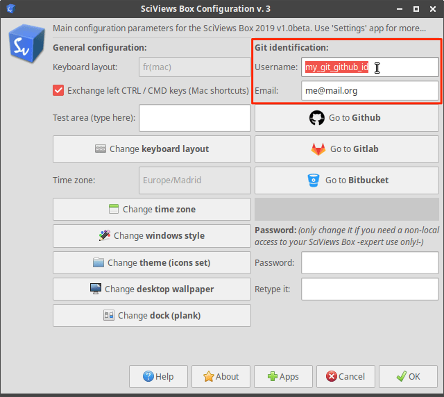
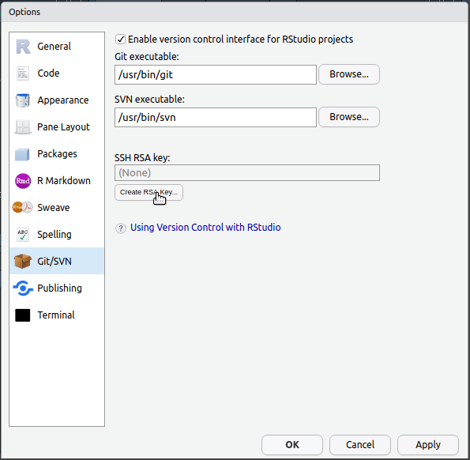
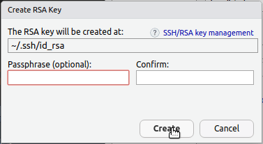
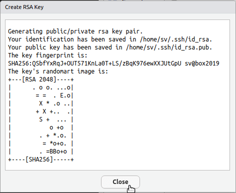
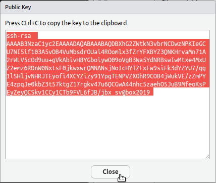
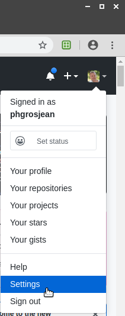
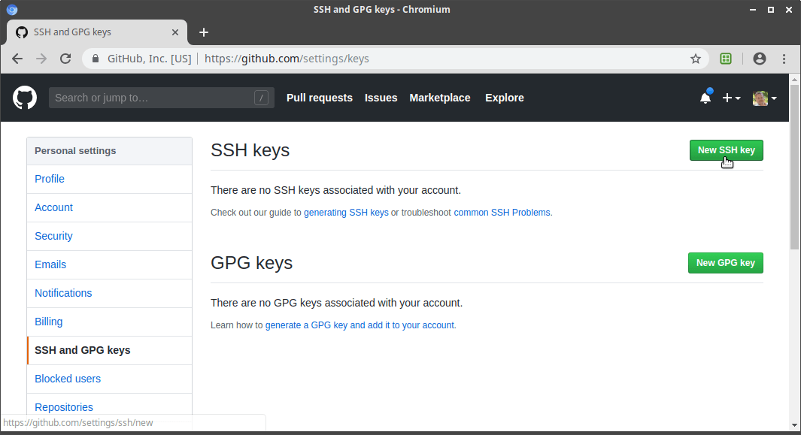
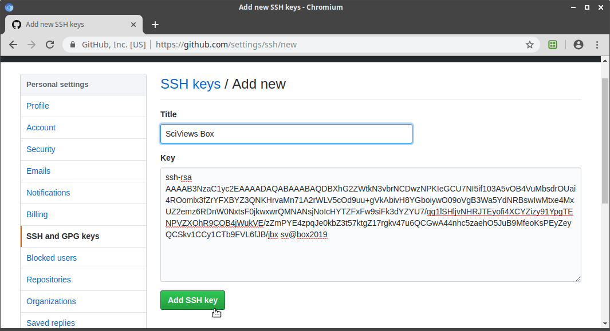

# (APPENDIX) Appendices {.unnumbered}

# Installation de la SciViews Box {#svbox}

```{block, type='warning'}
**Dans ce cours nous utilisons un logiciel déployé dans le cloud avec SaturnCloud. Vous n'avez donc rien à installer localement sur votre ordinateur et vous pouvez ignorer tout ce qui suit ! Cette section est maintenue au cas où le déploiement dans SaturnCloud poserait problème et qu'il faudrait revenir à l'ancien système.**
```

```{r echo=FALSE, out.width="256px", fig.align='right'}

```

Pour installer la **SciViews Box** localement, référez-vous à [la page de départ du site](https://wp.sciviews.org). **Vous pouvez conserver l'ancienne SciViews Box en parallèle avec cette nouvelle version**, mais vérifiez si vous avez assez d'espace sur le disque dur pour contenir les deux simultanément. Comptez par sécurité 25Go par version. Si vous manquez de place, vous pouvez éliminer l'ancienne version avant d'installer la nouvelle (vos projets ne seront pas effacés).

## Migration des projets

Concernant les projets réalisés dans une version précédente de la SciViews Box, ceux-ci restent disponibles, même si vous éliminez l'ancienne. Plusieurs cas de figure se présentent :

1.  Vous conservez deux ou plusieurs versions de la SciViews Box en parallèle. Dans ce cas, nous conseillons fortement de garder chaque projet accessible à partir de la version dans laquelle il a été créé. Seulement les projets que vous décidez de *migrer* explicitement (voir ci-dessous) seront à déplacer dans le dossier `shared` de la nouvelle SciViews Box. Vous aurez à faire cette manipulation, par exemple, si vous devez recommencer un cours l'année suivante afin d'être en phase (même version de la svbox) par rapport à vos nouveaux collègues.

2.  Vous ne conservez que la dernière version de la SciViews Box, mais ne devez pas accéder fréquemment à vos anciens projets, et dans ce cas, vous pouvez réinstaller temporairement l'ancienne version de svbox. À ce moment-là, ne migrez pas vos anciens projets. Éliminez simplement l'ancienne svbox, tout en laissant vos projets intacts dans son répertoire `shared`. Lors de la réinstallation de l'ancienne svbox, vous retrouverez alors tous vos anciens projets intacts.

3.  Vous ne conservez pas d'ancienne version de la svbox et vous ne souhaitez pas devoir la réinstaller. Il est possible de *migrer* vos anciens projets en les déplaçant de l'ancien répertoire `shared` vers le nouveau. **Soyez toutefois conscients que vos documents Quarto et R Markdown, ainsi que vos scripts R ne fonctionneront pas forcément dans la nouvelle svbox et qu'une adaptation sera peut-être nécessaire !**

## Configuration

A chaque nouvelle installation de la SciViews Box, vous devez la reconfigurer. Antérieurement, vous passiez par la boite de dialogue `SciViews Box Configuration`. En particulier, vous deviez y indiquer votre identifiant et email Git (zone encadrée en rouge dans la copie d'écran ci-dessous).



À partir de la SciViews Box 2021, et du nouveau site web, la configuration est plus facile et en grande partie automatisée. **En principe, vous n'aurez même plus à utiliser cette boite de configuration.** La SciViews Box se configure toute seule à partir du moment où :

1.  Vous utiliser un **clavier belge** sous Windows, ou un clavier **Mac français** (clavier par défaut pour les Macs en Belgique) sous macOS[^a1-installation-svbox-1],

2.  Vous ouvrez le site du cours à partir du lien dans **Moodle** depuis la page du cours que vous suivez,

3.  Vous vous êtes enregistré sur ce même site via le login **GitHub**,

4.  Vous avez lancé votre SciViews Box en tâche de fond, et ouvrez RStudio via le bouton `RStudio` bleu qui se trouve dans la barre supérieure de menu du site web (éventuellement, il faut le faire une seconde fois si une application **BioDataScience** est installée pour être certain que tout est bien actualisé ; RStudio vous le proposera automatiquement).

[^a1-installation-svbox-1]: Si vous utilisez un autre clavier que celui configuré par défaut, la procédure via le panneau de configuration de la SciViews Box reste disponible.

Tout cela est expliqué plus en détail dans la nouvelle page d'accueil du site web.

### Compte GitHub dans RStudio

RStudio offre la possibilité (de manière optionnelle) d'enregistrer une clé publique/privée dans votre SciViews Box afin de vous enregistrer sur GitHub de manière permanente. L'avantage, c'est que vous ne devrez plus constamment entrer votre login et mot de passe à chaque opération sur GitHub ! Nous vous le conseillons donc.

-   Entrez dans RStudio, et allez dans le menu `Tools -> Global Options... || Outils -> Options globales...` (notez que nous présentons ici `version anglaise || version française`, utilisez celui qui convient à votre configuration de RStudio). Ensuite, cliquez dans la rubrique `Git/SVN` dans la boite de dialogue.



-   Ensuite, cliquez sur le bouton `Create SSH key... || Créer une clé SSH...`. La phrase de passe n'est pas nécessaire (il est même préférable de la laisser vide si vous voulez utiliser Github sans rien devoir taper à chaque fois). Cliquez sur le bouton `Create || Créer`.



-   Vous obtenez alors une fenêtre similaire à celle ci-dessous (bien sûr avec des données différentes). Ceci confirme que votre clé cryptographique a été créée localement. Fermez cette fenêtre pour revenir à la boite de dialogue de configuration de RStudio.



-   Dans la boite de dialogue de configuration de RStudio, section `Git/SVN` cliquez sur le lien `View public key || Voir la clé publique` qui apparaît une fois la clé créée :


-   La clé est affichée dans une fenêtre, déjà présélectionnée. Copiez-là dans le presse-papier (`Ctrl-C` ou `Cmd-C` sous macOS, ou clic bouton droit et sélection de `Copy || Copier` dans le menu contextuel), puis fermez cette fenêtre.



-   Dans votre navigateur web favori, naviguez vers <https://github.com>, connectez-vous à votre compte, et accédez à ses paramètres (menu déroulant en haut à droite, entrée `Settings`) :



-   Dans les paramètres de votre compte, cliquez sur la rubrique `SSH and GPG keys`, ensuite sur le bouton vert `New SSH key`



-   Collez-y votre clé à partir du presse-papier dans la zone `Key`. Vous pouvez lui donner un nom évocateur dans le champ `Title`. Ensuite, cliquez sur `Add SSH key`.



-   Déconnectez et reconnectez-vous dans RStudio pour que les changements soient pris en compte. La prochaine action sur GitHub depuis RStudio pourrait encore déclencher la demande de votre login et mot de passe, mais ensuite, les opérations devraient se faire directement.

Si vous éprouvez toujours des difficultés à faire collaborer R et RStudio avec Git et GitHub, voyez [Happy Git and GitHub for the UseR](https://happygitwithr.com) (en anglais) qui explique les différentes procédures bien plus en détail.
