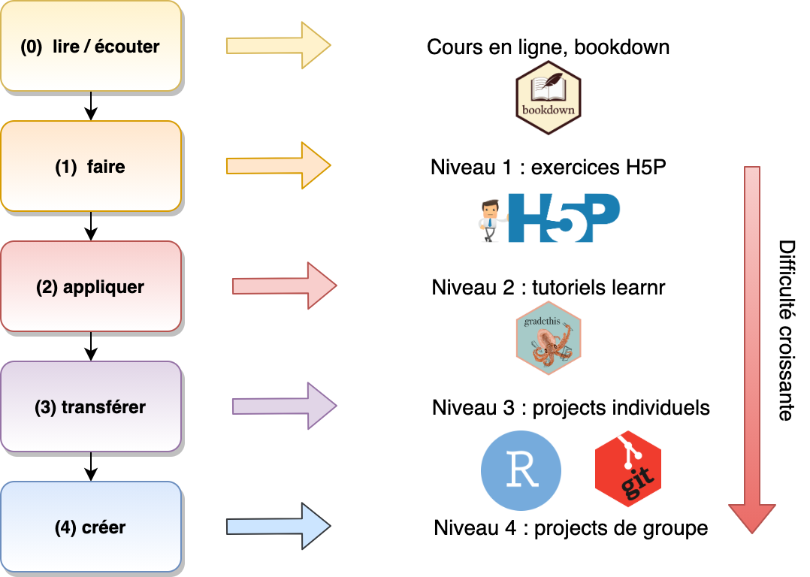

# Préambule {#preambule .unnumbered}

```{r setup, include=FALSE}
knitr::write_bib(c(.packages(), 'bookdown', 'knitr', 'rmarkdown'), 'packages.bib')
```

`r learnitdown::clean_ex_toc()` `r learnitdown::diagnose_login(lang = "fr")`

Cet ouvrage est conçu pour être utilisé de manière interactive en ligne. En effet, vous y trouverez des vidéos, des démonstrations interactives, et des exercices sous forme de questionnaires interactifs. **Ces différents éléments ne sont, bien évidemment, utilisables qu'en ligne.**


------------------------------------------------------------------------

*Le matériel dans cet ouvrage est distribué sous licence [CC BY-NC-SA 4.0](https://creativecommons.org/licenses/by-nc-sa/4.0/deed.fr).*

------------------------------------------------------------------------

<details>

<summary>Informations système</summary>

```{r, class.source='hidden-code'}
sessioninfo::session_info()
```

</details>

## Vue générale du cours {#vuegenerale .unnumbered}

Cet ouvrage interactif est le second volume d'une série de trois ouvrages traitant de la science des données biologiques. L'écriture de cette suite de livres a débuté au cours de l'année académique 2018-2019. Pour l'année académique `r !'{acad_year}'`, ceci est le support du cours de `r !'[Science des données II : analyse et modélisation](https://webcontent.umons.ac.be/web/fr/pde/{acad_year}/ue/US-B3-SCBIOL-006-M.htm)'` au troisième Bachelier en Biologie en Faculté des Sciences de l'Université de Mons (UMONS), et dont le responsable est Philippe Grosjean

La matière est divisée en dix modules de six heures chacun en présentiel. Il nécessite environ huit heures (variable, en fonction de votre rythme et de votre technique d'apprentissage entre six et dix heures) en travail à domicile. **Cette matière fait suite au premier cours dont le contenu est considéré comme assimilé (voir [cours SDD I](https://wp.sciviews.org/sdd-umons){target="top"}).**

Les cinq premiers modules du cours sont consacrés à la **modélisation**, plus particulièrement à la **régression**, un domaine particulièrement important de la science des données qui étend les concepts déjà vu au cours SDD I d'analyse de variance et de corrélation entre deux variables. Ces cinq modules formeront aussi un socle sur lequel nous pourrons élaborer les techniques d'apprentissage machine (classification supervisée), et puis ensuite l'apprentissage profond à la base de l'intelligence artificielle qui seront abordées plus tard dans le cours SDD III. Cette partie est dense, mais *ultra* importante !

Les cinq modules suivants s'intéresseront à l'**exploration des données**, encore appelée **analyse des données** qui vise à découvrir des caractéristiques intéressantes dans de très gros jeux de données. Ces techniques sont d'autant plus utiles que les données volumineuses deviennent de plus en plus courantes en biologie.

## Matériel pédagogique {#pedagogie .unnumbered}

Le matériel pédagogique, rassemblé dans ce syllabus interactif, est aussi varié que possible. Vous pourrez ainsi piocher dans l'offre en fonction de vos envies et de votre profil d'apprenant pour optimiser votre travail. Vous trouverez :

-   le présent ouvrage en ligne,

-   des [exercices H5P](http://www.h5p.org) en ligne repérables par le logo [](https://wp.sciviews.org/h5p/){target="top"} sur lequel vous pouvez cliquer pour avoir plus d'infos sur leur utilisation,

-   des [applications Shiny](https://shiny.rstudio.com/) qui sont de véritables petits programmes avec interface Web écrits en R. Ils vous démontrent "en live" certains concepts. Ces applications doivent être lancées en cliquant sur l'image contenant le logo [](https://wp.sciviews.org/shiny_app/){target="_parent"} et elles doivent être quittées avec le bouton `Quit` ou `Quit & Save` si l'enregistrement est activé. N'oubliez pas de soumettre votre réponse avec le bouton `Submit`. Si le serveur distant est trop lent ou indisponible, il est aussi possible de lancer ces applications Shiny directement dans RStudio (voir le message en italique qui apparaît en dessous de l'application),

-   des [tutoriels interactifs learnr](https://rstudio.github.io/learnr/). Vous pourrez exécuter ces tutoriels directement dans RStudio, et vous aurez alors accès à des pages Web réactives contenant des explications, des exercices et des quiz en ligne dans votre environnement de travail habituel. Ces tutoriels sont repérables par l'icône suivante [](https://wp.sciviews.org/tutorial/){target="_parent"},

-   des [dépôts GitHub Classroom](https://classroom.github.com/) dans la section [BioDataScience-Course](https://www.github.com/BioDataScience-Course) pour réaliser et documenter vos travaux personnels. Les liens vers ces dépôts sont repérables par l'icône GitHub [](https://wp.sciviews.org/github_assignment/){target="_parent"},

-   des renvois vers des documents externes en ligne, des vidéos [Youtube](https://www.youtube.com/) ou [Vimeo](https://vimeo.com/), des ouvrages en ligne en anglais ou en français, des blogs, des tutoriels, des questions sur des sites comme [Stackoverflow](https://stackoverflow.com/) ou dans des [mailing lists R](https://www.r-project.org/mail.html), de [X (ex Twitter)](https://twitter.com/)...

-   des diapositives de présentations distribuées via le dépôt `r !'[sdd_lessons sur BioDataScience-Course](https://github.com/BioDataScience-Course/sdd_lessons/tree/{acad_year})'`.

```{block, type='info'}
::: {.nocourse}
Tout ce matériel est accessible à partir du [site Web du cours](https://wp.sciviews.org){target='top'}, et du présent syllabus interactif.
:::

::: {.S-BIOG-015 .S-BIOG-937-958-959}
Tout ce matériel est accessible à partir du [site Web du cours](https://wp.sciviews.org){target='top'}, du présent syllabus interactif et de Moodle pour les étudiants de l'UMONS.

Les travaux personnels seront à réaliser en utilisant une machine virtuelle préconfigurée, la **"SciViews Box"**, que nous installerons ensemble durant la séance introductive. **Nous installerons une nouvelle version de la SciViews Box** et vous aurez différentes manipulations à réaliser dans SaturnCloud pour pouvoir utiliser le matériel du cours. Il est donc très important que vous soyez présent•e durant cette première séance !

Vous pourrez poser vos questions par mail à l'adresse [sdd@sciviews.org](mailto:sdd@sciviews.org)  ou dans les "issues" du dépôt Github de ce cours. L'accès à se dépôt vous sera donné au début du cours.

Un **outil d'annotation** et de surlignage est intégré dans le cours en ligne. Il vous permet :

- de personnaliser votre cours en écrivant dedans comme vous le feriez avec un syllabus papier (annotations privées... tout ce qui vous passe par la tête).

- d'échanger des informations complémentaires entre vous (par exemple, trucs et astuces supplémentaires, liens utiles, etc.) ou avec vos enseignants (passages moins clairs ou lacunes éventuelles). Soyez constructif dans vos commentaires publiques et réservez vos questions pour les "issues". Nous tiendrons compte de vos remarques pour améliorer le cours pour les années suivantes.

Pour annoter ou surligner, vous sélectionnez du texte et vous cliquez sur l'un des deux boutons `Annotate` ou `Highlight` qui apparaissent. Vous devez vous créer un compte (gratuit) sur [hypothes.is](https://hypothes.is) auparavant. Vos annotations publiques sont à poster dans le groupe **BioDataScience-Course**. Vous devez [vous y abonner en cliquant sur ce lien](https://hypothes.is/groups/miAKPpWy/biodatascience-course) et ensuite sélectionner ce groupe dans la barre d'outil en haut du panneau d'annotation **avant d'ajouter vos commentaires, qu'ils soient personnels ou de groupe**.
:::
```

## Approche pédagogique {#approchepedagogique .unnumbered}

Ce livre en ligne ainsi que tout le matériel pédagogique cité plus haut a été développé pour être employé en pédagogie active en classe inversée. On peut résumer cette approche en deux phases. Vous apprenez d'abord à la maison, nous appliquons *ensuite* en présentiel.

### Classe inversée & pédagogie active {.unnumbered}

Dans la plus grande partie de vos cours, vous avez donc suivi **passivement** un cours *ex cathedra* suivi, éventuellement, par une séance d'exercice ou de travaux pratiques.

On peut schématiser ce mode d'apprentissage comme cela :


À la fin, un examen est indispensable pour valider l'acquisition des concepts.

Les cours de science des données utilisent une autre approche et se donnent en **classe inversée**. Le schéma ci-dessous vous illustre l'organisation d'un module du cours. Vous devrez donc préparer en distanciel la matière avant les séances en présentiel. Lors de chaque heure de travail lié à ce cours vous serez donc **actif**.


Une présentation des changements introduits par rapport à l'année précédente vous est faite durant la première séance introductive. La présentation correspondante est disponible au format PDF `r !'[ici](https://github.com/BioDataScience-Course/sdd_lessons/raw/{acad_year}/B00/presentations/B00Pa_intro.pdf)'`.

### Quatre niveaux d'exercices {.unnumbered}

Quatre niveaux d'exercices de difficultés croissantes vous seront proposés.

-   niveau I : découvrir les notions dans des exercices rapides et ciblés intégrés au sein du cours en ligne.
-   niveau II : appliquer les notions vues dans des exercices sous la forme de tutoriel très cadré
-   niveau III : transférer les notions dans des projets individuels guidés sur des données biologiques
-   niveau IV : créer/réaliser des analyses dans des projets de groupe libres sur des données biologiques nouvelles grâce aux notions vues

Chaque type d'exercice est associé à un outil présenté dans le matériel pédagogique.



Toutes vos réponses sont collectées et utilisées afin de construire la note finale. Il n'est donc plus nécessaire de passer un examen classique en session d'examen. Tous ces exercices permettent de déterminer si vous maîtrisez les acquis d'apprentissage de ce cours. Cependant, vous aurez des **interrogations** classiques régulières sur la matière vue jusque là.

Un rapport de progression dans les exercices est mis à votre disposition à la fin de chaque module. En outre, un rapport de progression global est accessible depuis Moodle.

```{block, type='warning'}
Les notes des exercices plus faciles de niveau 1, 2 et 3 sont comptabilisées séparément des exercices plus difficiles de niveau 4, des challenges et des interrogations, avec une pondération également en faveur de ces derniers. **Votre objectif est donc de bien vous préparer et de réussir vos projets, challenges et interrogations en présentiel.** Les exercices faciles que vous réalisez chez vous aident à bien vous préparer. **Faites les sérieusement, c'est dans votre intérêt.**

L'évaluation est **continue** tout au long de l'année. Il n'y a pas d'examen en fin d'année et il n'y a pas moyen non plus de repasser un examen en seconde session. La présence aux séances est **obligatoire** pour cette raison et toute absence injustifiée sera sanctionnée par un zéro pour la matière concernée.
```

### Plan du cours {#plancours .unnumbered}

Le plan du cours est une forme de contrat entre les étudiants et les enseignants. Ce document structure les attentes de vos encadrants. Veuillez lire ce document attentivement.

-   `r !'[Plan du cours de Science des données biologiques II : années {acad_year}](https://github.com/BioDataScience-Course/BioDataScience-Common/tree/{acad_year}/docs/plan_de_cours/sdd2_plan_cours_{acad_year}.pdf)'`


## Issues {#issues .unnumbered}

Toutes les questions relatives aux exercices sont à poser dans les **"issues" GitHub** dédiées à ce cours.

```{r assign_B00Qa_issues, echo=FALSE, results='asis'}
if (exists("assignment2"))
  assignment2("B00Qa_issues", part = NULL, clone = FALSE,
    url = "https://github.com/BioDataScience-Course/B00Qa_{YY}M_issues-b{YY}",
    course.ids = c(
      'S-BIOG-015'         = !"B00Qa_{YY}M_issues"),
    course.urls = c(
      'S-BIOG-015'         = !"{assign_url$B00Qa_issues}"),
    course.starts = c(
      'S-BIOG-015'         = !"{course_start} 10:00:00"),
    course.ends = c(
      'S-BIOG-015'         = !"{course_end} 23:59:59"),
    term = "", level = 0,
    toc = "Poser ses questions dans une issue.", n = 100,
    texts = learnitdown::assignment2_fr(
      title = "Rejoignez le projet",
      course = "[Projet GitHub Classroom d\u00e9di\u00e9e aux issues pour les \u00e9tudiants inscrits au cours de {course_name}]({course_url}){{target=\"_blank\"}}", 
      alt = "Les issues ne sont pas accessibles aux \u00e9tudiants externes."))
```

*Note : vos enseignants sont également accessibles par mail via [sdd\@sciviews.org](mailto:sdd@sciviews.org){.email}, mais uniquement si vos questions nécessitent un échange en privé, sinon, vous devez utiliser les issues.*

Une fois que vous avez rejoint le groupe **`r !"b{YY}"`**, il n'est plus nécessaire d'utiliser le lien GitHub Classroom vers ces issues. Vous pouvez retrouver directement les issues liées à ce dépôt depuis la bannière du site.


Vous pouvez aussi directement créer une issue depuis RStudio. Voyez le fichier `README.md` dans le dépôt des issues pour les explications.

Enfin, vous avez à disposition un learnr de "feedback" qui vous permet de faire des suggestions sur le contenu de ce cours, module par module, ou de manière générale :

`r learnr("B99La_feedback", title = "Learnr de feedback", toc = NULL, text = "Utilisez le document suivant pour vos suggestions sur le cours :")`

## Planning des séances {#planning .unnumbered}

| Module             | Préparation pour le ... |  Fin N1-3            | Projet N4                   | Challenge                       | Interrogation.             |
|--------------------|-------------------------|----------------------|-----------------------------|---------------------------------|----------------------------|
| **Quadri 1**       |                         |                      |                             |                                 |                            |
| *(install party)*  | `r !"{mod$start[1]}"`   | `r !"{mod$N3[1]}"`   | `r !"{mod$N4[1]}"`          | **`r !"{mod$challenge[1]}"`**   | **`r !"{mod$test[1]}"`**   |
| 1 Rég. lin. 1.     | `r !"{mod$start[2]}"`   | `r !"{mod$N3[2]}"`   | `r !"{mod$N4[2]}"`          | **`r !"{mod$challenge[2]}"`**   | **`r !"{mod$test[2]}"`**   |
| 2 Rég. lin. 2      | `r !"{mod$start[3]}"`   | `r !"{mod$N3[3]}"`   | `r !"{mod$N4[3]}"`          | **`r !"{mod$challenge[3]}"`**   | **`r !"{mod$test[3]}"`**   |
| 3 LM               | `r !"{mod$start[4]}"`   | `r !"{mod$N3[4]}"`   | `r !"{mod$N4[4]}"`          | **`r !"{mod$challenge[4]}"`**   | **`r !"{mod$test[4]}"`**   |
| 4 GLM              | `r !"{mod$start[5]}"`   | `r !"{mod$N3[5]}"`   | `r !"{mod$N4[5]}"`          | **`r !"{mod$challenge[5]}"`**   | **`r !"{mod$test[5]}"`**   |
| 5 Non linéaire     | `r !"{mod$start[6]}"`   | `r !"{mod$N3[6]}"`   | **fin `r !"{mod$N4[6]}"` ** | **`r !"{mod$challenge[6]}"`**   | **`r !"{mod$test[6]}"`**   |
| *(rattrapage)*     | `r !"{mod$start[7]}"`   | `r !"{mod$N3[7]}"`   | `r !"{mod$N4[7]}"`          | **`r !"{mod$challenge[7]}"`**   | **`r !"{mod$test[7]}"`**   |
| **Quadri 2**       |                         |                      |                             |                                 |                            |
| 6 Classif.         | `r !"{mod$start[8]}"`   | `r !"{mod$N3[8]}"`   | `r !"{mod$N4[8]}"`          | **`r !"{mod$challenge[8]}"`**   | **`r !"{mod$test[8]}"`**   |
| 7 ACP/AFC          | `r !"{mod$start[9]}"`   | `r !"{mod$N3[9]}"`   | `r !"{mod$N4[9]}"`          | **`r !"{mod$challenge[9]}"`**   | **`r !"{mod$test[9]}"`**   |
| 8 AFM              | `r !"{mod$start[10]}"`  | `r !"{mod$N3[10]}"`  | `r !"{mod$N4[10]}"`         | **`r !"{mod$challenge[10]}"`**  | **`r !"{mod$test[10]}"`**  |
| 9 MDS              | `r !"{mod$start[11]}"`  | `r !"{mod$N3[11]}"`  | `r !"{mod$N4[11]}"`         | **`r !"{mod$challenge[11]}"`**  | **`r !"{mod$test[11]}"`**  |
| 10 SOM             | `r !"{mod$start[12]}"`  | `r !"{mod$N3[12]}"`  | `r !"{mod$N4[12]}"`         | **`r !"{mod$challenge[12]}"`**  | **`r !"{mod$test[12]}"`**  |

: Dates importantes pour les activités de science des données biologiques II (à 23:59:59 pour les fins de projets N3 ou N4, à l'heure de la séance en présentiel pour les autres dates).

-   La colonne **préparation pour le...** indique la date pour laquelle vous devez avoir préparé[^index-1] la *totalité* du chapitre correspondant du cours en ligne, y compris les exercices de niveaux 1 et 2 (H5P, learnr, shiny).

-   Les **projets individuels** **de niveau 3** sont réalisés en présentiel. Vous ne pourrez les compléter efficacement que si vous avez bien préparé la matière. La date indiquée dans cette colonne correspond à la clôture des projets. Logiquement, vous devez avoir aussi terminé les exercices de niveaux 1 et 2 à ce moment-là.

-   Les **projets de groupe** **de niveau 4** se font sur une plus longue durée et à cheval sur plusieurs modules. Étalez et répartissez le travail entre vous. Prévoyez le temps nécessaire pour *terminer* vos rapports avant la date de fin.

-   Les **challenges** sont des exercices qui se font obligatoirement en séance sous forme de jeux, type compétition entre vous ou contre la montre. *Ils nécessitent d'être au point dans la manipulation du logiciel pour l'analyse de données biologiques en pratique.*

-   Les **interrogations** sont des contrôles classiques en présentiel sur feuille de papier ou sur ordinateur et limités à 30, 45 ou 60 minutes. *Réussir implique que vous ayez assimilé toute la matière vue jusque là.* Prévoyez entre une demi et une journée et demie pour l'étude et la révision avant cette date, selon votre rythme de travail.

-   Les **séances en présentiel** sont généralement réparties sur une semaine avec **deux heures le lundi et quatre heures le jeudi ou le vendredi**, sauf quand l'horaire impose une autre configuration.
    *   La **première séance de deux heures du lundi** est consacrée aux questions/réponses sur la matière et aux courtes explications en classe. Le projet individuel de niveau 1 est débuté. *Les étudiants doivent étudier la matière pour l'interrogation ou le challenge* et préparer leur seconde série de questions pour la séance suivante.
    *   Les **deux premières heures de la seconde séance de fin de semaine** sont consacrées à la poursuite du projet de niveau 1 qui doit normalement se terminer à ce moment-là, ou presque. Une nouvelle séance de **questions/réponses** et de discussion sur la matière est également prévue. Elle vise à vous préparer au mieux à l'interrogation ou au challenge. Ensuite, après une courte interruption, **une interrogation écrite** a lieu durant environ une demi-heure, sauf autres directives (parfois 45 minutes ou même une heure).
    *   Les **deux dernières heures de la seconde séance** sont consacrées au travail sur le **projet de groupe**. *À l'issue de ces deux séances, les étudiants terminent leurs exercices de niveaux 1-3 chez eux*, généralement pour le lundi suivant.

[^index-1]: Préparer la matière en classe inversée signifie que vous avez **étudié** ce que vous comprenez par vous-même et que vous avez **noté** vos questions relatives à ce que vous ne comprenez pas pour les poser en séance. Il ne s'agit pas *juste* de lire de manière distraite le syllabus !

*Notez les dates clés dans vos agendas. Les informations ci-dessus sont données à titre indicatif pour vous permettre de planifier votre travail. Elles pourraient toutefois légèrement évoluer au cours de l'année académique en fonction de l'évolution de l'apprentissage et/ou d'imprévus.*
